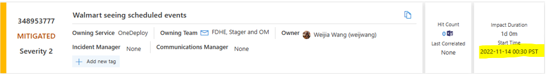

# Finding Node Level Changes

For this scenario, you are given an ICM number and told to find the node-level changes that have occured in this incident. While there are many different approaches to find the solution to this scenario, there are a few paths that are quicker and reduce the TTM. Below is a graph of the paths that we will discuss and for you to refer to as we walk through each approach. For this scenario, we will use [ICM 348953777](https://portal.microsofticm.com/imp/v3/incidents/details/348953777/home) as an example incident

## Step One: Locate the Node ID in ICM

Navigate to the ICM ticket to find the Node ID. Copy this ID as you will need it later to input into the tooling

## Step Two: When did this Incident Occur?

Second step to take is noting when this incident occurred as this date will be the deciding factor on the tools you will use. For this scenario the incident occurred on 2022-11-14, meaning that you will use either the [OneDeploy Walmart Dashboard](https://dataexplorer.azure.com/dashboards/95963854-b111-4680-a16f-9f3383d49f9b?p-_startTime=2days&p-_endTime=now&p-_measure=all&p-_payload=all&p-_tag=all&p-_impact=v-All&p-_region=all&p-_ve=all&p-_noflyzone=all&p-_RoleInstanceName=all&p-_nodeid=all#c676ca09-727b-4124-ab01-8e3782e191f9) or [FCM](https://aka.ms/FCM). [Azure Service Insights (ASI)](https://asi.azure.ms/) only stores the last 60 days worth of data, which is why you will not be able to utilize its tooling for this scenario. 

## Step Three: Tooling

For this step you can use use either the [OneDeploy Walmart Dashboard](https://dataexplorer.azure.com/dashboards/95963854-b111-4680-a16f-9f3383d49f9b?p-_startTime=2days&p-_endTime=now&p-_measure=all&p-_payload=all&p-_tag=all&p-_impact=v-All&p-_region=all&p-_ve=all&p-_noflyzone=all&p-_RoleInstanceName=all&p-_nodeid=all#c676ca09-727b-4124-ab01-8e3782e191f9) or [FCM Change Explorer](https://aka.ms/FCM). In this scenario, the user that is affected is a Walmart customer, but that does not mean that you have to use the OneDeploy Walmart Dashboard since FCM is not limited to the customer type. However, if the incident was not a Walmart customer, you would only be able to use FCM. 

<!-- With this particular scenario, the incident occurred quite awhile ago and because of that, FCM Change Explorer or the Walmart Dashboard will be the tools that will produce the quickest results. This is because FCM lets you filter down the time range to a 48 hour period which effectively weeds out data that you do not need.-->  

<!-- NEED TO FIX --> 

<!-- Using the Walmart dashboard will yield the expected results, but it will take much longer to load due to the limitations it has in adjusting the filtering dates - which we will expand on in the *Finding Node-Related Changes in OneDeploy Walmart Dashboard* section below. Best practice is to use the Walmart dashboard for customer incidents that have occurred in the last 60 days to avoid the long loading times.--> 

<!-- NEED TO FIX --> 

### Finding Node-Related Changes in FCM

For this scenario, FCM will produce the quickest results due to how far in the past this incident occurred.

1. Navigate to [FCM Change Explorer](https://aka.ms/FCM)
2. Update the *Time Range* filters to the where the end date contains the start date displayed on the ICM ticket. 

    

3. Paste the Node ID into the *Impacted Location Hierarchy* filter

    

4. Press search located on the top of the filter panel

    

5. Expand the results to view the node-related changes

    

Now you have all the information on the changes that occurred on a specific node. In the image above, you will see the Change information in the table indicating there were NMAgent and VNetAgent updates occurring. In the filtering panel on the left side you can see that the updated occurred in the *sat11prdapp03* cluster located in South Central US.

For further guidence on using FCM Change Explorer, please refer to our [User Guide](https://eng.ms/docs/products/fcm-engineering-hub/changeexplorer/changeexploreroverview)

### Finding Node-Related Changes in OneDeploy Walmart Dashboard

For this senario, the Walmart dashboard will yield the results, but you it will take longer to load and you will have to search through more data to find the changes you are looking for.

1. Navigate to [OneDeploy Walmart Dashboard](https://dataexplorer.azure.com/dashboards/95963854-b111-4680-a16f-9f3383d49f9b?p-_startTime=2days&p-_endTime=now&p-_measure=all&p-_payload=all&p-_tag=all&p-_impact=v-All&p-_region=all&p-_ve=all&p-_noflyzone=all&p-_RoleInstanceName=all&p-_nodeid=all#c676ca09-727b-4124-ab01-8e3782e191f9)

2. Update the *Time Range* filter to last 365 days.

    
<!-- NEED TO FIX --> 

3. Paste the Node ID into the *Node ID* filter

    

4. The dashboard will automatically start filtering once you input your data. Once the data loads, navigate to the *Changes on Walmart Nodes* table and find the changes that occurred around the incident start time. When you find the change, expand it to reveal additional details

    

Now you have all the information on the changes that occurred on a specific node. In the image above, you will see the Change information in the table indicating there were NMAgent and VNetAgent updates occurring. In the filtering panel on the left side you can see that the updated occurred in the *sat11prdapp03* cluster located in South Central US. This matches the data that we found using FCM Change Explorer.