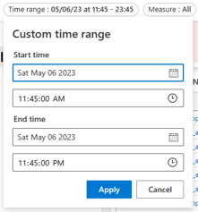
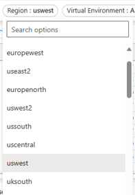
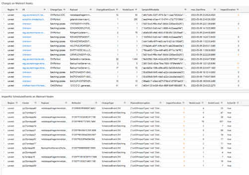

# Finding Changes within a specific Region, Customer and Time Range

For this scenario, you are given the below region, customer and time range and told to find any changes that have occured:

Region: US West 
Customer: Walmart
Time Range: 05/06/23 at 11:45am to 05/06/23 at 11:45pm

## Step One: Tooling
Since this is a Walmart customer, the [OneDeploy Walmart Dashboard](https://dataexplorer.azure.com/dashboards/95963854-b111-4680-a16f-9f3383d49f9b?p-_startTime=2days&p-_endTime=now&p-_measure=all&p-_payload=all&p-_tag=all&p-_impact=v-All&p-_region=all&p-_ve=all&p-_noflyzone=all&p-_RoleInstanceName=all&p-_nodeid=all#c676ca09-727b-4124-ab01-8e3782e191f9) will show the changes that fall within the these specifications.

## Step One: Filtering

1. Adjust the time range to fit the criteria by selecting *Custom Time Range*

    

2. Adjust the region to Us West

    

3. You will see your final results which include Changes, Impactful Scheduled Events, and OM Changes on Walmart Nodes

    

**Note: We need an option for scenarios where you are not given a subscription ID, but instead a customer name** 