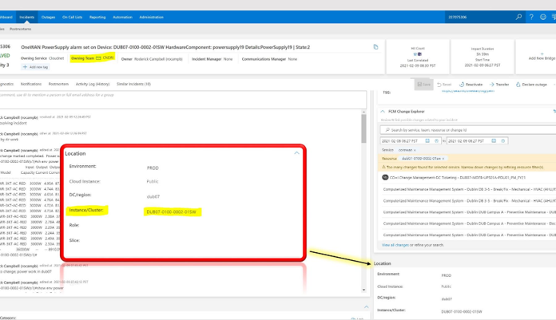
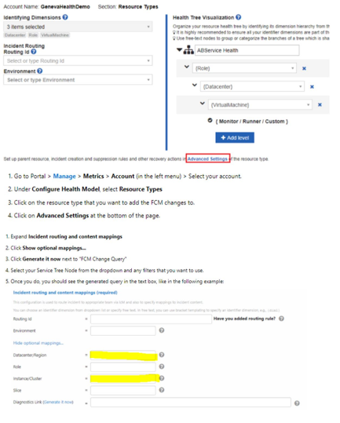
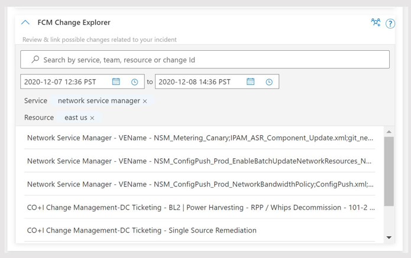
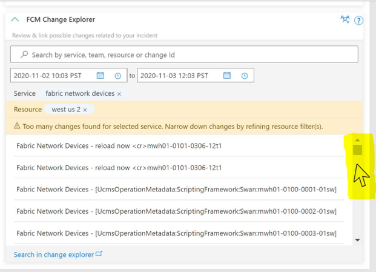
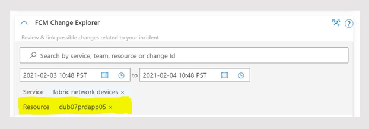
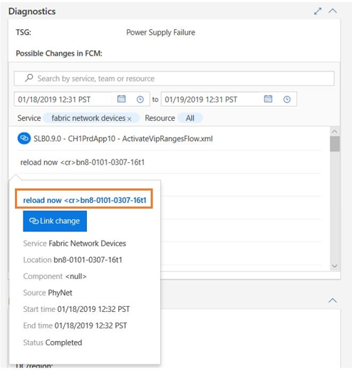

FCM Change Card in IcM Incident Details Diagnostics Widget, shows relevant changes that are happening for the incident owning service and for the impacted location in the context of incident information. Change Card enables the On-Call Engineer and Incident Managers to quickly get a sense of relevant changes that may have caused the incident. When an incident happens and incident tickets get created in ICM, FCM Change Card observes incident metadata, like service and incident location (resources: region, data center, cluster, etc.) and displays relevant changes. To achieve the same, FCM correlates change data from various deployment and config management systems to narrow down and show relevant changes. Users can also take advantage of Change Card to search for changes for a particular service, location, or both.

## Best Practices for Change Card
To show relevant changes for a given incident, FCM Change Card relies on good quality incident meta data (specifically the owning service and location information in the incident, as shown below for an incident) . Please make sure the following onboarding steps are completed before enabling FCM Change Card for your service:

- Step 1: Complete onboarding to [Service Tree](https://gadocs.msftcloudes.com/Service%20Tree/Products/Modelling.html)
- Step 2: Complete [IcM to Service Tree metadata mapping for your Service](https://icmdocs.azurewebsites.net/administration/manageServices/servicetreeIntegration.html)
- Step 3: Complete ingesting your topology information in [Azure Graph](https://azuregraph-preview.msftcloudes.com/)
- Step 4: Create and configure [monitors](https://genevamondocs.azurewebsites.net/alerts/AuthorAMonitor/MonitorsV2.html) for your resource types using the dimensions (DC/Region, Instance/Cluster) as defined by your team in Azure Graph (as part of Step 3 onboarding). Azure teams are [required to update these fields while creating or editing](https://genevamondocs.azurewebsites.net/whatsnew/newsletter/november2020/HealthRegion.html) new Geneva monitors (as well as resource types). This is an Azure wide ask from IcM/FCM to improve incident correlation. FCM relies on this information to improve the On Call experience and narrow down and show relevant changes in Change Card. To populate incident location from your MDM dimensions, go to your monitor resource health and map the dimension as shown below.

<!-- 
## How Change Card Works
Change Card displays the top 5 most relevant changes for the applied search criteria. Take advantage of the search functionality to change, update or apply additional condition for better search results. See next section for Search experience by ChangeID, Service Name and Resource.

Whenever there are too many changes to show, Users can see the available top 50 changes in change card by selecting “View top 50 changes” to scroll down further or narrow down the changes by refining their search criteria as shown in the next section.

## Search Experience
Change Card search functionality allows on-call engineers to search for changes across various levels of infrastructure and to scope their search from a broad search, such as all changes in service, a region, down to changes for a specific device and even search for specific change by using Change ID.

Example: Narrowing down from a region (Europe North) to a specific cluster (dub07prdapp)

Once you select from the available options shown in the drop-down list, then that selection will be applied to the search criteria.

## Search for ChangeID, Service Name and Resource:

### Service Name
Use Service Name if you want to see all changes for your service based on key words such as Service Tree Name, subscription, etc. If your services are not in a ServiceTree then this search will not work.

### Resource
The search result will be categorized by common resource types such as region, data center or cluster. The best way to search is starting off with a larger scope like region; and then drilling down to the inner scope to arrive at a smaller scope. This will enable you to end up with a smaller list of changes to look for. However, if you know the exact impacted area or the specific impacted resource for the incident, then you can directly search with that resource ID.

**Supported Resources**

| Resource |
|:-------|
| DCCode |   
| DCName |   
| LocationType |   
| Cluster |   
| ClusterType |   
| NetworkDevice |   
| NgsDeviceType |   
| AzureDeviceType |   
| NetworkDeploymentType |   
| NetworkDeviceVendor |
| Region |
| GeoName |

### Change ID
You can search for specific change by ChangeID and search result will desplay the exact change found in FCM.

![ADD IMAGE]

### Free Text
For cases when a particular resource is not found in FCM or when the service name is not matching with the one in ServiceTree, engineers can use the free text search criteria as shown below.

### How to access the detailed change information and link the change using Change Card
To further understand the nature of the changes surfaced by Change Card for a given incident, users can navigate from the deep link on the title to the change record (as shown in the examples below).

Example Navigating from the change title to the RTO record for a change that was made using AzDeployer.

Also, can use the link in the details to access in the change records in deployment system that rolling.

Link the culprit change clicking in the 'Link Change' in the change details. This linked culprit change presents the change that caused the incident confirmed by on-call engineers. By linking the culprit change help for other on-call engineer to easy finding the change information. FCM team receives the signal and work further improve algorithm for finding the most relevant changes.

### Troubleshooting Changes not Found

If FCM is not able to locate any changes for given criteria, the on-call engineer can narrow down the relevant change result using embedded new search experience in change card:

Specify the Instance/Cluster to see more relevant changes The deployment or configuration changes are not in FCM The IcM Service to Service Tree Service Name mapping is incorrect

Request Assistance from FCM team deeplink provides the ability for a service DRI to request assistance/engage with FCM DRI from within the Change Card if:

A service DRI concludes the current incident is change related and cannot find relevant changes in the change card after using the search functionality. Any of the intended change card functionality is not working as intended for the service.

In addition, you can flag the incident with Azure incident Managers (if available) so that the use case can be clearly investigated post mitigation. Alternatively, “Requesting Assistance” from FCM team deeplink provides the ability for a service DRI to request assistance/engage with FCM DRI from within the Change Card. -->