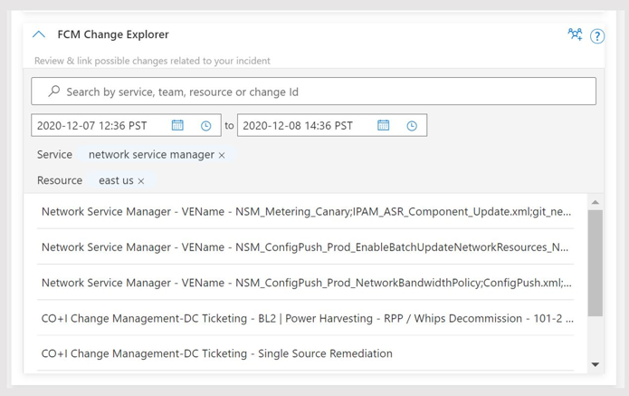
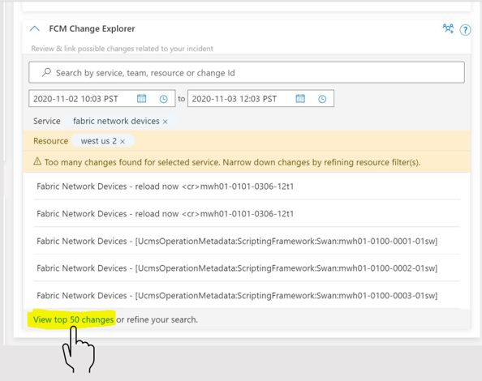
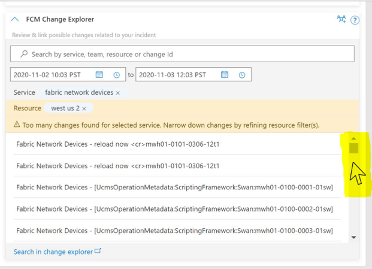

## How Change Card Works
Change Card displays the top 5 most relevant changes for the applied search criteria. Take advantage of the search functionality to change, update or apply additional condition for better search results. See next section for Search experience by ChangeID, Service Name and Resource.

Whenever there are too many changes to show, Users can see the available top 50 changes in change card by selecting “View top 50 changes” to scroll down further or narrow down the changes by refining their search criteria as shown in the next section.

