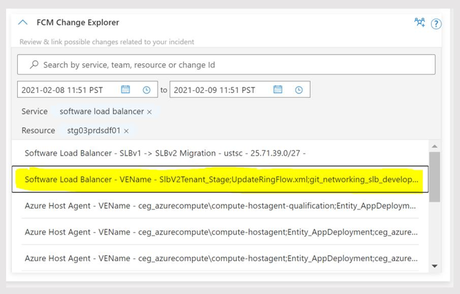
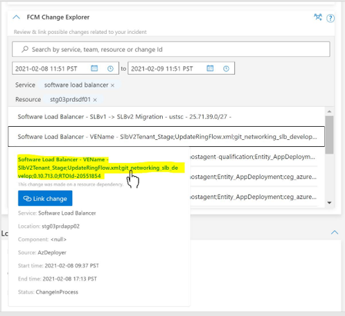
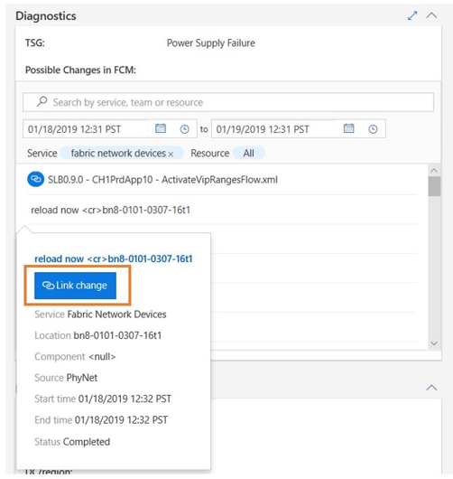

# How to access the detailed change information and link the change using Change Card
To further understand the nature of the changes surfaced by Change Card for a given incident, users can navigate from the deep link on the title to the change record (as shown in the examples below).

Example Navigating from the change title to the RTO record for a change that was made using AzDeployer.

Also, can use the link in the details to access in the change records in deployment system that rolling.

Link the culprit change clicking in the 'Link Change' in the change details. This linked culprit change presents the change that caused the incident confirmed by on-call engineers. By linking the culprit change help for other on-call engineer to easy finding the change information. FCM team receives the signal and work further improve algorithm for finding the most relevant changes.

