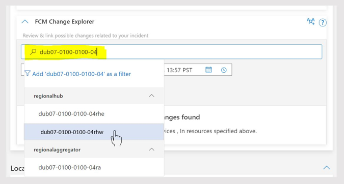

# Resource
The search result will be categorized by common resource types such as region, data center or cluster. The best way to search is starting off with a larger scope like region; and then drilling down to the inner scope to arrive at a smaller scope. This will enable you to end up with a smaller list of changes to look for. However, if you know the exact impacted area or the specific impacted resource for the incident, then you can directly search with that resource ID.

## Supported Resources

| Resource |
|:-------|
| DCCode |   
| DCName |   
| LocationType |   
| Cluster |   
| ClusterType |   
| NetworkDevice |   
| NgsDeviceType |   
| AzureDeviceType |   
| NetworkDeploymentType |   
| NetworkDeviceVendor |
| Region |
| GeoName |