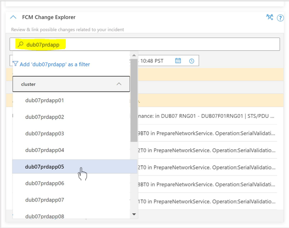
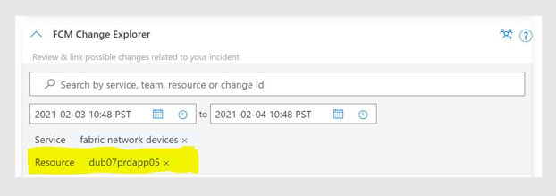

# Search Experience
Change Card search functionality allows on-call engineers to search for changes across various levels of infrastructure and to scope their search from a broad search, such as all changes in service, a region, down to changes for a specific device and even search for specific change by using Change ID.

Example: Narrowing down from a region (Europe North) to a specific cluster (dub07prdapp)

Once you select from the available options shown in the drop-down list, then that selection will be applied to the search criteria.

