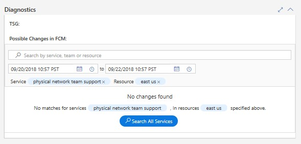
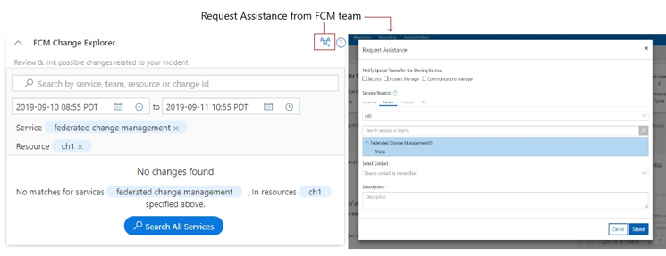

# Troubleshooting Changes not Found

If FCM is not able to locate any changes for given criteria, the on-call engineer can narrow down the relevant change result using embedded new search experience in change card:

Specify the Instance/Cluster to see more relevant changes The deployment or configuration changes are not in FCM The IcM Service to Service Tree Service Name mapping is incorrect

Request Assistance from FCM team deeplink provides the ability for a service DRI to request assistance/engage with FCM DRI from within the Change Card if:

A service DRI concludes the current incident is change related and cannot find relevant changes in the change card after using the search functionality. Any of the intended change card functionality is not working as intended for the service.

In addition, you can flag the incident with Azure incident Managers (if available) so that the use case can be clearly investigated post mitigation. Alternatively, “Requesting Assistance” from FCM team deeplink provides the ability for a service DRI to request assistance/engage with FCM DRI from within the Change Card.