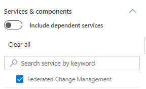
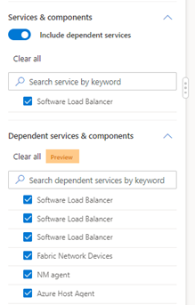
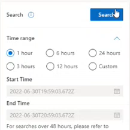

# Search by Specific Filters

1. Navigate to the [Change Explorer](https://aka.ms/fcm) home page 

    

2. Select the time range for which you’d like to see changes. Note: searches can only be done over a 48 hours period. *To query a larger time range, please refer to* [Lens Explorer](https://lens.msftcloudes.com/#/discover/query//results?_g=()) 

    

3. Search for the service by typing in the service name in **Services & Components** search bar on the left side of the screen   

    

4. Toggle **Include Dependent Services** to display Dependent services and components. *This step is optional and not manditory*

    

5. Fill out any remaining filters and then press Search in the top left corner. 

    