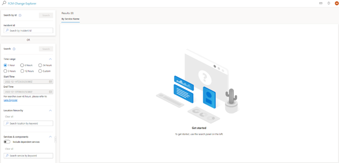
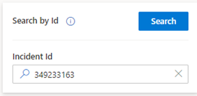
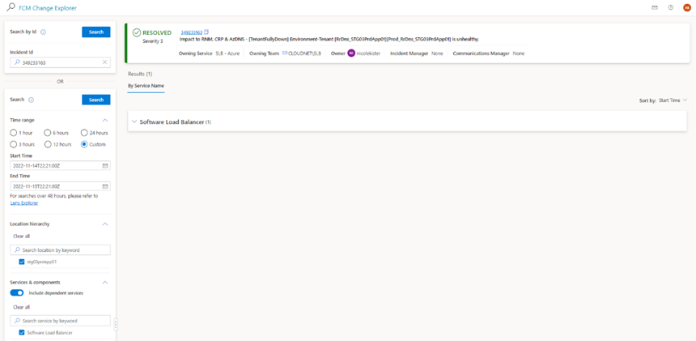

# Search by Incident

1. Navigate to the [Change Explorer](https://aka.ms/fcm) home page 

    

2. Take the Incident ID you’d like to see the changes for and enter it in the search by Incident ID section and then press search  

    

3. Your results screen will load with the link to the incident, table containing the changes and the filter panel on the left side of the screen updated with the corresponding information found in ICM Incident 

    