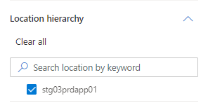
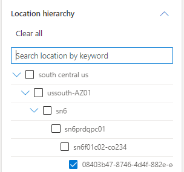

# Search by Location

Search for the location in **Location Hierarchy** search bar on the left side of the screen based on the incident you have chosen. This step is optional, you may leave it blank if it is not applicable. A full list of location options (region, cluster, storage tenant, etc) can be found at the bottom of this page. More schema information can be found [Here](https://eng.ms/docs/products/fcm-engineering-hub/onboard/fcmarchitecture/kusto/kusto)
    

## Location Types
| Location Type |
|:--------------|
| region  |
| datacenter  |
| Cluster  |
| Unkown  |
| RegionalHub  |
| ToRRouter  |
| ClusterSpine  |
| DCSpine  |
| RegionalShim  |
| SwanRouter  |
| BackEndToRRouter  |
| CoreRouter  |
| RegionalAggregator  |
| torrouter  |
| dcspine  |
| storagetenant  |
| backendclusterspine  |
| minit  |
| clusterspine  |
| backendtorrouter  |
| loadbalancer  |
| farm  |
| borderleaf  |
| coret  |
| regionalhub  |
| internetcorerouter  |
| corerouter  |
| zone  |
| internetedgerouter  |
| internetroutereflector  |
| aggswitch  |
| internetbackbonerouter  |
| regionalshim  |
| corporateaggregaterouter  |
| swanrouter  |
| aggrouter  |
| regionalaggregator  |
| BorderLeaf  |
| BackendClusterSpine  |
| wanrouter  |
| node  |