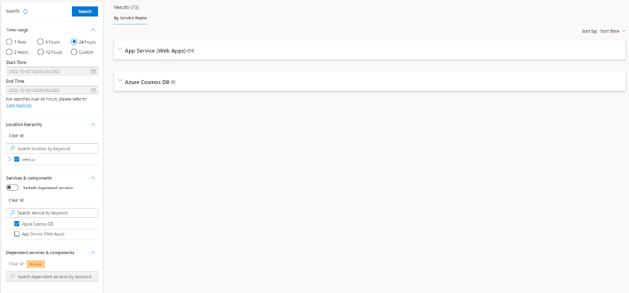
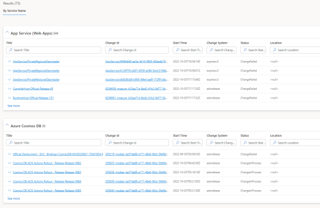
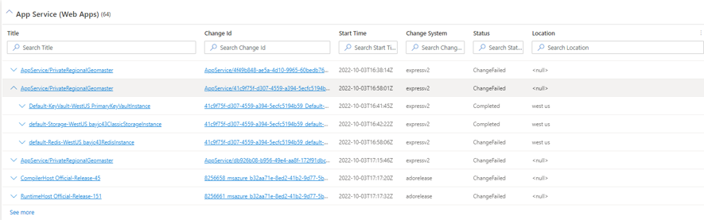
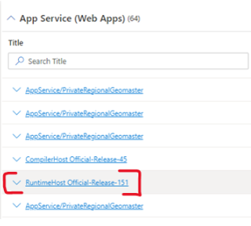
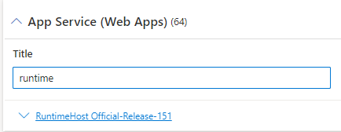

# Viewing your Results

1. After you enter and run your search, the results appear in the middle of the screen in the By Service Name section. *Note: the results will appear in a collapsed state, expand the sections that appear in the results By Service Name section by clicking the the Caret*

    
    

2. Once expanded, you will see a view of all the parent changes within the service. By clicking the caret next to each parent, you can expand further to view the child-related changes. 

    

3. Within the Title and Change ID column, there are hyperlinks attached. Clicking the link in the Title column will open the change details as recorded in the FCM database, while the link in the Change ID column will open the site (such as ExpressV2, DevOps/Visual Studio, or AdobeRelease) where the change was initially deployed from. 

    
    