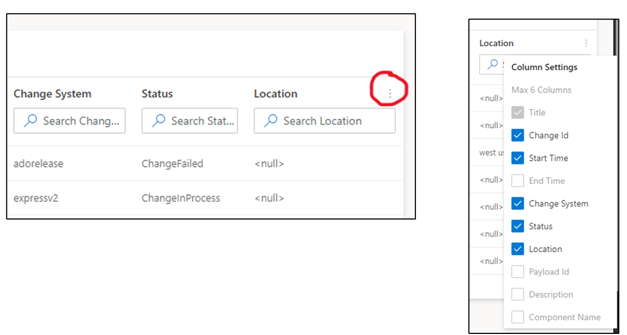

# Additional Visual customizations

1. You can resize the width on filtering panel by clicking on the icon with the three dots and dragging horizontally to make the panel wider or smaller.
2. Change out the columns of the table by clicking the three dots on the right and making your selection. *Note: the max number of columns you are able to select is 6. You will need to deselect at least one column to make another selection* 

    

 <!--   The column options are:

    | Column |
    |:-------|
    | Title |   
    | Change ID |   
    | Start Time |  
    | End Time |    
    | Change System |   
    | Status |  |
    | Location |    
    | Payload ID |  
    | Description | 
    | Component Name |  -->