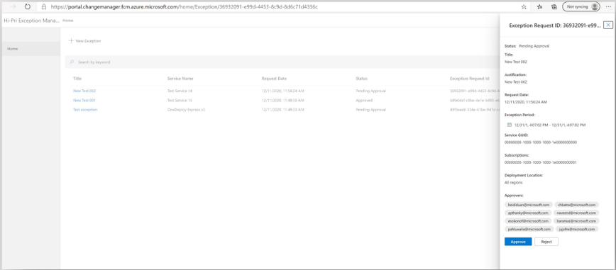

# How to approve or reject an exception request?
Once the requestor submits the Ev2 exception request, Approvers will receive an automated email (as shown in Figure-5) from the notification system with the subject: Approval Requested | | < Service info>. Approvers can click on the deep link on the email body, to approve (Figure-6) or reject the exception request. Note: You will receive the approval request email, only if you are an Approver.

**Figure 6** - Example: Viewing and approving the exception request (approver persona)

