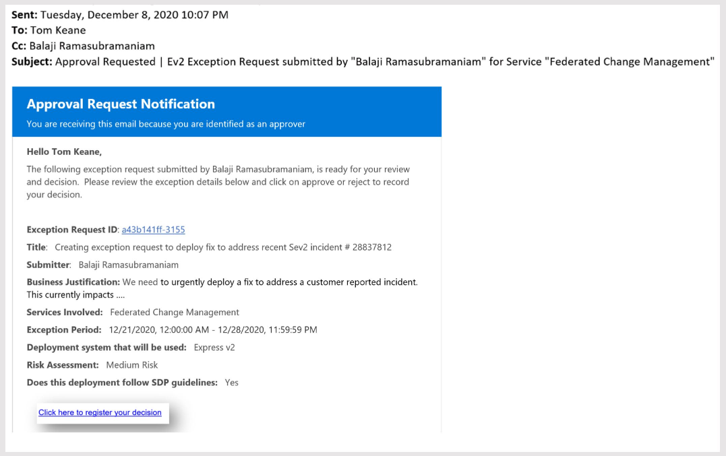

# How will service owners and approvers be informed about the current state of an exception request?
When an exception is submitted, the approver will receive an email (and the requestor will be on the CC line) confirming that the request was successfully submitted (Figure-5). Requestors and approvers can also navigate directly to exception management portal to review the status of a given exception request.

**Figure 5** - Example: Automated approval request email notification that is sent to approvers.

