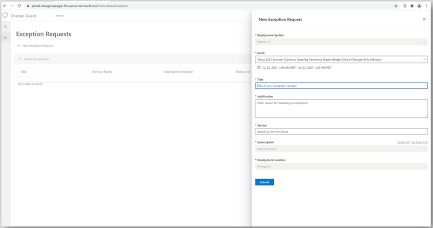
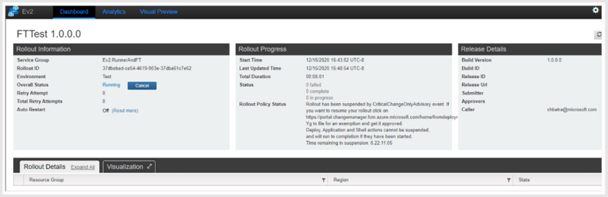
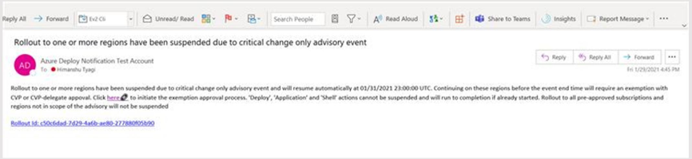
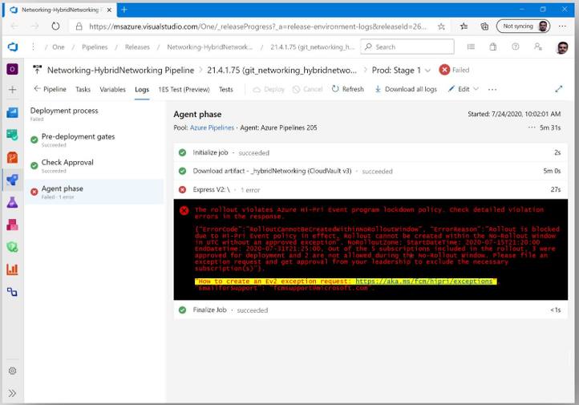

# How to Create an Ev2 Exception Request - Proactive and Reactive Scenarios

## How to Create an Ev2 exception request in advance for a critical deployment that is planned during a Hi-Pri CCOA? (Proactive)
Service owners can raise an Ev2 exception request by following the steps outlined below.
1. Navigate to https://aka.ms/changeguard to create a new Ev2 exception request (Figure 1).
2. Complete all the required fields (title, business justification, etc..), click the submit button at the bottom of the form to kick off the approval process. Upon submission, the approver and requestor will both receive an email notification (Figure 5).

**Figure 1** - Requesting an Ev2 exception in advance for a deployment planned during a Hi-Pri CCOA

## How to create an Ev2 exception request for a critical deployment that is currently blocked during a Hi-Pri CCOA? (Reactive)
Service owners can raise an Ev2 exception request for their Ev2 rollout from the embedded link from any of the Ev2 entry points a) via Ev2 portal upon restarting an existing rollout (as shown in Figure 2); b) via Ev2 email notification (as shown in Figure 3) and c) via OneBranch VSRM + Ev2 Compliance Release pipeline task (as shown in Figure 4).

Step 1: Navigate from the Ev2 entry point to complete the prepopulated Ev2 exception form. Step 2: Complete all the required fields (title, justification, etc..) and click the submit button at the bottom of the form to start approval process.

**Figure 2** - Example: Request an exception to unlock the blocked rollout/deployment while tracking it from Ev2 Portal

**Figure 3** - Example: Request an exception to unlock the blocked rollout/deployment by navigating from the Ev2 rollout notification email.

**Figure 4** - Example: Request an exception to unlock the blocked rollout/deployment by navigating from the OneBranch VSRM/Ev2 compliance release pipeline to the prepopulated exception form.

