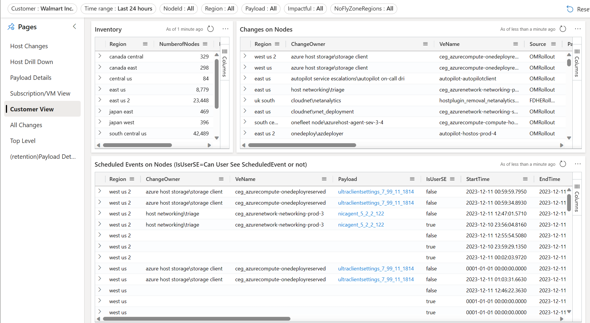

### <a name="CustomerView"> <h1> Navigating the “Customer” View </h1> </a>

The “Customer View” provides a summary view of host updates made to customer VM(s) such as Batched updates, Scheduled Events, OM rollouts, Live Migration etc.
The “Inventory” table shows the Number of Nodes and VMs summarized by region for the given customer.
The “Changes on Nodes” table shows the details of all the changes that are made on the nodes, on which the VM are hosted.

