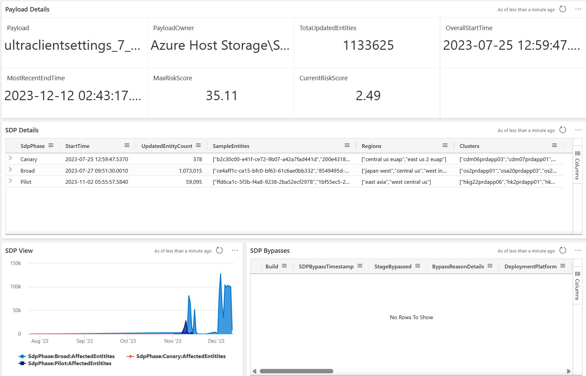

### <a name="payloadDetails"> <h1> Navigating the “Payload Details” View </h1> </a>

For a given payload, the “Payload Details” view provides the risk score of the payload, the payload owner, total count of entities that have received the payload, SDP details and SDP bypasses. The “Payload Details” view also provides the details of all the entity change events that occurred as deployment of the payload.

