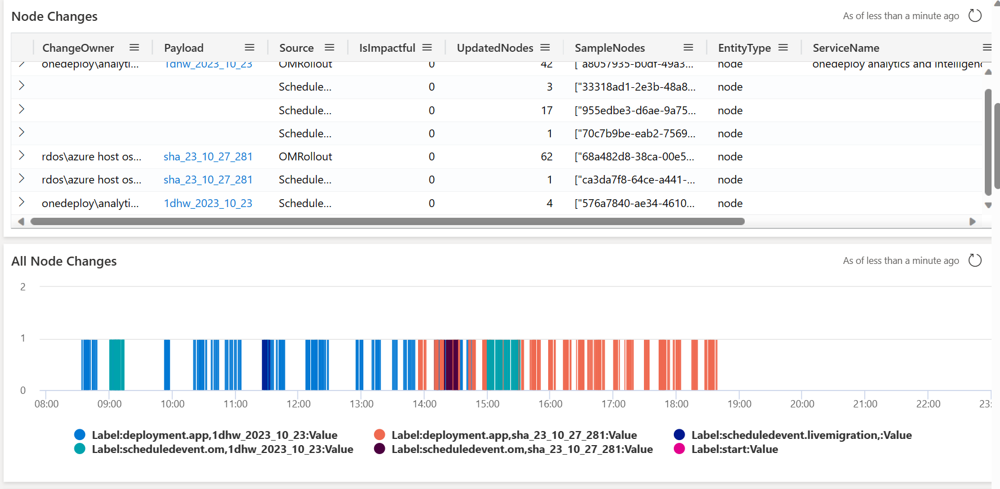
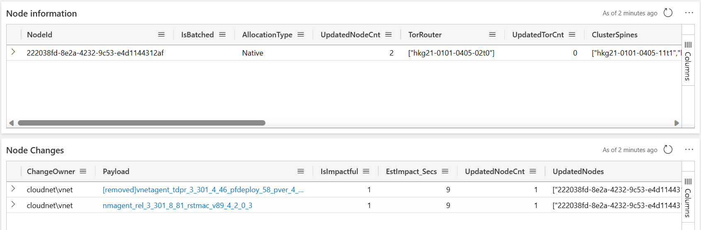
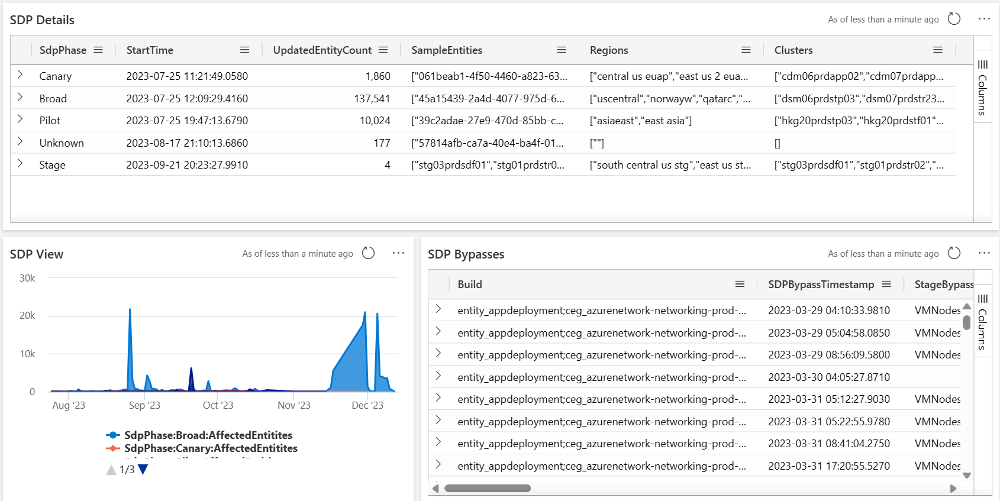
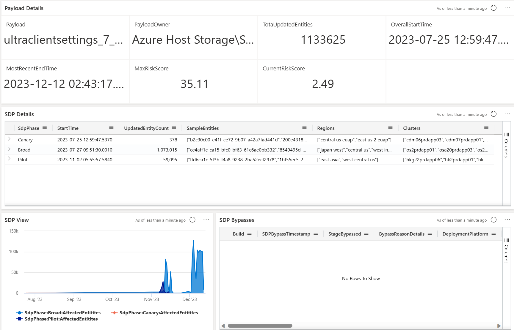

<h1>Examples/ Scenarios: </h1>


### <a name="E2E Scenario Subscription/VM"> <h2>A. E2E Scenario Subscription/VM - CRI from Tesco reporting un-expected impact with ScheduledEvents in West Europe </h2> </a>

1. Navigate to the subscription view and filter for the VMSS being affected by the CRI, [OneDeployFCM (azure.com)](https://dataexplorer.azure.com/dashboards/d0357802-00ae-48c7-85a2-5cf02d98de77?p-_startTime=2023-12-02T08-03-00Z&p-_endTime=2023-12-02T23-03-00Z&p-_subscriptionId=v-74ba4183-cbca-45aa-bcad-45fa6d8c600c%2C74ba4183-cbca-45aa-bcad-45fa6d8c600c&p-_VMSSId=v-%2FSUBSCRIPTIONS%2F74BA4183-CBCA-45AA-BCAD-45FA6D8C600C%2FRESOURCEGROUPS%2FMC_PROD1-STACK-MANGO_PROD1-MANGO_WESTEUROPE%2FPROVIDERS%2FMICROSOFT.COMPUTE%2FVIRTUALMACHINESCALESETS%2FAKS-MANGO2-10179778-VMSS&p-_VMSSId=v-%2FSUBSCRIPTIONS%2F74BA4183-CBCA-45AA-BCAD-45FA6D8C600C%2FRESOURCEGROUPS%2FMC_PROD1-STACK-MANGO_PROD1-MANGO_WESTEUROPE%2FPROVIDERS%2FMICROSOFT.COMPUTE%2FVIRTUALMACHINESCALESETS%2FAKS-MANGO3-40048547-VMSS&p-_VMArmId=all#94b18683-84fa-4c7c-a61d-9f31dd242ae3). 
The CRI identified the impact around 20:55 UTC on Dec 2nd. 
    
    Using this view we are able to determine that its not correlated to any of the OM rollouts, but to the Live Migration. This enables getting the LM team involved to mitigate. 



### <a name="E2E Scenario Host Changes"> <h2>B. E2E Scenario Host Changes ->  Payload Details, Host Drill Down (Navigation using hyperlinks) </h2> </a>

Incident [425027989](https://portal.microsofticm.com/imp/v3/incidents/incident/425027989/summary) : [S500] [CSS SEV A] [ARR] [MySQL] - [Slow performance taking long time to queries] | CXP ACE S500 Customer - HSBC PayMe  

  
1. Navigate to [Host Changes](https://dataexplorer.azure.com/dashboards/d0357802-00ae-48c7-85a2-5cf02d98de77?p-_startTime=1hours&p-_endTime=now&p-_region=all&p-_cluster=all&p-_serviceName=all&p-_payload=all#91d01f68-e694-4da7-9181-641151bec452) and filter for cluster (hkg21prdstf01) over that time duration. Select End time as incident start time: 2023-09-20 11:56:01 UTC, and StartTime as 2023-09-20 04:56:01 PDT (–3 hrs from the incident started). 

    The [results](https://dataexplorer.azure.com/dashboards/d0357802-00ae-48c7-85a2-5cf02d98de77?p-_startTime=2023-09-20T08-39-00Z&p-_endTime=2023-09-20T11-39-00Z&p-_region=all&p-_cluster=v-hkg21prdstf01&p-_payload=all#91d01f68-e694-4da7-9181-641151bec452) shows there is an impactful NMAgent change deployed to the cluster .   


2. Using Node to find the most accurate changes, as provided in the incident the node that got affected is “222038fd-8e2a-4232-9c53-e4d1144312af", drilling to Host Drill Down view and specifying the Node, also shows the impactful NMAgent change being deployed to the Node.  

    The [results](https://dataexplorer.azure.com/dashboards/d0357802-00ae-48c7-85a2-5cf02d98de77?p-_startTime=2023-09-20T05-39-00Z&p-_endTime=2023-09-20T11-39-00Z&p-_nodeid=v-222038fd-8e2a-4232-9c53-e4d1144312af&p-_entityTypeNode=all#08c31477-dfa3-43d3-9427-a6a57b228c43) shows there is an impact full NMAgent change deployed to the Node.   



3. Navigate to [Payload view](https://dataexplorer.azure.com/dashboards/d0357802-00ae-48c7-85a2-5cf02d98de77?p-_entityType=all&p-_payload=v-nmagent_rel_3_301_8_81_rstmac_v89_4_2_0_3#84c6c83e-687d-44a3-a599-110f700efce7) to get SDP progression, SDP bypass and additional info on Payload . (Note: NMAgent payload has been identified as one of the root cause for network latency and query time outs.)



 ### <a name="E2E Scenario Customer View"> <h2>C. E2E Scenario Customer View ->  Payload Details, Host Drill Down (Navigation using hyperlinks) </h2> </a>

 **RedButton CRI from Walmart reporting un-expected impact with ScheduledEvents in West US** 

 1. Here we start with the [Customer View](https://dataexplorer.azure.com/dashboards/d0357802-00ae-48c7-85a2-5cf02d98de77?p-_customer=v-Walmart+Inc.&p-_startTime=1hours&p-_endTime=now&p-_nodeid=all&p-_region=all&p-_payload=all&p-_impactful=v-All&p-_noflyzone=all#f6ae4f7b-26a3-4a54-aa13-6d777c774f54) and Select [Walmart](https://dataexplorer.azure.com/dashboards/d0357802-00ae-48c7-85a2-5cf02d98de77?p-_customer=v-Walmart+Inc.&p-_startTime=2023-12-08T19-13-54Z&p-_endTime=2023-12-08T22-13-54Z&p-_nodeid=all&p-_region=v-west+us&p-_payload=all&p-_impactful=v-All&p-_noflyzone=all#f6ae4f7b-26a3-4a54-aa13-6d777c774f54) and filter for West US.


 2. We find the payload ceg_azurecompute-onedeployreserved has been deploying the payload [ultraclientsettings_7_99_11_1814](https://dataexplorer.azure.com/dashboards/d0357802-00ae-48c7-85a2-5cf02d98de77?p-_entityType=all&p-_payload=v-ultraclientsettings_7_99_11_1814#84c6c83e-687d-44a3-a599-110f700efce7), and there was 1 Batching update. 

    We can jump to the payload view to see the progression of the payload and if any SDP Bypasses were done, which we did not see.



3. Jump to the [Host Drill Down view](https://dataexplorer.azure.com/dashboards/d0357802-00ae-48c7-85a2-5cf02d98de77?p-_startTime=2023-12-08T19-13-54Z&p-_endTime=2023-12-08T22-13-54Z&p-_nodeid=v-3a491bfc-5af3-2148-11d6-86a2d765cc8c%2Cbcfd771e-aecd-b710-b0e4-5ed503bc1b20%2C777e97c5-4894-660c-5978-f96d156e3211%2C35b393ea-b4c2-43be-9af7-9a05302e500e%2C5be33b74-9c3f-4717-abdc-82add72a02c0%2C0612cca5-9c4f-3858-4838-3be181e28403%2C115e0149-f9ca-1683-65b6-39edc86318a8%2C638a12c8-3d88-218d-924a-aac1ffce3c26%2C5ebb3a93-e411-4328-a292-6df006c298a1%2Cd9f7f549-e9a2-48a3-b5d0-f02f4be6a991&p-_entityTypeNode=all#08c31477-dfa3-43d3-9427-a6a57b228c43), we see that the Regressed AIR BP signal observed is not correlated to this payload OM rollout. 

    **Hence we can quickly confirm that the regression is unrelated to the host changes.**


### <a name="navigatingControlPlaneChanges"> <h2>Navigating Incidents that involve Control Plane Changes </h2> </a>

**What type of Incidents are caused by Control Plane Changes?**

CRUD operation failures on VM, VMSS 

**Incident pattern** - ApiUnexpectedFailures exceeded thresholds for ApiName: virtualmachinescalesets.resourceoperation.put. Location: < Region >. 

Example of Control plane Incident: [Incident-440639800 Details - IcM (microsofticm.com)](https://portal.microsofticm.com/imp/v3/incidents/incident/440639800/summary) 

OR [Incident 425736167](https://portal.microsofticm.com/imp/v3/incidents/incident/425736167/summary) : CRUD operations failing for compute resources in …. 


### <a name="controlPlaneChanges"> **How to find Control plane changes?** </a>

Select the fabricCluster as the EntityId to get granular results 

If fabriccluster is not available, choose the region 

**How to Identify fabricCluster for a given VM?**

If you know the VMId, you can find the fabric cluster using the query  

```
cluster('azcrp.kusto.windows.net').database('crp_allprod').VMApiQosEvent
| where vMId =='<VMID>'
| project fabricCluster,PreciseTimeStamp
| order by PreciseTimeStamp desc
| limit 100
```

**Where and what input is given in the dashboard to show the control plane changes?**

Identify the fabric cluster: uswestcentral-prod-a (provided in the incident 440639800) 

Identify control plane changes: 

1. Go to All Changes view  [FCM (azure.com)](https://dataexplorer.azure.com/dashboards/d0357802-00ae-48c7-85a2-5cf02d98de77?p-_startTime=1hours&p-_endTime=now&p-_entityIds=all&p-_region=all&p-_availabilityZone=all&p-_datacenter=all&p-_cluster=all&p-_serviceName=v-Azure+Cosmos+DB&p-_icmTeamName=all&p-_source=all&p-_entityType=all&p-_veName=all&p-_payload=all&p-_payloadOwner=all#66cc3653-ecde-4c2c-9d24-1838d351d4d4) 

2. Make sure you remove/reset any filters, already set 

3. Enter the fabric cluster in to EntityId: uswestcentral-prod-a 

4. Enter the above fabric cluster name in the EntityId filter and set the time line correctly, recommended to use –24 hrs as the start time from the incident start time. There are scenarios where the issue was latent, so set the time filters as needed. 


Dashboard link: [here](https://dataexplorer.azure.com/dashboards/d0357802-00ae-48c7-85a2-5cf02d98de77?p-_startTime=2023-11-09T23-51-00Z&p-_endTime=2023-11-10T23-51-00Z&p-_entityIds=v-uswestcentral-prod-a&p-_region=all&p-_availabilityZone=all&p-_datacenter=all&p-_cluster=all&p-_serviceName=all&p-_icmTeamName=all&p-_source=all&p-_entityType=all&p-_veName=all&p-_payload=all&p-_payloadOwner=all#66cc3653-ecde-4c2c-9d24-1838d351d4d4) 


### <a name="networkingChanges"> <h2>Navigating Incidents that involve Networking Changes </h2> </a>

**What type of Incidents are caused by SDN Changes?**

Network latencies, lost connection with the VM, lost connection between compute and storage nodes

**Example of SDN  Incident:**

[Incident-425027989 Details - IcM (microsofticm.com)](https://portal.microsofticm.com/imp/v3/incidents/details/425027989/home), The Host updates (NMAgent ) has triggered query time outs, followed by more issues on the client side

**Where and what is the input given in the dashboard to show the SDN (software defined network) changes**

The first step in identifying the host updates is to identify the node or cluster or storage tenant/cluster. In the above incident, the below Entities/locations are identified

**Storage Nodes:** 222038fd-8e2a-4232-9c53-e4d1144312af, 3206df73-7121-480a-9bf3-65169887a5d1, 9ded79f9-5971-4b61-a187-7b05d0d425e4

**Storage Tenant:** ms-hkg21prdstf01a

**Storage Cluster:** hkg21prdstf01

If granular location is provided, then the number of changes will be confined, correlated and accurate. It is highly recommended to inputs node’s affected to get accurate results. 

**Changes for Nodes:** 

1. Go to [Node View](https://dataexplorer.azure.com/dashboards/d0357802-00ae-48c7-85a2-5cf02d98de77?p-_startTime=1hours&p-_endTime=now&p-_nodeid=all&p-_dynamicMeasure=all&p-_entityTypeNode=all#08c31477-dfa3-43d3-9427-a6a57b228c43)
2. Get the nodes affected in the comma separated format, in this case 222038fd-8e2a-4232-9c53-e4d1144312af, 3206df73-7121-480a-9bf3-65169887a5d1, 9ded79f9-5971-4b61-a187-7b05d0d425e4 
3. Enter the above comma separated values into NodeId filter and set the time line correctly, recommended to use –24 hrs as the start time from the incident start time. There are scenarios where the issue was latent, so set the time filters as needed. 


Dashboard link : [here](https://dataexplorer.azure.com/dashboards/d0357802-00ae-48c7-85a2-5cf02d98de77?p-_startTime=2023-09-19T11-56-00Z&p-_endTime=2023-09-20T11-56-00Z&p-_nodeid=v-222038fd-8e2a-4232-9c53-e4d1144312af%2C+3206df73-7121-480a-9bf3-65169887a5d1%2C+9ded79f9-5971-4b61-a187-7b05d0d425e4&p-_dynamicMeasure=all&p-_entityTypeNode=v-node#08c31477-dfa3-43d3-9427-a6a57b228c43) 

**Changes for StorageTenant:**

1. Go to All Changes view  [FCM (azure.com)](https://dataexplorer.azure.com/dashboards/d0357802-00ae-48c7-85a2-5cf02d98de77?p-_startTime=1hours&p-_endTime=now&p-_entityIds=all&p-_region=all&p-_availabilityZone=all&p-_datacenter=all&p-_cluster=all&p-_serviceName=v-Azure+Cosmos+DB&p-_icmTeamName=all&p-_source=all&p-_entityType=all&p-_veName=all&p-_payload=all&p-_payloadOwner=all#66cc3653-ecde-4c2c-9d24-1838d351d4d4) 

2. Make sure you remove/reset any filters, already set 

3. Enter the storage tenant in EntityId : ms-hkg21prdstf01a 

4. Enter the above SQL cluster name in the EntityId filter and set the time line correctly, recommended to use –24 hrs as the start time from the incident start time. There are scenarios where the issue was latent, so set the time filters as needed. 


Dashboard link : [here](https://dataexplorer.azure.com/dashboards/d0357802-00ae-48c7-85a2-5cf02d98de77?p-_startTime=2023-09-19T11-56-00Z&p-_endTime=2023-09-20T11-56-00Z&p-_entityIds=v-ms-hkg21prdstf01a&p-_region=all&p-_availabilityZone=all&p-_datacenter=all&p-_cluster=all&p-_serviceName=all&p-_icmTeamName=all&p-_source=all&p-_entityType=all&p-_veName=all&p-_payload=all&p-_payloadOwner=all#66cc3653-ecde-4c2c-9d24-1838d351d4d4) 

**Changes for Cluster:** 

1. Go to All Changes view  [FCM (azure.com)](https://dataexplorer.azure.com/dashboards/d0357802-00ae-48c7-85a2-5cf02d98de77?p-_startTime=1hours&p-_endTime=now&p-_entityIds=all&p-_region=all&p-_availabilityZone=all&p-_datacenter=all&p-_cluster=all&p-_serviceName=v-Azure+Cosmos+DB&p-_icmTeamName=all&p-_source=all&p-_entityType=all&p-_veName=all&p-_payload=all&p-_payloadOwner=all#66cc3653-ecde-4c2c-9d24-1838d351d4d4) 
2. Make sure you remove/reset any filters, already set 
3. Enter the Cluster in Cluster filter: hkg21prdstf01 
4. Enter the above SQL cluster name in the EntityId filter and set the timeline correctly, recommended to use –24 hrs as the start time from the incident start time. There are scenarios where the issue was latent, so se the time filters as needed. 


Dashboard link : [here](https://dataexplorer.azure.com/dashboards/d0357802-00ae-48c7-85a2-5cf02d98de77?p-_startTime=2023-09-19T11-56-00Z&p-_endTime=2023-09-20T11-56-00Z&p-_entityIds=v-ms-hkg21prdstf01a&p-_region=all&p-_availabilityZone=all&p-_datacenter=all&p-_cluster=all&p-_serviceName=all&p-_icmTeamName=all&p-_source=all&p-_entityType=all&p-_veName=all&p-_payload=all&p-_payloadOwner=all#66cc3653-ecde-4c2c-9d24-1838d351d4d4) 


### <a name="storageChanges"> <h2>SQL reports that a tenant is unhealthy and needs to investigate potential host- related culprits: </h2> </a>

Identify Changes made to SQL cluster, For example incident [429061332](https://portal.microsofticm.com/imp/v3/incidents/incident/429061332/summary)

SQL cluster: tr21509.eastus2-a.worker.database.windows.net 

**Changes for SQL Cluster:** 

1. Go to All Changes view  [FCM (azure.com)](https://dataexplorer.azure.com/dashboards/d0357802-00ae-48c7-85a2-5cf02d98de77?p-_startTime=1hours&p-_endTime=now&p-_entityIds=all&p-_region=all&p-_availabilityZone=all&p-_datacenter=all&p-_cluster=all&p-_serviceName=v-Azure+Cosmos+DB&p-_icmTeamName=all&p-_source=all&p-_entityType=all&p-_veName=all&p-_payload=all&p-_payloadOwner=all#66cc3653-ecde-4c2c-9d24-1838d351d4d4) 

2. Make sure you remove/reset any filters, already set 

3. Get the SQL cluster : tr21509.eastus2-a.worker.database.windows.net 

4. Enter the above SQL cluster name in the EntityId filter and set the time line correctly, recommended to use –24 hrs as the start time from the incident start time. There are scenarios where the issue was latent, so se the time filters as needed. 


Dashboard Link : [here](https://dataexplorer.azure.com/dashboards/d0357802-00ae-48c7-85a2-5cf02d98de77?p-_startTime=2023-10-03T15-42-00Z&p-_endTime=2023-10-04T15-42-00Z&p-_entityIds=v-tr21509.eastus2-a.worker.database.windows.net&p-_region=all&p-_availabilityZone=all&p-_datacenter=all&p-_cluster=all&p-_serviceName=all&p-_icmTeamName=all&p-_source=all&p-_entityType=all&p-_veName=all&p-_payload=all&p-_payloadOwner=all#66cc3653-ecde-4c2c-9d24-1838d351d4d4) 

If the above SQL change is not identified as the culprit, lets dig into node’s the SQL cluster is hosted on find host changes 

For the above SQL cluster, the node identified is: 668fd9f1-ceb8-6d43-606c-280cde4c930c ( SQL team can provide the node’s on which the Cluster is hosted) 

**Changes for Nodes:**

1. Go to [Node View](https://dataexplorer.azure.com/dashboards/d0357802-00ae-48c7-85a2-5cf02d98de77?p-_startTime=1hours&p-_endTime=now&p-_nodeid=all&p-_dynamicMeasure=all&p-_entityTypeNode=all#08c31477-dfa3-43d3-9427-a6a57b228c43) 
2. Get the nodes affected in the comma separated format, in this case : 668fd9f1-ceb8-6d43-606c-280cde4c930c  
3. Enter the above comma separated values into NodeId filter and set the time line correctly, recommended to use –24 hrs as the start time from the incident start time. There are scenarios where the issue was latent, so se the time filters as needed. 


Dashboard link : [here](https://dataexplorer.azure.com/dashboards/d0357802-00ae-48c7-85a2-5cf02d98de77?p-_startTime=2023-10-03T15-42-00Z&p-_endTime=2023-10-04T15-42-00Z&p-_nodeid=v-668fd9f1-ceb8-6d43-606c-280cde4c930c&p-_dynamicMeasure=all&p-_entityTypeNode=all#08c31477-dfa3-43d3-9427-a6a57b228c43) 

**Identifying TOR, T1, T2 Changes for the Node:** 

The connection to the Node can be lost/interrupted due to update to the TOR, T1’s, T2’s connected to the Node. Since TOR is single point of failure, check for Tor updates. (There is more redundancy for T1 and T2, so mostly T1, T2 changes do not impact the Node). 

The node information table in node view provides a summary and details of the node, example cluster, TOR, number of changes made to TOR, T1, number of changes made to T1, is the node batched, node allocation type (Empty Node, MultipleUpdate) etc. 

To Identify ToR, T1 and T2 changes, go to Node View and select the nodeid, follow the same steps as identifying node changes mentioned above. 

After the filters are set and queried for changes, scroll down in the Node view to look for TOR, T1 and T2 changes 


Dashboard Link: [here](https://dataexplorer.azure.com/dashboards/d0357802-00ae-48c7-85a2-5cf02d98de77?p-_startTime=2023-10-03T15-42-00Z&p-_endTime=2023-10-04T15-42-00Z&p-_nodeid=v-668fd9f1-ceb8-6d43-606c-280cde4c930c&p-_dynamicMeasure=all&p-_entityTypeNode=all#08c31477-dfa3-43d3-9427-a6a57b228c43)


