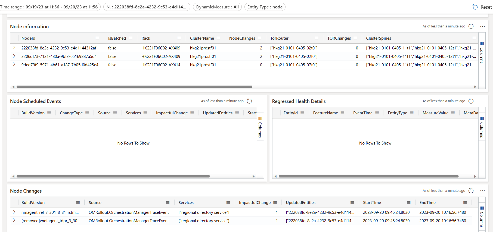
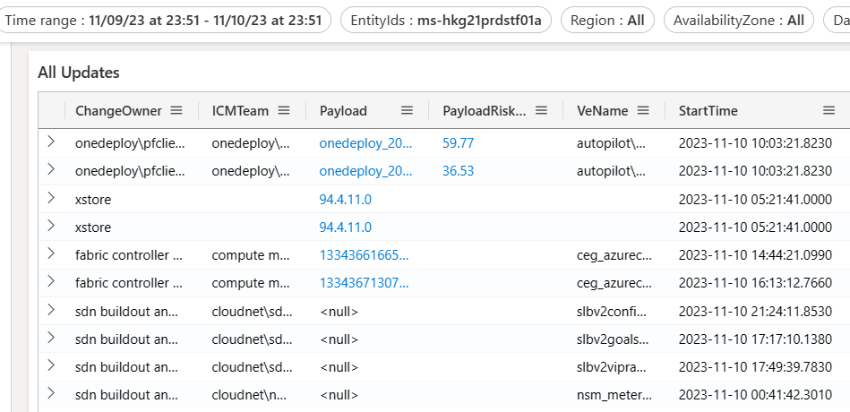
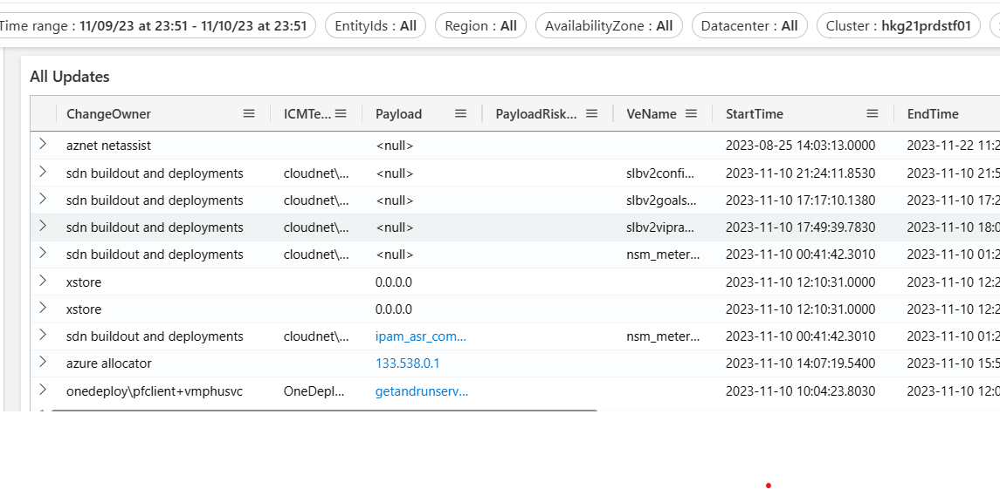

# Navigating Incidents That Involve Networking Changes

## What Types of Incidents Are Caused by SDN Changes?

- **Network Latencies**
- **Lost Connection with the VM**
- **Lost Connection Between Compute and Storage Nodes**

### Example of SDN Incident

- [Incident-425027989](https://portal.microsofticm.com/imp/v3/incidents/details/425027989/home)

  - The Host updates (NMAgent) triggered query timeouts, followed by more issues on the client side.

## How to Identify SDN Changes

### Step 1: Identify the Affected Components

- **Storage Nodes**:

  - `222038fd-8e2a-4232-9c53-e4d1144312af`
  - `3206df73-7121-480a-9bf3-65169887a5d1`
  - `9ded79f9-5971-4b61-a187-7b05d0d425e4`
- **Storage Tenant**: `ms-hkg21prdstf01a`
- **Storage Cluster**: `hkg21prdstf01`

### Step 2: Identify Changes for Nodes

- **Go to Node View**: [Node View](https://dataexplorer.azure.com/dashboards/...)
- **Enter Node IDs**: Input the Node IDs into the **NodeId** filter.
- **Set Timeline**: Recommended to use **Start Time** as 24 hours before the incident start time.

**Dashboard Link**: [Node View Dashboard](https://dataexplorer.azure.com/dashboards/...)

### Step 3: Identify Changes for Storage Tenant

- **Go to All Changes View**: [All Changes View](https://dataexplorer.azure.com/dashboards/...)
- **Reset Filters**
- **Enter Storage Tenant**: Input `ms-hkg21prdstf01a` into the **EntityId** filter.
- **Set Timeline**

**Dashboard Link**: [Storage Tenant Changes Dashboard](https://dataexplorer.azure.com/dashboards/...)

### Step 4: Identify Changes for Cluster

- **Go to All Changes View**
- **Reset Filters**
- **Enter Cluster**: Input `hkg21prdstf01` into the **Cluster** filter.
- **Set Timeline**

**Dashboard Link**: [Cluster Changes Dashboard](https://dataexplorer.azure.com/dashboards/...)
