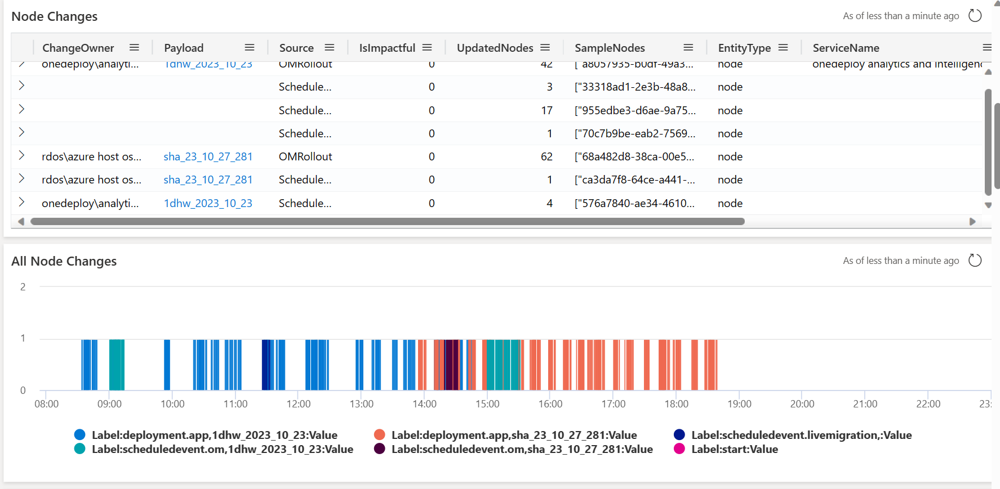

# Scenario A: E2E Scenario - Subscription/VM Impact

## CRI from Tesco Reporting Unexpected Impact with Scheduled Events in West Europe

### Step 1: Navigate to the Subscription View

- **Filter for the VMSS being affected by the CRI**: [OneDeployFCM (azure.com)](https://dataexplorer.azure.com/dashboards/d0357802-00ae-48c7-85a2-5cf02d98de77?p-_startTime=2023-12-02T08-03-00Z&p-_endTime=2023-12-02T23-03-00Z&p-_subscriptionId=v-74ba4183-cbca-45aa-bcad-45fa6d8c600c%2C74ba4183-cbca-45aa-bcad-45fa6d8c600c&p-_VMSSId=v-%2FSUBSCRIPTIONS%2F74BA4183-CBCA-45AA-BCAD-45FA6D8C600C%2FRESOURCEGROUPS%2FMC_PROD1-STACK-MANGO_PROD1-MANGO_WESTEUROPE%2FPROVIDERS%2FMICROSOFT.COMPUTE%2FVIRTUALMACHINESCALESETS%2FAKS-MANGO2-10179778-VMSS&p-_VMSSId=v-%2FSUBSCRIPTIONS%2F74BA4183-CBCA-45AA-BCAD-45FA6D8C600C%2FRESOURCEGROUPS%2FMC_PROD1-STACK-MANGO_PROD1-MANGO_WESTEUROPE%2FPROVIDERS%2FMICROSOFT.COMPUTE%2FVIRTUALMACHINESCALESETS%2FAKS-MANGO3-40048547-VMSS&p-_VMArmId=all#94b18683-84fa-4c7c-a61d-9f31dd242ae3).

  The CRI identified the impact around **20:55 UTC on Dec 2nd**.
- **Analysis**: Using this view, we can determine that the issue is not correlated with any of the OM rollouts but is related to the **Live Migration**. This enables us to involve the Live Migration (LM) team to mitigate the issue.

