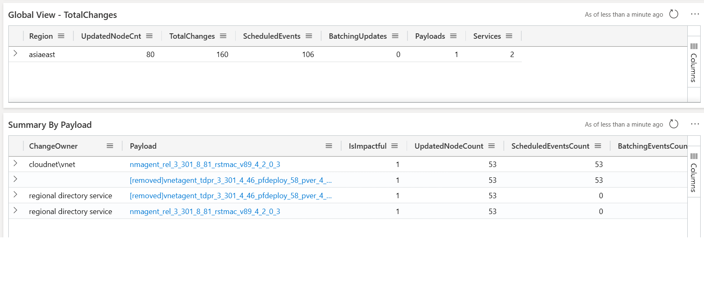
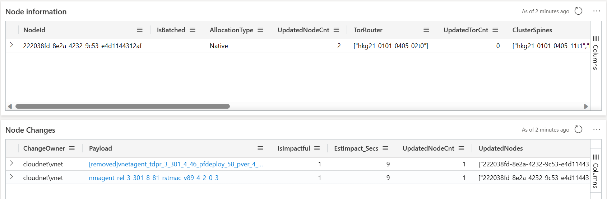
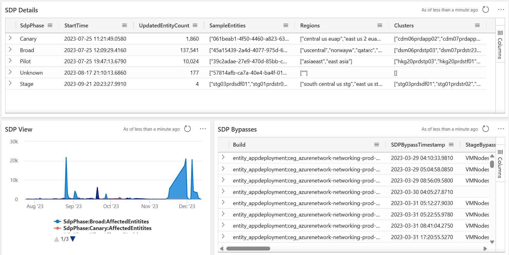

# Examples/Scenarios

## B. E2E Scenario Host Changes - Analyzing Payload Details and Host Drill Down

Incident [425027989](https://portal.microsofticm.com/imp/v3/incidents/incident/425027989/summary): **[S500] [CSS SEV A] [ARR] [MySQL] - Slow Query Performance Impacting HSBC PayMe**

<iframe src="https://microsoft-my.sharepoint.com/personal/azizjalelb_microsoft_com/_layouts/15/embed.aspx?UniqueId=b4e75fee-7af2-4326-af97-be0a00ed6867&embed=%7B%22ust%22%3Atrue%2C%22hv%22%3A%22CopyEmbedCode%22%7D&referrer=StreamWebApp&referrerScenario=EmbedDialog.Create" width="640" height="360" frameborder="0" scrolling="no" allowfullscreen title="ScB Demo CI.mp4"></iframe>

### 1. Navigate to the Host Changes View

- Access the [Host Changes dashboard](https://dataexplorer.azure.com/dashboards/d0357802-00ae-48c7-85a2-5cf02d98de77?p-_startTime=1hours&p-_endTime=now&p-_region=all&p-_cluster=all&p-_serviceName=all&p-_payload=all#91d01f68-e694-4da7-9181-641151bec452) and filter for the affected **cluster (`hkg21prdstf01`)**.
- **Set the time range**:

  - **Start Time**: 2023-09-20 04:56:01 PDT (3 hours before the incident start).
  - **End Time**: 2023-09-20 11:56:01 UTC (incident start time).
- This filter helps isolate changes that could have contributed to the incident.
- The [results](https://dataexplorer.azure.com/dashboards/d0357802-00ae-48c7-85a2-5cf02d98de77?p-_startTime=2023-09-20T08-39-00Z&p-_endTime=2023-09-20T11-39-00Z&p-_region=all&p-_cluster=v-hkg21prdstf01&p-_payload=all#91d01f68-e694-4da7-9181-641151bec452) reveal an **NMAgent change** deployed to the cluster during this time frame, which could be linked to the observed performance issues.

### 2. Drill Down to the Specific Node

- Use the **Node ID** provided in the incident details, **"222038fd-8e2a-4232-9c53-e4d1144312af"**, to narrow down the search.
- Navigate to the [Host Drill Down view](https://dataexplorer.azure.com/dashboards/d0357802-00ae-48c7-85a2-5cf02d98de77?p-_startTime=2023-09-20T05-39-00Z&p-_endTime=2023-09-20T11-39-00Z&p-_nodeid=v-222038fd-8e2a-4232-9c53-e4d1144312af&p-_entityTypeNode=all#08c31477-dfa3-43d3-9427-a6a57b228c43) and specify the **Node ID** to get detailed information about changes affecting that node.
- The results confirm the **NMAgent change was deployed** to this node as well, providing a stronger correlation between the deployment and the incident.

### 3. Review the Payload Details

- Go to the [Payload view](https://dataexplorer.azure.com/dashboards/d0357802-00ae-48c7-85a2-5cf02d98de77?p-_entityType=all&p-_payload=v-nmagent_rel_3_301_8_81_rstmac_v89_4_2_0_3#84c6c83e-687d-44a3-a599-110f700efce7) to get insights into the **SDP progression, SDP bypass status,** and any other relevant payload information.
- The **NMAgent payload** identified here has been recognized as a potential root cause for **network latency and query timeouts**, contributing to the slow performance reported during the incident.

