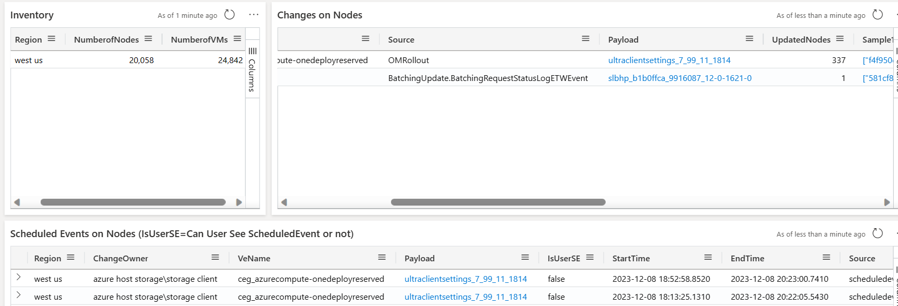
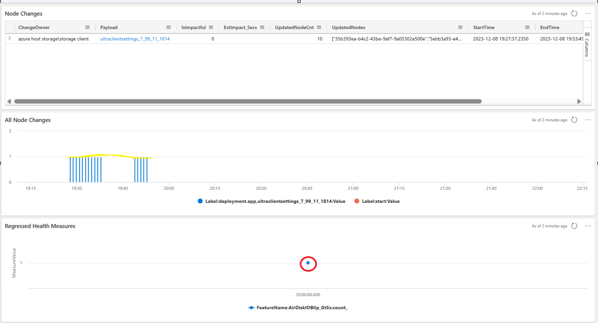

# Scenario C: E2E Scenario - Customer View Analysis

## RedButton CRI from Walmart Reporting Unexpected Impact with Scheduled Events in West US

### Step 1: Start with the Customer View

- **Access the Customer View**: [Customer View](https://dataexplorer.azure.com/dashboards/d0357802-00ae-48c7-85a2-5cf02d98de77?p-_customer=v-Walmart+Inc.&p-_startTime=1hours&p-_endTime=now&p-_nodeid=all&p-_region=all&p-_payload=all&p-_impactful=v-All&p-_noflyzone=all#f6ae4f7b-26a3-4a54-aa13-6d777c774f54)
- **Select Customer**: `Walmart Inc.`
- **Filter for Region**: `West US`

### Step 2: Identify the Payload

- **Payload**: `ceg_azurecompute-onedeployreserved`
- **Deployed Payload**: `ultraclientsettings_7_99_11_1814`
- **Batching Update**: There was 1 batching update.
- **Access the Payload View** to see the progression and any SDP bypasses (none observed).

### Step 3: Jump to Host Drill Down View

- **Access the Host Drill Down View**: [Host Drill Down View](https://dataexplorer.azure.com/dashboards/d0357802-00ae-48c7-85a2-5cf02d98de77?p-_startTime=2023-12-08T19-13-54Z&p-_endTime=2023-12-08T22-13-54Z&p-_nodeid=v-3a491bfc-5af3-2148-11d6-86a2d765cc8c%2Cbcfd771e-aecd-b710-b0e4-5ed503bc1b20%2C777e97c5-4894-660c-5978-f96d156e3211%2C35b393ea-b4c2-43be-9af7-9a05302e500e%2C5be33b74-9c3f-4717-abdc-82add72a02c0%2C0612cca5-9c4f-3858-4838-3be181e28403%2C115e0149-f9ca-1683-65b6-39edc86318a8%2C638a12c8-3d88-218d-924a-aac1ffce3c26%2C5ebb3a93-e411-4328-a292-6df006c298a1%2Cd9f7f549-e9a2-48a3-b5d0-f02f4be6a991&p-_entityTypeNode=all#08c31477-dfa3-43d3-9427-a6a57b228c43)
- **Observation**: The regressed AIR BP signal observed is not correlated to this payload OM rollout.

**Conclusion**: We can quickly confirm that the regression is unrelated to the host changes.

