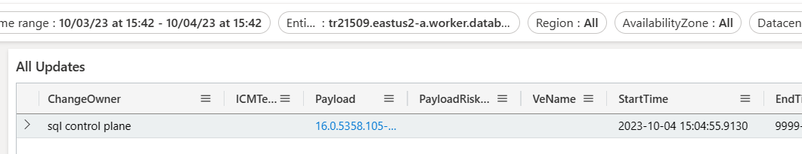
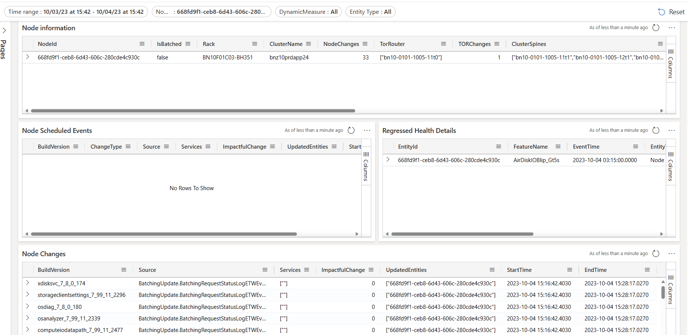
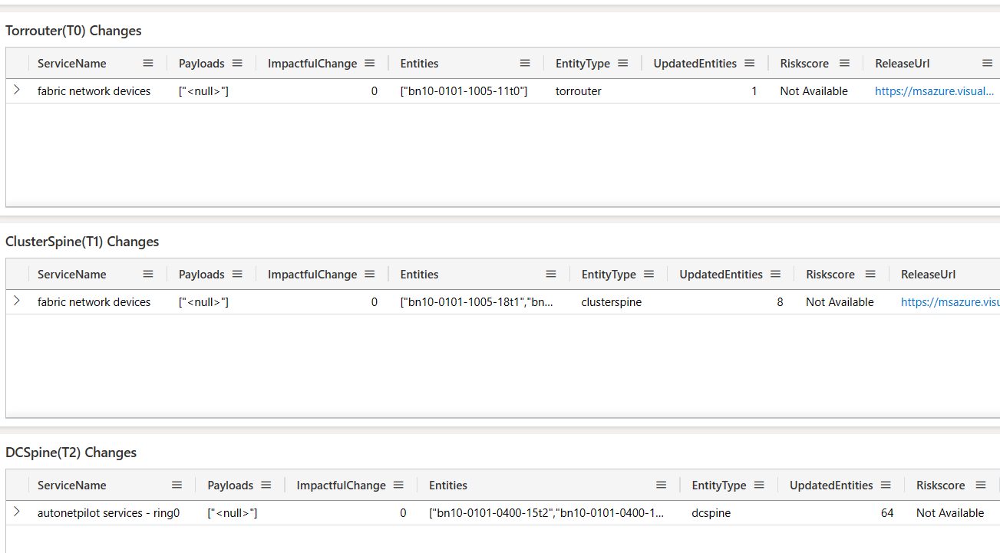

# Investigating Unhealthy SQL Tenants and Host-Related Culprits

## Scenario

**SQL reports that a tenant is unhealthy and needs to investigate potential host-related culprits.**

### Example Incident

- [Incident-429061332](https://portal.microsofticm.com/imp/v3/incidents/incident/429061332/summary)
- **SQL Cluster**: `tr21509.eastus2-a.worker.database.windows.net`

## Identifying Changes for SQL Cluster

### Step 1: Go to All Changes View

- **Access All Changes View**: [All Changes View](https://dataexplorer.azure.com/dashboards/...)
- **Reset Filters**
- **Enter SQL Cluster Name**: Input `tr21509.eastus2-a.worker.database.windows.net` into the **EntityId** filter.
- **Set Timeline**: Recommended to use **Start Time** as 24 hours before the incident start time.

**Dashboard Link**: [SQL Cluster Changes Dashboard](https://dataexplorer.azure.com/dashboards/...)

### Step 2: If SQL Changes Are Not the Culprit, Investigate Nodes

- **Node ID**: `668fd9f1-ceb8-6d43-606c-280cde4c930c` (provided by the SQL team)

## Identifying Changes for Nodes

### Step 1: Go to Node View

- **Access Node View**: [Node View](https://dataexplorer.azure.com/dashboards/...)
- **Enter Node ID**: Input the Node ID into the **NodeId** filter.
- **Set Timeline**

**Dashboard Link**: [Node Changes Dashboard](https://dataexplorer.azure.com/dashboards/...)

## Identifying TOR, T1, T2 Changes for the Node

- **TOR**: Top of Rack switch updates can be a single point of failure.
- **Go to Node View** and look for TOR, T1, and T2 changes in the Node Information Table.

**Dashboard Link**: [TOR, T1, T2 Changes Dashboard](https://dataexplorer.azure.com/dashboards/...)
