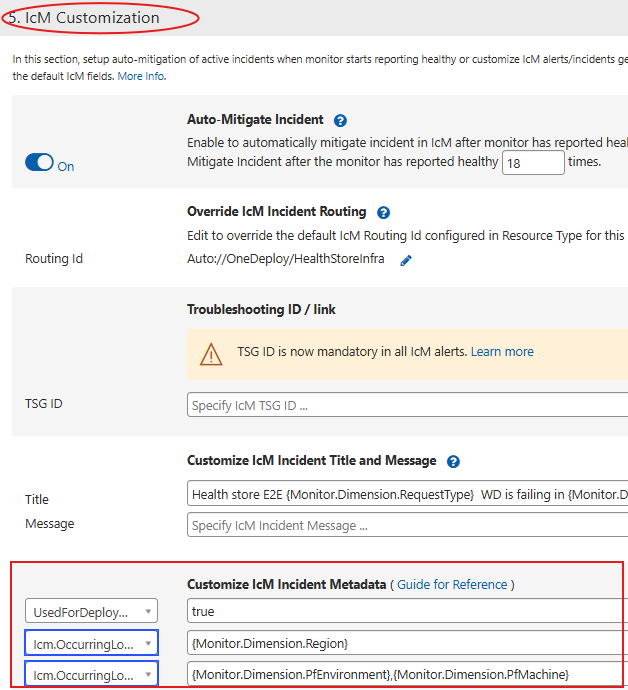

# ICM Location Attributes

## Populating Standard Values in ICM Location Attributes for Monitor-Raised Incidents

### MDM Monitors

Change Insights uses the following fields in ICM incidents to understand the impacted location and provide relevant changes for that location:

* **Detected DC/Region** : Used to derive the region and datacenter for the incident.
* **Instance/Cluster** : Used to derive granular locations (like cluster, PFEnvironment, node, ToR, VM, etc.).
* ]]]}}}}

> **Note:** For each incident, these fields are present under the **Impact Assessment** tab -> **Location and Impact Details** section.

> **Important:** Change Insights uses the most granular location provided in the above fields to show changes. **Therefore, the more granular the location, the more relevant the changes will be.**

---

## Steps to Populate Standard Values in ICM Location Attributes for Monitor-Raised Incidents

### MDM Monitors

Please follow the steps below:

1. **If the identified action item is `NoAction` or `PendingAnalysis`, then no action is required from the owning team.**

   * We are continuously trying to increase our coverage for `PendingAnalysis` monitors to reduce the manual effort required by the owning team to investigate and update the ICM mapping.
2. **If the identified action item is `EmitStdLocationInMdmMetricDimension+MapMDMDimensionToICMLocation`, then you need to emit/update at least one underlying metric to contain a `Region` dimension.**

   * Please refer to the official Geneva documentation for emitting metrics. Then proceed to step 3 for updating the ICM Mapping on the monitor.

   > **Note:** Region must follow the standardized values provided here: [FCM Regions]()
   >
3. **If you have added a new dimension to the underlying metric of the monitor or the identified action item is `MapMDMDimensionToICMLocation`, then identify which dimension in the monitor represents a standard value by going through the `MonitorDimensionMappings` column of the dashboard.**

   * The dimension key identified by the Kusto dashboard is all  **lowercase** . To find the **case-sensitive** value, please refer to the section of the monitor shown below.
   * | MDM_v1                                        | MDM_v2                                        |
     | --------------------------------------------- | --------------------------------------------- |
     |  |  |
4. **Refer to the table below to find ICM mapping configuration.**

* | MDM_v1                                                                                                                                             | MDM_v2                                                                                                                                                                          |
  | -------------------------------------------------------------------------------------------------------------------------------------------------- | ------------------------------------------------------------------------------------------------------------------------------------------------------------------------------- |
  | Go to section `<ins>`*"5. IcM Customization"*`</ins>` and *"Add Metadata"*. `  `  | Got to section `<ins>`*"3. Customize Incident"*`</ins>` -> *"3.1 Incident Metadata"* and *"+Metadata"* `  `  |
* **Use the below table to map the dimension to their respective ICM Location Attributes.**

  > ⚠️ Replace `IdentifiedDimensionKey(s)` with the dimension key(s) identified in step *3*.To provide multiple values for an **ICM Metadata Key**, use `,` (comma separated) values as shown in screenshot below.
  > 📝 **Alternatively**, use the dimension values provided in the `Suggested_IcM_Datacenter_Metadata` and `Suggested_IcM_DeviceName_Metadata` columns in the dashboard for the corresponding IcM metadata key, if those columns are not empty.
  >

  | MDM_v1                                 | MDM_v2                                 |
  | -------------------------------------- | -------------------------------------- |
  |  |  |
* 

5. **Conditions:**

   * **Identified dimension is of type region or datacenter.**
     * **ICM Metadata Key:** `Icm.OccurringLocation.DataCenter`
     * **Monitor Dimension:** `{Monitor.Dimension.IdentifiedDimensionKey}`
   * **Identified dimension is of type cluster, node, PFEnvironment, PFMachine, ToR, VM, etc.**
     * **ICM Metadata Key:** `Icm.OccurringLocation.DeviceName`
     * **Monitor Dimension:** `{Monitor.Dimension.IdentifiedDimensionKey}`

   > **Note:** Please refer to the Geneva official documentation for more information on how to customize ICM fields.
   >

---

# Additional Resources

* **Access to FCM Change Events** : The FCM Change events are in the `Fcmdata` Kusto cluster, under the `FCMKustoStore` database in the `ChangeEvent` table.
* **Access via Kusto Explorer** : Visit [Kusto Explorer](https://fcmdataro.kusto.windows.net:443) and run the following query:

<pre class="!overflow-visible">

kusto

<button class="flex gap-1 items-center py-1"><svg width="24" height="24" viewBox="0 0 24 24" fill="none" xmlns="http://www.w3.org/2000/svg" class="icon-sm"><path fill-rule="evenodd" clip-rule="evenodd" d="M7 5C7 3.34315 8.34315 2 10 2H19C20.6569 2 22 3.34315 22 5V14C22 15.6569 20.6569 17 19 17H17V19C17 20.6569 15.6569 22 14 22H5C3.34315 22 2 20.6569 2 19V10C2 8.34315 3.34315 7 5 7H7V5ZM9 7H14C15.6569 7 17 8.34315 17 10V15H19C19.5523 15 20 14.5523 20 14V5C20 4.44772 19.5523 4 19 4H10C9.44772 4 9 4.44772 9 5V7ZM5 9C4.44772 9 4 9.44772 4 10V19C4 19.5523 4.44772 20 5 20H14C14.5523 20 15 19.5523 15 19V10C15 9.44772 14.5523 9 14 9H5Z" fill="currentColor"></path></svg>Copy code</button>

<code class="!whitespace-pre hljs language-kusto">cluster('FCMDataro').database('EntityModel').materialized_view('EntityChangeEventsMaterializedView') 
  | limit 100
  </code>

</pre>

* **Permissions** : Request access to the `FCMUsers` Security Group on [IDWeb](http://idweb).
* **Supported Use** : The dataset is intended for exploration and answering ad hoc questions. Reporting should be done against the Kusto datastream from the follower [https://fcmdataro.kusto.windows.net:443/EntityModel](https://fcmdataro.kusto.windows.net:443/EntityModel). Service integration should be against the FCM APIs per agreed-upon SLAs.

---
