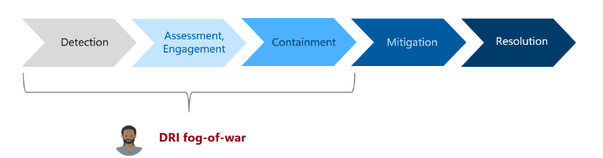

**Change Insights ICM Experience User Guide**
=========================================

This guide is designed to empower Designated Responsible Individuals (DRIs) and engineering teams to effectively utilize the Change Insights features integrated within Incident and Change Management (ICM) experiences—including **the ICM portal**, **Microsoft Teams integration**, and **AI summaries.** By leveraging these tools, you can enhance your incident response processes, swiftly identify potential contributors to customer-impacting incidents, and take actionable steps toward resolution.


### **1.1 What is Change Insights?**

**Change Insights** is your insider's view into the changes happening across the Azure ecosystem that might be influencing customer-impacting incidents. Seamlessly integrated with your ICM experience, it offers:

* **Curated Lists of Potentially Impactful Changes** : Access prioritized lists of changes that align with your incident's timeline and scope. Get actionable details like change owners, specific impacts, and standardized data to quickly assess the situation.
* **Actionable Tools** : Directly from the ICM interface, you can pause or roll back suspicious changes through governed workflows, enabling rapid containment of potential issues.
* **OneDeploy Copilot (coDeploy)** *(Under construction)* : An AI-powered assistant that provides personalized insights into changes, answers deployment-related questions, and accelerates troubleshooting during the "fog-of-war" experienced in incident management.

### **1.2 Our Mission and Objectives**



Our mission with Change Insights is to **enhance the efficiency and effectiveness of DRIs during incident management** by providing critical insights into changes that may be affecting system performance. Here's how we're aiming to achieve that:

* **Simplify Your Workload** : By filtering out the noise and presenting only the most relevant change data, we reduce cognitive overload so you can focus on what truly matters.
* **Enable Swift Action** : With tools to pause or roll back changes at your fingertips, you can quickly mitigate issues and minimize customer impact.
* **Enhance Engagement** : Integrated seamlessly into the ICM portal and Teams, Change Insights fits right into your existing workflow without missing a beat.
* **Boost Actionability** : Detailed insights and direct links empower you to engage with the right teams and make informed decisions rapidly.
* **Foster Continuous Improvement** : Your feedback is gold. By sharing your experiences, you help us refine Change Insights, making it even more precise and effective for everyone.

### **1.3 Real-World Scenarios: How Change Insights Helps You**

Change Insights is designed to be utilized in various scenarios that DRIs commonly encounter:

1. **Managing Monitor-Raised Incidents in ICM Portal**: When an incident is raised by system monitors, DRIs can use the Change Insights in the ICM portal to identify and investigate potential changes contributing to the incident.
2. **Navigating Critical Incidents within Teams**: During critical incidents that involve collaboration across teams, Change Insights integration with Teams via the ICM Assistant (Obi) provides real-time insights and allows DRIs to take action directly within the conversation.
3. **Responding to Escalating Impact**: In situations where an incident's impact is escalating, Change Insights helps DRIs stay updated with refreshed data as new information becomes available, ensuring they can adjust their response accordingly.
4. **Contributing to Continuous Improvement**: After resolving an incident, confirm any culprit changes within Change Insights. Your input helps enhance the platform's accuracy for future incidents.
5. **Utilizing AI Assistance for Troubleshooting**: Use the upcoming coDeploy assistant to get quick answers to your deployment questions and gain deeper insights into changes, accelerating your troubleshooting process.

### **1.4 Quick Access Links**

* **OneDeploy FCM Dashboard [https://aka.ms/onedeployfcm](https://aka.ms/onedeployfcm)**
* The FCM Change events are in the `fcmdataro` Kusto cluster, under the `EntityModel` database in the table `EntityChangeEvents`.
* **Access via Kusto Explorer** : Visit [fcmdataro.EntityModel | Azure Data Explorer](https://fcmdataro.kusto.windows.net:443) and run the following query:
  ```
  cluster('fcmdataro.kusto.windows.net').database('EntityModel').EntityChangeEvents
  | take 10
  ```
* **Change Data Coverage by QCS, HVT, TCB** : ChangeInsights Coverage : [https://aka.ms/fcmcoverage](https://aka.ms/fcmcoverage)
* **Helpful Kusto Queries**: Refer to the [Helpful Kusto Queries Page](queries.md) for common queries.
* **Change Insight Availability by Orchestrators** : Details are provided in the [Introduction](Introduction.md) section.
* **OneDeploy All Changes** : Access all changes via OneDeploy: [OneDeploy All Changes Dashboard]()
* **Permissions** : Request access to the `FCMUsers` Security Group on [IDWeb](http://idweb).
* **Reporting** : Use the Kusto datastream from the follower [FCMDataro Kusto](https://fcmdataro.kusto.windows.net:443/EntityModel).
* **Service Integration** : Integrate with FCM APIs per agreed-upon SLAs.
