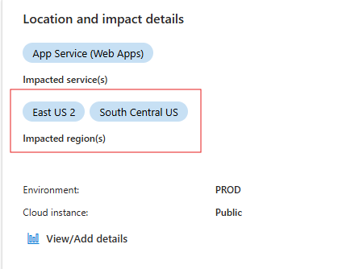
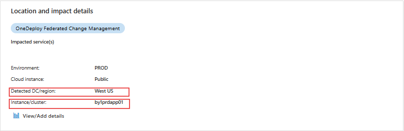
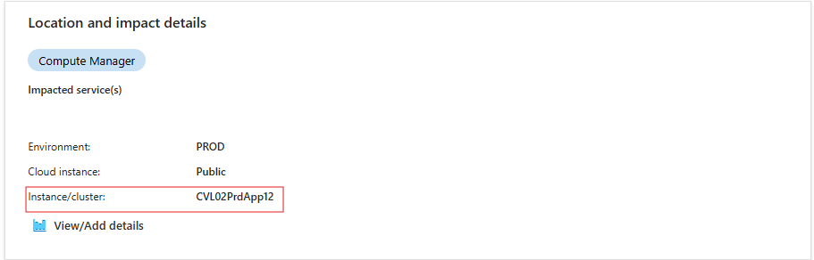

**Change Insights ICM Experience User Guide**
=========================================

User Experience
---------------

During the "fog of war" in incident management, providing insights about what changes have occurred---given critical contextual data such as location, service, and time frame---is essential to help narrow down suspects and isolate potential impacts for change-related incidents.

Currently, Azure (Sev0, 1, 2) incidents with valid location data are enriched with **Change Insights**. If no changes are found, the ICM is updated with "No changes found."

The data in ICM provides a list of changes along with key information such as payload information, impact details, owning ICM path (for request assistance), as well as a **Pause** button that takes the user to the Deployment Orchestrator Experience to enforce a **No-Fly Zone**.

Once the discussion summary is enriched, the data is available to be picked up in the ICM AI Summary and broadcasted via the ICM Assistant (Obi) in Teams to give DRIs information in the experiences they are in.

*Insight is also surfaced in the Eng Bridge Teams chat. If there is a change in location in ICM, the insight is broadcasted to the Teams chat. AI summary picks up the insights, but there is planned work to optimize the results and predictability of what is shown.*

---

Prerequisites to Surface Change Insights
----------------------------------------

To provide relevant changes for an incident, three important dimensions are needed:

1. **When**: The time range for the change search. We search for changes in the last 12 hours from the impact start time.
2. **Where**: The granular location where the impact is happening. The more granular the location (like "node", "torrouter", "cluster", etc.), the more relevant the changes will be. For services operating at the region level, the impacted region in ICM should be specified.
3. **Who**: The service responsible for the incident.

---

### Supported Locations and Entities

Below are the supported location/entity types to enable the Change Insights experience. Note that the locations must match standard locations specified in the **Source** column.

| **ICM Location**   | **Source**   | **Search Criteria**            | **ICM Field Required**                               | **Results**                                                              | **Notes**                                          |
| ------------------------ | ------------------ | ------------------------------------ | ---------------------------------------------------------- | ------------------------------------------------------------------------------ | -------------------------------------------------------- |
| **Region**         | FCM Regions        | Region + Service                     | Impacted region(s)                                         | Show top 10 changes made by the service in the impacted region for last 12 hrs | Changes to any EntityType by that service in that region |
| **Cluster**        | FCM Clusters       | Cluster                              | Instance/Cluster (comma-separated list of clusters)        | Show top 10 changes made to the cluster for last 12 hrs                        | Changes made to Cluster, Nodes, ToR                      |
| **Node**           | FCM Nodes          | Node, ToR                            | Instance/Cluster (comma-separated list of node IDs)        | Show top 10 changes made to the Node, ToR for last 12 hrs                      | Changes made to the Node, ToR                            |
| **ToR**            | FCM ToRs           | ToR                                  | Instance/Cluster (comma-separated list of ToR IDs)         | Show top 10 changes made to the ToR for last 12 hrs                            | Changes made to the ToR                                  |
| **Storage Tenant** | FCM StorageTenants | Storage Tenant, Storage Cluster, ToR | Instance/Cluster (comma-separated list of Storage Tenants) | Show top 10 changes made to the Storage Tenant for last 12 hrs                 | Changes made to the Storage Tenant, Cluster, ToR         |
| **PFEnvironment**  | FCM PFEnvironments | PFEnvironment                        | Instance/Cluster (comma-separated list of PFEnvironments)  | Show top 10 changes made to the PFEnvironment for last 12 hrs                  | Changes made to the PFEnvironment                        |

#### Examples of the ICM Fields That Must Be Populated

1. **Impacted Regions**

   
2. **Detected DC/Region**

   
3. **Instance/Cluster**

   

> **Important:** Change Insights picks up the most granular location provided in the above fields while providing insights for an incident.

---

### Unsupported Location Types

The following location types are yet to be supported:

| **EntityType** |
| -------------------- |
| VirtualMachine       |
| VMSS                 |
| SQL Ring             |
| CosmosDB Federation  |

---

# Change insight availability by Orchestrators

| Supported Deployment Systems                   | Change Data Onboarded                                                                                                                                                                                                                                                                                                                                                                                                                                               | Change Data Granularity                          |
| ---------------------------------------------- | ------------------------------------------------------------------------------------------------------------------------------------------------------------------------------------------------------------------------------------------------------------------------------------------------------------------------------------------------------------------------------------------------------------------------------------------------------------------- | ------------------------------------------------ |
| PF (generic)                                   | Yes[(Sample Data)](https://dataexplorer.azure.com/dashboards/d0357802-00ae-48c7-85a2-5cf02d98de77?p-_startTime=1hours&p-_endTime=now&p-_entityIds=all&p-_region=all&p-_availabilityZone=all&p-_datacenter=all&p-_cluster=all&p-_serviceName=all&p-_entityType=v-pfenvironment&p-_entityType=v-pfenvironment%3Aagg&p-_entityType=v-pfmachine&p-_payload=all&p-_serviceTreeIds=all#66cc3653-ecde-4c2c-9d24-1838d351d4d4)* (PF Maintenance Service rebootful in progress) | PFCluster, Environment, MachineFunction, Machine |
| AzDeployer                                     | Yes[(Sample Data)](https://dataexplorer.azure.com/dashboards/d0357802-00ae-48c7-85a2-5cf02d98de77?p-_startTime=3hours&p-_endTime=now&p-_entityIds=all&p-_region=all&p-_availabilityZone=all&p-_datacenter=all&p-_cluster=all&p-_serviceName=all&p-_source=v-azdeployer&p-_entityType=all&p-_payload=all&p-_serviceTreeIds=all#66cc3653-ecde-4c2c-9d24-1838d351d4d4)                                                                                                    | Zone, Custom                                     |
| EV2                                            | Yes[(Sample Data)](https://dataexplorer.azure.com/dashboards/d0357802-00ae-48c7-85a2-5cf02d98de77?p-_startTime=3hours&p-_endTime=now&p-_entityIds=all&p-_region=all&p-_availabilityZone=all&p-_datacenter=all&p-_cluster=all&p-_serviceName=all&p-_source=v-expressv2&p-_entityType=all&p-_payload=all&p-_serviceTreeIds=all#66cc3653-ecde-4c2c-9d24-1838d351d4d4)                                                                                                     | Region                                           |
| FUSE                                           | Yes[(SampleData)](https://dataexplorer.azure.com/dashboards/d0357802-00ae-48c7-85a2-5cf02d98de77?p-_startTime=3hours&p-_endTime=now&p-_entityIds=all&p-_region=all&p-_availabilityZone=all&p-_datacenter=all&p-_cluster=all&p-_serviceName=all&p-_source=v-fuse_fuse&p-_entityType=v-clusterspine&p-_entityType=v-dcspine&p-_entityType=v-node&p-_entityType=v-torrouter&p-_payload=all&p-_serviceTreeIds=all#66cc3653-ecde-4c2c-9d24-1838d351d4d4)                    | ToR, Device/Switch                               |
| XStore(DynamicConfigChangedEvent,WADI)         | Yes[(Sample Data)](https://dataexplorer.azure.com/dashboards/d0357802-00ae-48c7-85a2-5cf02d98de77?p-_startTime=3hours&p-_endTime=now&p-_entityIds=all&p-_region=all&p-_availabilityZone=all&p-_datacenter=all&p-_cluster=all&p-_serviceName=all&p-_source=v-xstore-wadi&p-_source=v-xstore-xds&p-_entityType=all&p-_payload=all&p-_serviceTreeIds=all#66cc3653-ecde-4c2c-9d24-1838d351d4d4)                                                                            | Storage Stamp                                    |
| DC Ops                                         | Yes                                                                                                                                                                                                                                                                                                                                                                                                                                                                 | DC, COLO, ROW, RACK                              |
| Asguard(WARP, AzCP, AsguardRCore, AsguardCore) | Yes                                                                                                                                                                                                                                                                                                                                                                                                                                                                 | SF Tenant, UpdateDomain                          |
| Sql/CosmosDB Ring (SF)                         | Yes[(Sample data)](https://dataexplorer.azure.com/dashboards/d0357802-00ae-48c7-85a2-5cf02d98de77?p-_startTime=3hours&p-_endTime=now&p-_entityIds=all&p-_region=all&p-_availabilityZone=all&p-_datacenter=all&p-_cluster=all&p-_serviceName=all&p-_source=all&p-_entityType=v-microsoft.sql.cluster&p-_payload=all&p-_serviceTreeIds=all#66cc3653-ecde-4c2c-9d24-1838d351d4d4)                                                                                         | Ring                                             |
| GenevaActions                                  | Yes                                                                                                                                                                                                                                                                                                                                                                                                                                                                 | Region                                           |
| AzCIS                                          | Yes                                                                                                                                                                                                                                                                                                                                                                                                                                                                 | Cluster                                          |
| AzDM                                           | Yes                                                                                                                                                                                                                                                                                                                                                                                                                                                                 | AzDM Tenant                                      |
| OOAS                                           | Yes                                                                                                                                                                                                                                                                                                                                                                                                                                                                 | node,container,cluster,tenant,soc..etc           |

## Change data coverage by QCS, HVT,TCB

[ChangeInsights Coverage](https://aka.ms/fcmcoverage)

# Roadmap for Change Insights Experience Improvement

---
