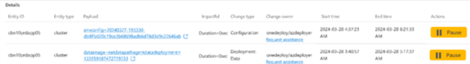

**4. Using Change Insights in ICM *(Beta - SE Feature)***
---------------------------------------------------

Change Insights provides powerful tools to help Designated Responsible Individuals (DRIs) manage incidents effectively by offering real-time insights into changes that could be contributing to the issue. These insights are accessible through multiple interfaces within the **ICM ecosystem**---the **Troubleshooting Tab**, **Teams Integration**, and the **AI Summary**. In this section, we will explore how to navigate and use these features, providing you with actionable steps to leverage Change Insights during incident response.

---

### **4.1 The Troubleshooting Tab**

The **Troubleshooting Tab** is one of the core areas within the ICM portal where DRIs can quickly identify suspicious changes, review details, and take necessary actions to mitigate impact. This tab serves as the primary interface for troubleshooting during an incident.

#### **How to Use the Troubleshooting Tab**

1. **Access the Tab**:

   - Navigate to the incident you are working on in the ICM portal and select the **Troubleshooting Tab**. This will present a curated list of changes associated with the incident's impact window and location.
   - **Tip**: If the incident impact evolves, make sure to refresh or revisit the tab to get the most updated data.
2. **View Curated Change List**:

   - The tab lists all relevant changes ranked by their **likelihood of contribution to the incident**. Changes are filtered based on key parameters such as **time**, **location**, and **service**.
   - **Tip**: Prioritize reviewing changes that are marked as **high-risk** or have **impact anomalies** in their corresponding services.
3. **Investigate Individual Changes**:

   - Click on any change entry to view more detailed information, such as:
     - **Change ID** and **Owner**: Identifies the change and the team responsible for it.
     - **Timestamp**: Shows when the change was implemented.
     - **Impact Details**: Provides specific context about the potential effect of the change.
     - **Health Metrics**: Displays correlated system anomalies or health deterioration associated with the change.
   - **Tip**: Compare health metrics with the change time window to verify if a specific change correlates with the reported incident impact.
4. **Recommended Actions**:

   - At the top of the tab, you may see **recommended actions** for managing the change, such as **pausing** or **rolling back** the change. These options are provided based on an assessment of the change's impact and risk.
   - **Tip**: Always validate the recommended action with data from the health metrics and consult with the change owner before proceeding.
5. **Request Assistance**:

   - If you need more information from the change owner or their team, use the **Request Assistance** button. This will automatically open a form with the change owner's details, allowing you to submit a request for further investigation or support.
   - **Tip**: Document all requests and responses within the ICM portal to maintain a clear audit trail for incident resolution.

#### **Best Practices for Using the Troubleshooting Tab**:

- **Focus on High-Risk Changes**: Begin by reviewing changes with high-risk scores or those that align with health anomalies in your system.
- **Use Health Metrics to Corroborate**: Always cross-reference change times with system health data to validate whether a change could be the root cause of an issue.
- **Take Action Early**: If a change appears to be directly linked to the incident, consider pausing or rolling back the change as early as possible to mitigate further impact.

---

### **4.2 Teams Integration with ICM Assistant (Obi)**

For incidents managed within Microsoft Teams, the **ICM Assistant (Obi)** surfaces real-time **Change Insights** into your active incident chats. This allows you to stay informed about changes without needing to leave the Teams environment.

#### **Using Change Cards in Teams**

1. **Receive Change Cards**:

   - **ICM Assistant (Obi)** will automatically post **Change Cards** into the Teams chat when a relevant change is detected. These cards provide a quick summary of the change, including:
     - **Change Owner**
     - **Impact Summary**
     - **Timestamp**
     - **Suggested Actions** (Pause, Request Assistance, etc.)
   - **Tip**: Respond to the Change Cards as soon as they appear to maintain a proactive approach during incident management.
2. **Request Assistance Directly from Teams**:

   - If you need more information, use the **Request Assistance** button on the Change Card. This will open a form within the Teams chat, allowing you to send an inquiry directly to the change owner or their team.
   - **Tip**: You can continue discussing the change with your team in the chat while awaiting the change owner's response, maintaining collaboration without switching platforms.
3. **Pause a Change from Teams**:

   - If a change is identified as a likely contributor to the incident, you can **pause** it directly from the Change Card by clicking the **Pause** button. A confirmation will appear once the pause action is completed, and the ICM Assistant will update the chat with the current status of the change (Paused, Resumed, etc.).
   - **Tip**: Only pause changes when there is a clear indication that the change is linked to the incident, and follow the pause action with a discussion in the Teams chat to validate with other DRIs.
4. **Monitor Status Updates in Teams**:

   - As more changes are detected, **ICM Assistant (Obi)** will provide status updates and summaries within the chat. Keep an eye on these updates to track the incident's progress and any newly identified changes.
   - **Tip**: Pin critical Change Cards or status updates to ensure the team has easy access to the most relevant information.

#### **Best Practices for Teams Integration**:

- **Engage with Change Cards Quickly**: Respond to Change Cards as soon as they are posted to maintain momentum in the incident resolution process.
- **Leverage Collaboration**: Use the Teams chat to discuss changes with your team while simultaneously investigating and taking action on the changes.
- **Use Real-Time Updates**: Keep the conversation updated with real-time insights to avoid missed opportunities to resolve the incident quickly.

---

### **4.3 AI Summary Features**

The **AI Summary** is designed to provide a high-level, rolling update on the incident, helping DRIs keep track of critical changes and their potential impact. The AI Summary brings together all the relevant change insights and displays them in one unified view, making it easy to monitor the incident's progression.

#### **Key Features of the AI Summary**

1. **Aggregated Change Data**:

   - The AI Summary consolidates all changes detected during the incident and presents them in a **ranked list**. Changes with the highest risk or most relevance to the incident are displayed at the top.
   - **Tip**: Regularly check the AI Summary during an incident to stay up to date with the most impactful changes.
2. **Real-Time Updates**:

   - The AI Summary is continuously updated as new changes are detected or as existing changes evolve (e.g., a paused change is resumed). This allows you to have a real-time view of the incident without switching between multiple dashboards.
   - **Tip**: Use the AI Summary as your primary reference point for changes, and drill down into specific changes as necessary.
3. **Actionable Insights**:

   - Each change in the AI Summary is accompanied by **recommended actions** such as pausing, rolling back, or requesting assistance. These recommendations are based on the AI's analysis of the change's impact and risk score.
   - **Tip**: Take note of changes with actionable insights at the top of the list and follow up on them immediately to mitigate further impact.
4. **Cross-Platform Sync**:

   - Any actions taken in the **Teams integration** or **Troubleshooting Tab** are reflected in the AI Summary, ensuring consistency across all platforms. This allows you to track the incident's progress from a single view while still interacting with the change in other areas.
   - **Tip**: Use this cross-platform sync to track what actions have already been taken and what still needs attention, ensuring a coordinated response.

#### **Best Practices for AI Summary**:

- **Monitor High-Risk Changes**: Keep a close eye on the top-ranked changes in the AI Summary, as these are most likely to be contributing to the incident.
- **Follow Actionable Insights**: When the AI provides a recommendation, such as pausing a change, make sure to review the details and take action promptly.
- **Stay Updated with Real-Time Changes**: As changes continue to evolve throughout the incident, the AI Summary provides the most current snapshot, allowing you to adjust your response as needed.

---

### **4.4 Best Practices for DRIs Using Change Insights**

- **Centralize Communication**: Whether you're using the ICM portal or Teams, maintain clear and centralized communication with your team about the changes you are investigating and the actions you are taking.
- **Act on High-Risk Changes**: Prioritize changes flagged as high-risk, and coordinate with change owners for immediate investigation or rollback.
- **Request Assistance Early**: If there is any uncertainty about a change, don't hesitate to use the **Request Assistance** feature. Early collaboration with the change owner can prevent further escalation.
- **Document Every Action**: Keep a record of every action taken (e.g., pausing a change, rolling back, requesting assistance) within the ICM portal to maintain a clear audit trail of the incident response.

By following these best practices and fully utilizing the features of **Change Insights** in the ICM ecosystem, you can significantly improve the speed and effectiveness of your incident response, ensuring that issues are identified and mitigated as quickly as possible.
