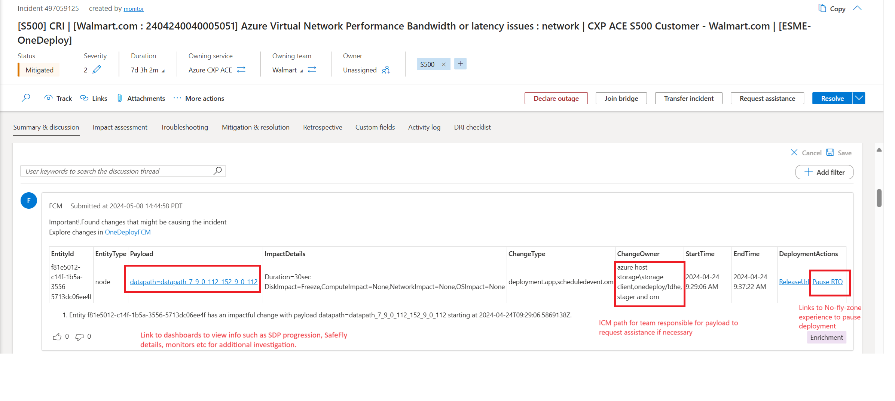
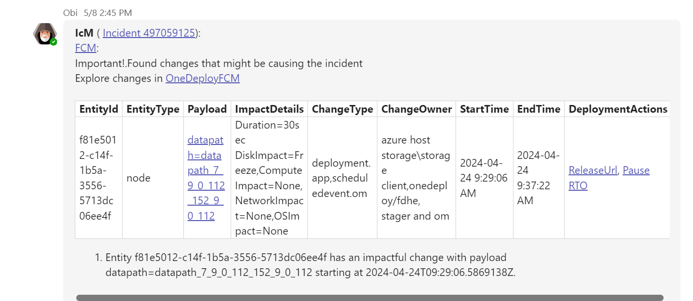
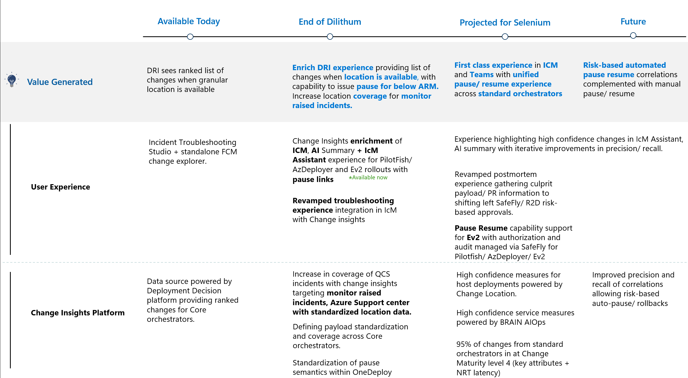

# ChangeInsights in ICM User Guide

## User Experience

During fog of war, providing insights around what changes have occurred given critical contextual data (location, service and time frame) is essential to help narrow down suspects and isolate potential impact for change related incidents. Currently Azure (Sev0,1,2) incidents with valid location data are enriched with change insights. If there is no change found, then the ICM is updated with "No changes found". The data in ICM provides a list of changes along with key information such as payload information, impact details, owning ICM path (for request assistance) as well as a Pause button that takes user to the Deployment Orchestrator Experience to enforce a No-Fly Zone. Once discussion summary is enriched, the data is available to be picked up in ICM AI Summary and broadcasted via IcM Assistant (Obi) in teams to give DRI information in the experiences they are in.

Insight is also surfaced in the Eng Bridge teams chat. If there is a change in location in ICM, the insight is broadcasted to the Teams chat. AI summary picks up the insights but there is planned work to optimize the results and predictability of what is shown.

## Prerequisites to surface change insights

To provide relevant changes for an incident, the three important dimensions needed are

1. When (Time range for change search, we search for time range of last 12 hrs from the impact start time).
2. Where ( The granular location where the impact is happening, the granular the location like "node", "torrouter","cluster"..etc , the changes will be relevant
For services operating at region, the impact region in ICM should be specified).
3. Who (The service responsible for the incident).

Below are the supported location/ entity types to light up the change insights experience. Also note that the locations must match standard locations specified in the Source column.

| ICM location | Source | Search Criteria | ICM field required | Results | Notes |
| --- | --- | --- | --- | --- | --- |
| Region | [FCM Regions](https://dataexplorer.azure.com/clusters/https%3a%2f%2ffcmdata.kusto.windows.net/databases/FCMKustoStore?query=H4sIAAAAAAAEAHPOSMxLT3WtKMjJL0otig%2fOzC3IyUzLTE3xSy0pzy%2fKDskvyM%2fJT6%2bsUSjPSC1KVfDJT04syczPC6ksSFWwtVVQKkpNB3KVeLlqFFIyi0sy85JL4Io8UwAqR0WoXwAAAA%3d%3d) | Region+Service | Impacted region(s) | Show top 10 change made by Service in the Impacted region for last 12hrs | Changes to any EntityType by that Service in that Region |
| Cluster | [FCM Clusters](https://dataexplorer.azure.com/clusters/https%3a%2f%2ffcmdata.kusto.windows.net/databases/FCMKustoStore?query=H4sIAAAAAAAEAD3KMQqAMAwAwF3wD6H%2fcBIHQVzsLqWNGqxNSSMq%2bHg3b752c2nF7s6RBWWe6MiRFsIwol4su%2bXMkdfnhWtDQRjYOyVO9skITQPGx7MoiqmrFwIVpeT1X334AOCeQnxgAAAA) | Cluster | Instance/cluster (Comma separated list of clusters) | Show top 10 change made to the Cluster for last 12hrs | Changes made to Cluster, Nodes, ToR |
| Node | [FCM Nodes](https://dataexplorer.azure.com/clusters/https%3a%2f%2ffcmdata.kusto.windows.net/databases/FCMKustoStore?query=H4sIAAAAAAAEAD3KsQqAIBAA0D3oHw7%2fwykagmjJPUQvPTJPTDDBj2%2frzW%2fyOjqc3xQ4Yz52ulOgk9BuWCrnS3HiwK51qB4zwspGF%2bKoWkKQEkRki2IcOlh6CkVT%2frLYD124pHJdAAAA) | Node | Instance/cluster (Comma separated list of node ids) | Show top 10 change made to the Node for last 12hrs | Changes made to the Node,ToR |
| ToR | [FCM ToRs](https://dataexplorer.azure.com/clusters/https%3a%2f%2ffcmdata.kusto.windows.net/databases/FCMKustoStore?query=H4sIAAAAAAAEAD3KwQpAQBAG4LvyDpP3cJKDkgt3yQ4ma%2f9tjFD78G6%2b81dtU1i5fqKHso69HNHLIuw6thu6D4jwWN9E98bK1GKeTBCGNzKVJRUGVVzGWuRZIienSZjtf437ACPI8jpiAAAA) | ToR | Instance/cluster (Comma separated list of ToR ids) | Show top 10 change made to the ToR for last 12hrs | Changes made to the ToR |

#### Examples of the ICM fields that must be populated

1. Impacted Regions 

2. Detected DC/Region

3. Instance/Cluster 

[!IMPORTANT]
Change Insights picks up the most granular location provided in the above fields while providing insights for an incident.

The following location types are yet to be supported:

| EntityType |
| --- |
| PFEnvironment |
| Storage Tenant |
| VirtualMachine |
| VMSS |
| SQL Ring |
| Cosmosdb Federation |

## Change insight availability by deployment system 

| Supported Deployment Systems | Change Data Onboarded | Change Data Granularity | NFZ/CCOA | Fast pause |
| --- | --- | --- | --- | --- |
| PF (generic) | Yes [(Sample Data)](https://dataexplorer.azure.com/dashboards/d0357802-00ae-48c7-85a2-5cf02d98de77?p-_startTime=1hours&p-_endTime=now&p-_entityIds=all&p-_region=all&p-_availabilityZone=all&p-_datacenter=all&p-_cluster=all&p-_serviceName=all&p-_entityType=v-pfenvironment&p-_entityType=v-pfenvironment%3Aagg&p-_entityType=v-pfmachine&p-_payload=all&p-_serviceTreeIds=all#66cc3653-ecde-4c2c-9d24-1838d351d4d4) * (PF Maintenance Service rebootful in progress) | PFCluster, Environment, MachineFunction, Machine | Supported | Supported for Azure Data plane deployments. Control Plane does not support fast pause. |
| AzDeployer | Yes [(Sample Data)](https://dataexplorer.azure.com/dashboards/d0357802-00ae-48c7-85a2-5cf02d98de77?p-_startTime=3hours&p-_endTime=now&p-_entityIds=all&p-_region=all&p-_availabilityZone=all&p-_datacenter=all&p-_cluster=all&p-_serviceName=all&p-_source=v-azdeployer&p-_entityType=all&p-_payload=all&p-_serviceTreeIds=all#66cc3653-ecde-4c2c-9d24-1838d351d4d4) | Zone, Custom | Supported | Supported for Azure Data plane deployments, not for Control plane |
| EV2 | Yes [(Sample Data)](https://dataexplorer.azure.com/dashboards/d0357802-00ae-48c7-85a2-5cf02d98de77?p-_startTime=3hours&p-_endTime=now&p-_entityIds=all&p-_region=all&p-_availabilityZone=all&p-_datacenter=all&p-_cluster=all&p-_serviceName=all&p-_source=v-expressv2&p-_entityType=all&p-_payload=all&p-_serviceTreeIds=all#66cc3653-ecde-4c2c-9d24-1838d351d4d4) | Region | Supported | Not Available |
| FUSE | Yes [(SampleData)](https://dataexplorer.azure.com/dashboards/d0357802-00ae-48c7-85a2-5cf02d98de77?p-_startTime=3hours&p-_endTime=now&p-_entityIds=all&p-_region=all&p-_availabilityZone=all&p-_datacenter=all&p-_cluster=all&p-_serviceName=all&p-_source=v-fuse_fuse&p-_entityType=v-clusterspine&p-_entityType=v-dcspine&p-_entityType=v-node&p-_entityType=v-torrouter&p-_payload=all&p-_serviceTreeIds=all#66cc3653-ecde-4c2c-9d24-1838d351d4d4) | ToR, Device/Switch | Manual coordination | Not Available |
| XDash (XStore) | Yes [(Sample Data)](https://dataexplorer.azure.com/dashboards/d0357802-00ae-48c7-85a2-5cf02d98de77?p-_startTime=3hours&p-_endTime=now&p-_entityIds=all&p-_region=all&p-_availabilityZone=all&p-_datacenter=all&p-_cluster=all&p-_serviceName=all&p-_source=v-xstore-wadi&p-_source=v-xstore-xds&p-_entityType=all&p-_payload=all&p-_serviceTreeIds=all#66cc3653-ecde-4c2c-9d24-1838d351d4d4) | Storage Stamp | Supported | Not Available |
| DC Ops | TBD | DC, COLO, ROW, RACK | Manual | Manual or N/A |
| Asgard (SF) | TBD | ? | Manual | Manual |
| Sql/CosmosDB Ring (SF) | Yes [(Sample data)](https://dataexplorer.azure.com/dashboards/d0357802-00ae-48c7-85a2-5cf02d98de77?p-_startTime=3hours&p-_endTime=now&p-_entityIds=all&p-_region=all&p-_availabilityZone=all&p-_datacenter=all&p-_cluster=all&p-_serviceName=all&p-_source=all&p-_entityType=v-microsoft.sql.cluster&p-_payload=all&p-_serviceTreeIds=all#66cc3653-ecde-4c2c-9d24-1838d351d4d4) | Ring | Information only | N/A |
| SF (Generic) | TBD | Ring, App, Service, Machine | TBD | TBD |
| K8S (Generic) | TBD | POD, Node, PODSet | TBD | TBD |
| K8S (Generic) | TBD | POD, Node, PODSet | TBD | TBD |
| PaaS (Generic) | TBD | Tenant, Role, RoleInstance | TBD | TBD |
| VMSS (Generic Platform driven (RSM)) | In Progress | VM, VMSet | Yes | TBD |
| VMSS (Generic) | TBD | VM, Set | TBD | TBD |

# Roadmap for change insights experience improvement

<!-- ### User Interface
Check out our demo video here!
-->