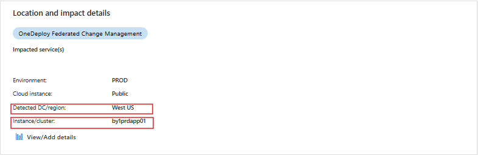

# ChangeInsights in ICM User Guide

## Overview
 ChangeInsights provides relevant changes for all Azure (Sev0,1,2) incidents, which enables DRI's to see changes potentialy causing the incident.
 To provide relevant changes for an incident, the three important dimensions needed are
1. When (Time range for change search, we search for time range of last 12 hrs from the impact start time).
2. Where ( The granular location where the impact is happening, the granular the location like "node", "torrouter","cluster"..etc , the changes will be relevant
           For services operating at region, the impact region in ICM should be specified).
3. Who (The service responsible for the incident).

| ICM location | Source | Search Criteria | Results | Notes
|:-----|:-----|:-----|:-----|:-----|
| Region | [FCM Regions](https://dataexplorer.azure.com/clusters/https%3a%2f%2ffcmdata.kusto.windows.net/databases/FCMKustoStore?query=H4sIAAAAAAAEAHPOSMxLT3WtKMjJL0otig%2fOzC3IyUzLTE3xSy0pzy%2fKDskvyM%2fJT6%2bsUSjPSC1KVfDJT04syczPC6ksSFWwtVVQKkpNB3KVeLlqFFIyi0sy85JL4Io8UwAqR0WoXwAAAA%3d%3d) | Region+Service|Show top 10 change made by Sevice in the Impacted region for last 12hrs| Changes to any EntityType by that Service in that Region|
| Cluster | [FCM Clusters](https://dataexplorer.azure.com/clusters/https%3a%2f%2ffcmdata.kusto.windows.net/databases/FCMKustoStore?query=H4sIAAAAAAAEAD3KMQqAMAwAwF3wD6H%2fcBIHQVzsLqWNGqxNSSMq%2bHg3b752c2nF7s6RBWWe6MiRFsIwol4su%2bXMkdfnhWtDQRjYOyVO9skITQPGx7MoiqmrFwIVpeT1X334AOCeQnxgAAAA) | Cluster|Show top 10 change made to the Cluster for last 12hrs| Changes made to Cluster, Nodes, ToR|
| Node | [FCM Nodes](https://dataexplorer.azure.com/clusters/https%3a%2f%2ffcmdata.kusto.windows.net/databases/FCMKustoStore?query=H4sIAAAAAAAEAD3KsQqAIBAA0D3oHw7%2fwykagmjJPUQvPTJPTDDBj2%2frzW%2fyOjqc3xQ4Yz52ulOgk9BuWCrnS3HiwK51qB4zwspGF%2bKoWkKQEkRki2IcOlh6CkVT%2frLYD124pHJdAAAA) | Node|Show top 10 change mades to the Node for last 12hrs| Changes made to the Node,ToR|
| ToR | [FCM ToRs](https://dataexplorer.azure.com/clusters/https%3a%2f%2ffcmdata.kusto.windows.net/databases/FCMKustoStore?query=H4sIAAAAAAAEAD3KwQpAQBAG4LvyDpP3cJKDkgt3yQ4ma%2f9tjFD78G6%2b81dtU1i5fqKHso69HNHLIuw6thu6D4jwWN9E98bK1GKeTBCGNzKVJRUGVVzGWuRZIienSZjtf437ACPI8jpiAAAA)| ToR|Show top 10 change mades to the ToR for last 12hrs| Changes made to the ToR|

#### Supported EntityTypes in roadmap

|EntityType| 
|:-----|
|PFEnvironment|
|Storage Tenant|
|VirtualMachine|
|VMSS|
|SQL Ring|
|Cosmosdb Federation|

The following are the currently supported deployment Systems

| Supported Deployment Systems| Change Data Onboarded  | Change Data Granularity | NFZ/CCOA | Fast pause | 
|:-----|:-----|:-----|:-----|:-----|
|PF (generic) | Yes [(Sample Data)](https://dataexplorer.azure.com/dashboards/d0357802-00ae-48c7-85a2-5cf02d98de77?p-_startTime=1hours&p-_endTime=now&p-_entityIds=all&p-_region=all&p-_availabilityZone=all&p-_datacenter=all&p-_cluster=all&p-_serviceName=all&p-_entityType=v-pfenvironment&p-_entityType=v-pfenvironment%3Aagg&p-_entityType=v-pfmachine&p-_payload=all&p-_serviceTreeIds=all#66cc3653-ecde-4c2c-9d24-1838d351d4d4) * (PF Maintenance Service rebootful in progress) | PFCluster, Environment, MachineFunction, Machine | Supported | Supported for Azure Data plane deployments. Control Plane does not support fast pause. | 
|AzDeployer| Yes [(Sample Data)](https://dataexplorer.azure.com/dashboards/d0357802-00ae-48c7-85a2-5cf02d98de77?p-_startTime=3hours&p-_endTime=now&p-_entityIds=all&p-_region=all&p-_availabilityZone=all&p-_datacenter=all&p-_cluster=all&p-_serviceName=all&p-_source=v-azdeployer&p-_entityType=all&p-_payload=all&p-_serviceTreeIds=all#66cc3653-ecde-4c2c-9d24-1838d351d4d4) | Zone, Custom| Supported | Supported for Azure Data plane deployments, not for Control plane | 
|EV2| Yes [(Sample Data)](https://dataexplorer.azure.com/dashboards/d0357802-00ae-48c7-85a2-5cf02d98de77?p-_startTime=3hours&p-_endTime=now&p-_entityIds=all&p-_region=all&p-_availabilityZone=all&p-_datacenter=all&p-_cluster=all&p-_serviceName=all&p-_source=v-expressv2&p-_entityType=all&p-_payload=all&p-_serviceTreeIds=all#66cc3653-ecde-4c2c-9d24-1838d351d4d4)|Region| Supported | Not Available | 
|FUSE| Yes [(SampleData)](https://dataexplorer.azure.com/dashboards/d0357802-00ae-48c7-85a2-5cf02d98de77?p-_startTime=3hours&p-_endTime=now&p-_entityIds=all&p-_region=all&p-_availabilityZone=all&p-_datacenter=all&p-_cluster=all&p-_serviceName=all&p-_source=v-fuse_fuse&p-_entityType=v-clusterspine&p-_entityType=v-dcspine&p-_entityType=v-node&p-_entityType=v-torrouter&p-_payload=all&p-_serviceTreeIds=all#66cc3653-ecde-4c2c-9d24-1838d351d4d4) | ToR, Device/Switch | Manual coordination | Not Available | 
|XDash (XStore)| Yes [(Sample Data)](https://dataexplorer.azure.com/dashboards/d0357802-00ae-48c7-85a2-5cf02d98de77?p-_startTime=3hours&p-_endTime=now&p-_entityIds=all&p-_region=all&p-_availabilityZone=all&p-_datacenter=all&p-_cluster=all&p-_serviceName=all&p-_source=v-xstore-wadi&p-_source=v-xstore-xds&p-_entityType=all&p-_payload=all&p-_serviceTreeIds=all#66cc3653-ecde-4c2c-9d24-1838d351d4d4)| Storage Stamp | Supported | Not Available| 
| DC Ops | TBD | DC, COLO, ROW, RACK | Manual | Manual or N/A |
| Asgard (SF) | TBD | ? | Manual | Manual |
| Sql/CosmosDB Ring (SF) | Yes [(Sample data)](https://dataexplorer.azure.com/dashboards/d0357802-00ae-48c7-85a2-5cf02d98de77?p-_startTime=3hours&p-_endTime=now&p-_entityIds=all&p-_region=all&p-_availabilityZone=all&p-_datacenter=all&p-_cluster=all&p-_serviceName=all&p-_source=all&p-_entityType=v-microsoft.sql.cluster&p-_payload=all&p-_serviceTreeIds=all#66cc3653-ecde-4c2c-9d24-1838d351d4d4) | Ring | Information only | N/A |
| SF (Generic) | TBD | Ring, App, Service, Machine | TBD | TBD |
| K8S (Generic) | TBD | POD, Node, PODSet | TBD | TBD | 
| K8S (Generic) | TBD | POD, Node, PODSet | TBD | TBD | 
| PaaS (Generic) | TBD | Tenant, Role, RoleInstance | TBD | TBD |
| VMSS (Generic Platform driven (RSM)) | In Progress | VM, VMSet | Yes | TBD |
| VMSS (Generic) | TBD | VM, Set | TBD | TBD |
## Identifying "Where"(impacted location) in ICM

Change Insights uses location (Where) in the incident to provide relevant changes in the incident

1. Impacted Regions 
 
   
2. Detected DC/Region

  
3. Instance/Cluster 

  

 *Change Insights picks up the most granular location provided in the above fields while providing insights for an incident.
 
## How to map "Where"(impacted location) in ICM
### Service using EV2 (Above ARM services) for deployments

#### Monitor Raised incidents -Detected DC/Region

  To identify the impacted region for the incident, ChangeInsights relies on Impacted Regions in ICM

##### How to map MDM dimension to ICM DC/Region

 
  
#### Manually Raised incidents - Impact Region
  To identify the impacted region for the incident, ChangeInsights relies on Impacted Regions in ICM

### Service using AzDeployer/PF (Below ARM services) for deployments

Provide granular location (Cluster, node) to identify relevant changes.

#### Monitor Raised incidents - specify impacted cluster

  To identify the impacted cluster for the incident, ChangeInsights relies on  "Instance/Cluster" field in ICM

  

##### How to map MDM dimension to "Instance/Cluster" field in ICM

 

 #### Incidents - specify impacted Nddes for an incident

  To identify the impacted node for the incident, ChangeInsights relies on  "Instance/Cluster" field in ICM

  
  
#### Manually Raised incidents - Instance/Cluster

  To identify the impacted cluster/node for the incident, update "Instance/Cluster" field in ICM

  

| Onboarding Deployment Systems | Known Gaps | NFZ/CCOA | Fast pause | 
|:-----|:-----|:-----|:-----|
|RSM SMD Guest updates| Onboarding in progress | Supported | Not Available | 
|Maintenance Orchestrator Host Updates| Onboarding in progress| Manual Coordination | Not Available | 
|AzDM Control Plane |Onboarding in progress | Supported | Not Available| 
|AKS |Onboarding in progress | Manual Coordination | Not Available| 

<!-- ### User Interface 
Check out our demo video here!
-->

