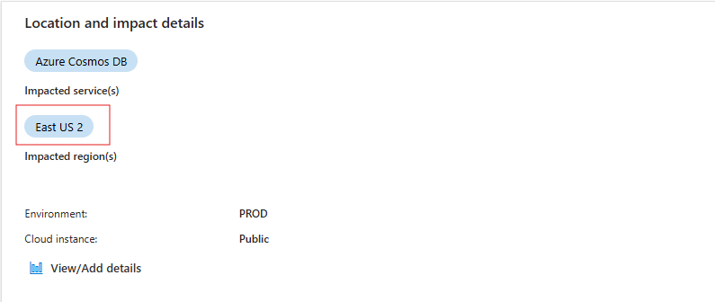
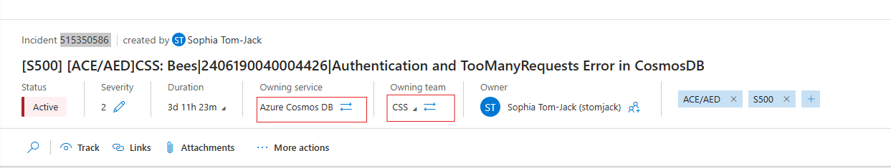
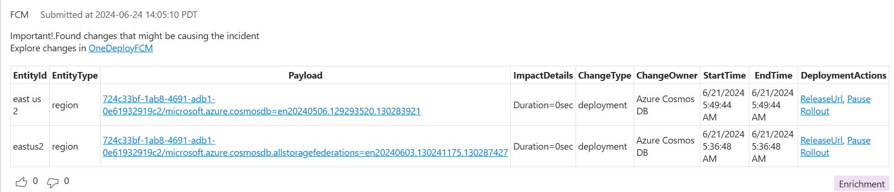
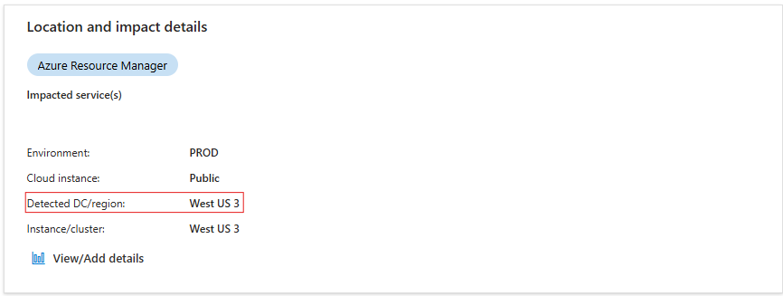
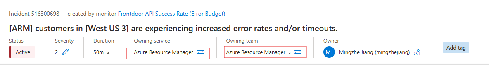
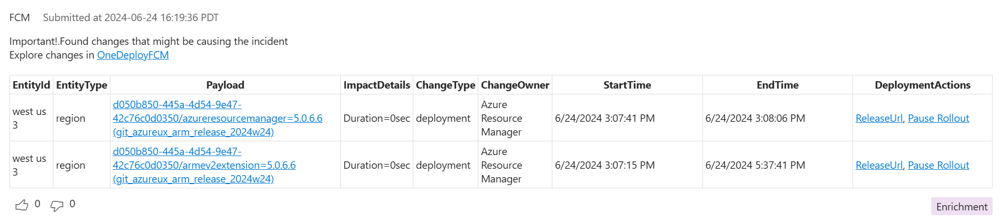

# ChangeInsights in ICM User Guide

### Examples

<!-- Impacted Regions in ICM-->

### Sev2 [515350586](https://portal.microsofticm.com/imp/v5/incidents/details/516300698/summary)[S500] [ACE/AED]CSS: Bees|2406190040004426|Authentication and TooManyRequests Error in CosmosDB

<!-- Detected DC/Region in Location and imapct Details in ICM-->
### Sev2 [516300698](https://portal.microsofticm.com/imp/v5/incidents/details/516300698/summary) [ARM] customers in [West US 3] are experiencing increased error rates and/or timeouts

<!-- ### User Interface 
Check out our demo video here!
-->

