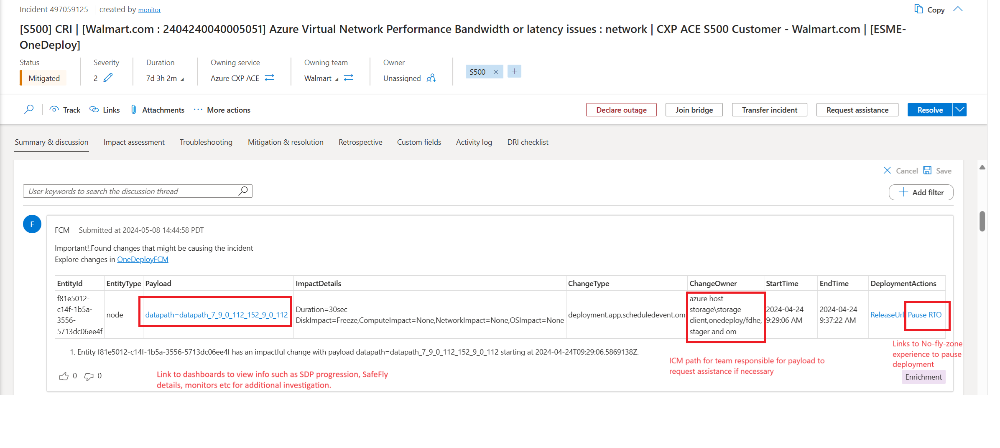
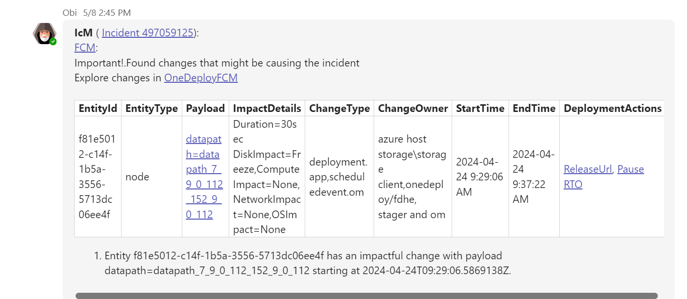
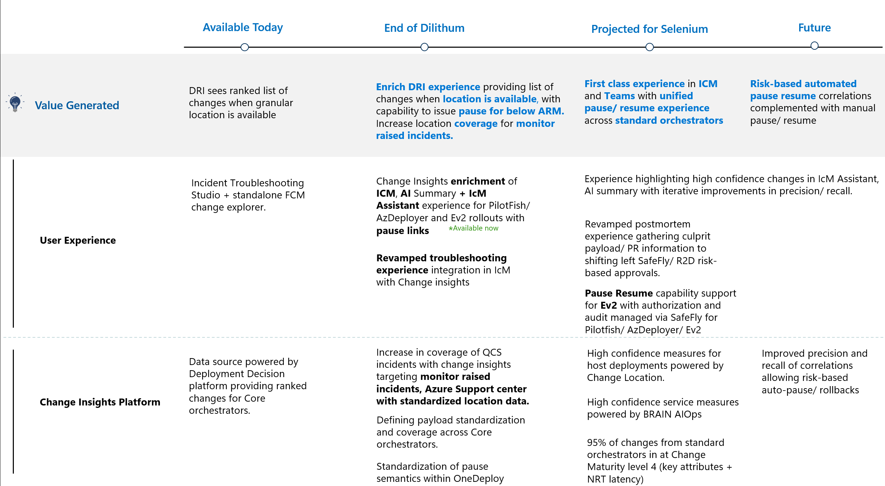

# ICM Experience

During fog of war, providing insights around what changes have occurred given critical contextual data (location, service and time frame) is essential to help narrow down suspects and isolate potential impact for change related incidents. Currently all Azure incidents with valid location data are enriched with change insights. If there is no change found, then the ICM is updated with "No changes found". Please see [ChangeInsights in ICM User Guide | Federated Change Management (eng.ms)](https://eng.ms/docs/products/fcm-engineering-hub/icmchangeinsights/changeinsights#overview) for the supported locations and ICM locations required to light up the experience.
The data in ICM provides a list of changes along with key information such as payload information, impact details, owning ICM path (for request assistance) as well as a Pause button that takes user to the Deployment Orchestrator Experience to enforce a No-Fly Zone. Once discussion summary is enriched, the data is available to be picked up in ICM AI Summary and broadcasted via IcM Assistant (Obi) in teams to give DRI information in the experiences they are in.

Insight is also surfaced in the Eng Bridge teams chat. If there is a change in location in ICM, the insight is broadcasted to the Teams chat. AI summary picks up the insights but there is planned work to optimize the results and predictability of what is shown.

# Roadmap for change insights experience improvement

