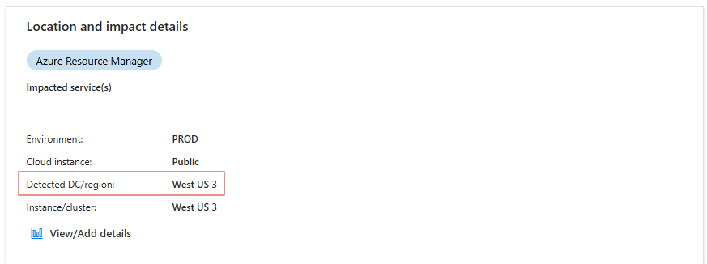
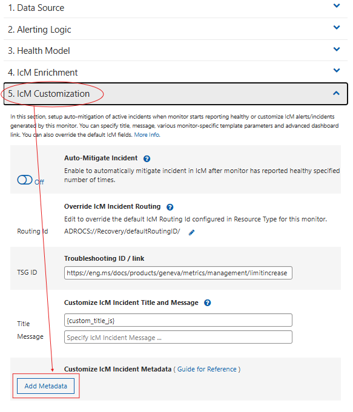
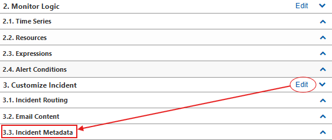

## ICM Location Attributes

**Change Insights** uses the below fields in ICM incident to understand the impacted location and provide relevant changes for location.
- <ins>*Detected DC/Region*</ins> -> to derive region, datacenter for the incident
- <ins>*Instance/Cluster*</ins> -> to derive granular locations (like - cluster, pfEnvironment, node, tor, vm, etc.)

> :construction: For each incident these fields are present under `Impact Assessment` tab -> `Location and impact details` section.  

> :rotating_light: **Change Insights** uses the most granular location provided in the above fields to show changes. <ins>Hence more granular the location, more relevant the changes will be.</ins>

## Populate standard values in ICM Location Attributes for monitor raised incidents.

### MDM Monitors

Please follow the below steps:
1. If the identified action item is `NoAction` or `PendingAnalysis`, then no action is required from the owning team.
We are continuously try to increase our coverage for `PendingAnalysis` monitors to reduce the manual effort required by the owning team to investigate & update the ICM mapping.

1. Follow this step <ins>only if</ins> the identified action item is `EmitStdLocationInMdmMetricDimension+MapMDMDimensionToICMLocation`, 
then you need to emit/update at-least one underlying metric to contain `Region` dimension.
Please refer to [official Geneva documentation for emitting metrics](https://eng.ms/docs/products/geneva/metrics/overview).  Then proceed to step **3** for updating the ICM Mapping on the monitor.  

    > :rotating_light: Region must follow the standardized values provided here [FCM Regions](https://dataexplorer.azure.com/clusters/https%3a%2f%2ffcmdata.kusto.windows.net/databases/FCMKustoStore?query=H4sIAAAAAAAEAHPOSMxLT3WtKMjJL0otig%2fOzC3IyUzLTE3xSy0pzy%2fKDskvyM%2fJT6%2bsUSjPSC1KVfDJT04syczPC6ksSFWwtVVQKkpNB3KVeLlqFFIyi0sy85JL4Io8UwAqR0WoXwAAAA%3d%3d)
 
1. If you have added a new dimension to the underlying metric of the monitor or the identified action item is `MapMDMDimensionToICMLocation`, 
then identify which dimension in the monitor represents a standard value by going through the `MonitorDimensionMappings` column of the dashboard.

    > :construction: Any dimension key-value pair which does not contain `DefaultMapping` is identified as a standard location by our system. This dimension should now be correctly mapped to ICM Location Attributes while creating incidents.

1. Refer to the below table to find ICM mapping configuration.
    
    | MDM_v1 | MDM_v2 |
    | --- | --- |
    | Go to section <ins>*"5. IcM Customization"*</ins> and *"Add Metadata"*.     | Got to section <ins>*"3. Customize Incident"*</ins> -> *"3.1 Incident Metadata"* and *"+Metadata"*     |

1. Use the below table to map the dimension to their respective ICM Location Attributes.
    
    > :warning: Replace `IdentifiedDimensionKey` with the dimension key identified in step *3*.
    
    | ICM Location Attribute | ICM Metadata Key| Monitor Dimension | Conditions | 
    | --- | --- | --- | --- |
    | Detected DC/Region | Icm.OccurringLocation .DataCenter | `{Monitor.Dimension.IdentifiedDimensionKey}` | If identified dimension is of type **region** or **datacenter**. |
    | Instance/Cluster   | Icm.OccurringLocation .DeviceName | `{Monitor.Dimension.IdentifiedDimensionKey}` | If identified dimension is of type cluster, node, tor, vm, etc. |
