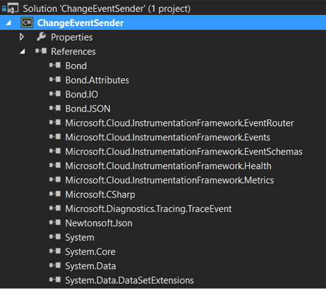

# Step 1: Get IFX Agentless (Eventrouter) bits 

## For public cloud 

Get the latest IFX Agentless (Eventrouter) bits as nuget. You can get the bits from nuget repository. 

For .Net Framework - Microsoft.Cloud.InstrumentationFramework.EventRouter.amd64 package is available @feed https://msazure.pkgs.visualstudio.com/_packaging/Official/nuget/v3/index.json
 

For .Net standard  - Microsoft.Cloud.InstrumentationFramework.EventRouter.NetStd package is available @feed https://msazure.pkgs.visualstudio.com/_packaging/FCM/nuget/v3/index.json 

*Note : Currently .Net std supports only Microsoft tenant*

**Get the latest IFX Agentless (Eventrouter) bits as nuget. You can get the bits from nuget repository listed above.** 

Install-Package Microsoft.Cloud.InstrumentationFramework.EventRouter.amd64 

Install-Package Microsoft.Cloud.InstrumentationFramework.VC14 

And your solution folder should look like this with all the required dll: 

