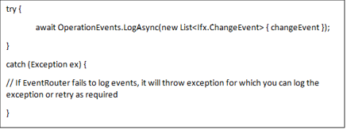

# Step 3: Write the code to send Change Event  

To send the change event, first you have to initialize the operation events with the account info, AADApplicationId and the certificate thumbprint: 

var cert = < get your cert from keyvault or local machine > 

 OperationalEvents.Initialize( 
    "fcmonboardtest", // FCM Test Account Name (DO NOT change this, for production “fcmerhub”) 
     
        "\<appid>”, // AADApplicationId(Your appid) 
         cert,true); // certificate associated with AADApplicationId 
     

Please refer to [ChangeEvent Field descriptions](https://eng.ms/docs/products/fcm-engineering-hub/onboard/datafielddesc/changeeventdesc) for further data information

<!--
*public static ChangeEvent CreateChangeEvent( 
string source,  
string title,  
string description,  
DateTimeOffset startTime,  
EventSchemas.ChangeTimeType startTimeType,  
byte priority,  
string impactedLocation,  
EventSchemas.ChangeLocationType locationType,  
Guid impactedServiceId,  
EventSchemas.ChangeStatus status,  
string sourceRecordId,  
EventSchemas.ChangeType changeType,  
DateTimeOffset endTime,  
EventSchemas.ChangeTimeType endTimeType,  
string? impactedComponentId = null,  
string changeOwner = null,  
string buildPath = null,  
string buildNumber = null,  
string changeInitiator = null,  
DateTimeOffset? created = null,  
EventSchemas.ChangeEnvironment? environmentName = null,  
DateTimeOffset? modified = null,  
string? subscriptionId = null,  
bool appendDescription = false,  
byte risk = 2,  
string externalSourceType = null,  
string? externalParentId = null);* -->

You can create a minimal change event like following: 

Once the event is created then you can send the event to FCM event hub with the following line of code: 

Please make sure when validating your changes in PPE your changes always contains: 
- EventRouterSample as ChangeSource (otherwise the changes will not be processed in PPE) 
- Your ServiceTreeGuid as Service's GUID (othwerwise the changes will not show in FCM PPE UI under your service name) 