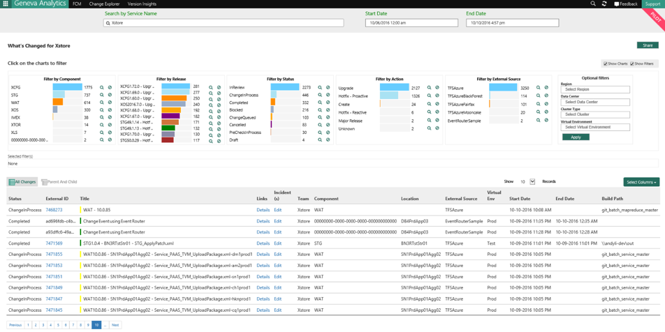
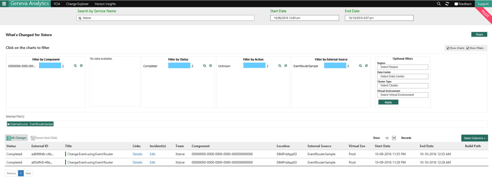
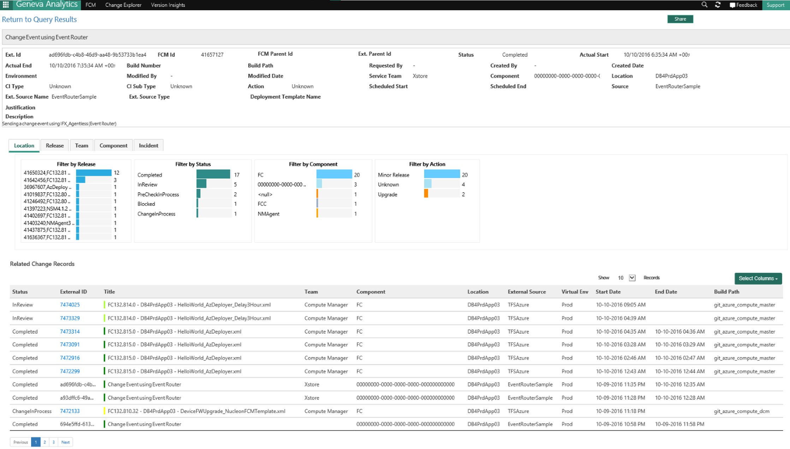

You can validate in [FCM PPE UI](https://fcmppe.msftcloudes.com/main.html#/WhatsChanged) if your change is successfully inserted into FCM PPE DB. To see your change in FCM PPE UI your service need to be in ServiceTree.  

Here is an [example](https://fcmppe.msftcloudes.com/Home/GoToDeepLinkV3?path=/WhatsChanged?serviceguid=734379f9-2d2c-48d4-a52a-5c509f699de4&servicename=Xstore&startdate=2016-10-06T07:00:00.000Z&enddate=2016-10-10T23:57:00.000Z&parentchildview=false) of validating in UI for a change that is sent as a ChangeEvent.  <!-- validate link -->

Search by your service name (in the example ‘xstore’ is the service as defined in Service Tree) and it will show all the changes for your service along with the changes you sent using IFX_Agentless as changeEvent <!-- theres a link here but it doesn't work -->

You can filter to show only your specific changes by Source <!-- theres a link here but it doesn't work -->

Details about a record created using the Event router sample solution: <!-- theres a link here but it doesn't work -->

## Right values in the right fields are crucial 

Please make sure you follow every step mentioned above and chose the right values mentioned for different fields in the Appendices. Wrong values will make your change event either not be parsed correctly or not to be inserted in FCM DB. 

Sample Solution to download https://microsoft.sharepoint.com/teams/WAG/EngSys/ServiceMgmt/ChangeMgmt/Shared%20Documents/Send%20ChangeEvent%20Using%20IFX%20Agentless/ChangeEvent_Using_IFXAgentless_Sample.zip <!-- validate link -->