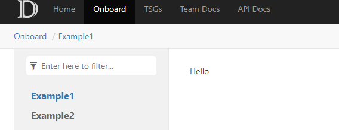

# What is Onboarding to FCM? 

## Onboarding means: 
- Your Service is using a standard deployment system (ExpressV (EV2), AzDeployer, Geneva Actions)
- The [FCM onboarding form](https://forms.office.com/Pages/ResponsePage.aspx?id=v4j5cvGGr0GRqy180BHbRxquAYMMq_9PvupXzjCOyq9UMEZHTjVEVVgzR1RVT0VDVjZITUM3S0tBUy4u) has been filled out and approved
- The service is listed in [Service Tree](https://servicetree.msftcloudes.com/main.html#/)
- The Engineers for the service have validated the change data for the Service/Component in the [FCM UI](https://aka.ms/fcm). 
- Data and visualization issues are logged and tracked by FCM.

**Note:** *If you are using standard deployment systems like ExpressV (EV2), AzDeployer, Geneva Actions, there is no onboarding required. Apart from the standard deployment systems, FCM gets changes from these custom deployment systems.*

## Onboarding Forms
#### FCM Push/Pull Access Request and App ID Approval
This is the first form you need to fill out before proceeding to the next step: [FCM onboarding form](https://forms.office.com/Pages/ResponsePage.aspx?id=v4j5cvGGr0GRqy180BHbRxquAYMMq_9PvupXzjCOyq9UMEZHTjVEVVgzR1RVT0VDVjZITUM3S0tBUy4u). FCM is built on the data supplied by other services. In order to know what data that is being pushed to FCM, we need to ask a few questions to ensure we are able to support this data and we can keep track on the services FCM has onboarded. This form also needs to be filled out by users who are requesting access to pull data from FCM through our Kusto cluster. 

If your service is already onboarded to FCM but you need to request approval for an App ID, you will need to submit a request in the [FCM onboarding form](https://forms.office.com/Pages/ResponsePage.aspx?id=v4j5cvGGr0GRqy180BHbRxquAYMMq_9PvupXzjCOyq9UMEZHTjVEVVgzR1RVT0VDVjZITUM3S0tBUy4u) and select App ID approval for previously onboarded service. 

#### What am I filling out? 

The [FCM onboarding form](https://forms.office.com/Pages/ResponsePage.aspx?id=v4j5cvGGr0GRqy180BHbRxquAYMMq_9PvupXzjCOyq9UMEZHTjVEVVgzR1RVT0VDVjZITUM3S0tBUy4u) asks for the following types of information: 

- Service Tree ID 
- Service to be onboarded 
- If your intent is to push data to FCM, and/or pull data
- Onboard an App ID 
- Justification/information about the application 

The App ID form is the same [link](https://forms.office.com/Pages/ResponsePage.aspx?id=v4j5cvGGr0GRqy180BHbRxquAYMMq_9PvupXzjCOyq9UMEZHTjVEVVgzR1RVT0VDVjZITUM3S0tBUy4u) as the FCM onboarding form. If your service has already been onboarded to FCM, please re-fill out the form and include the information about your App ID

**Note:** *This should be the first form that you fill out in order to be granted approval to use FCM. This form helps us gain an idea for how FCM is being utilized and to track the type of data that is populating FCM.*

#### Onboarding Assistance
If you need assistance with the FCM onboarding form fields or have any onboarding related questions, email [FCM Support](mailto:fcmsupport@microsoft.com?subject=Onboarding%20Request:%20[Team%20Name]) 

<!--or visit our [Office Hours](https://microsoft.sharepoint.com/teams/WAG/EngSys/ServiceMgmt/ChangeMgmt/SitePages/Home.aspx#OfficeHours) via teams. -->

<!-- Add onboarding instructions in this sections. 
The TOC yaml below is an indexer into different subsections. For example,
```
- Name: Description
  href: description.md
- name: Example1
  href: Doc1.md
- name: Example2
  href: Doc2.md
```
will create two sub-sections like below:
 -->