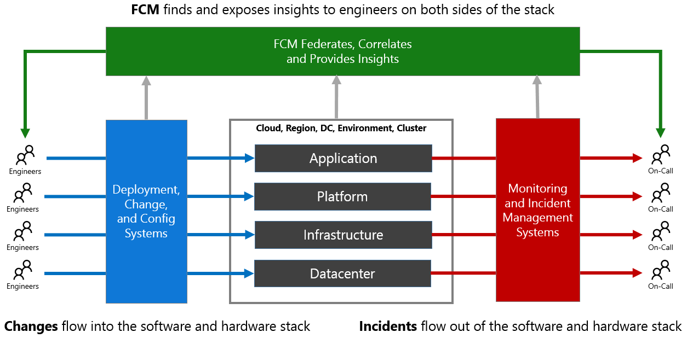

# Why FCM? 

### What is Federated Change Management and Why Use It? 
Federal Change Management (FCM) provides actionable insights derived from Service State and Change across Microsoft cloud, service layers and dependencies. By federating, correlating and merging data from these sources, FCM can derive and expose actionable insights to help engineers make better decisions. By doing so FCM insights can reduce risk to current production environments and reduce the time to mitigate live site incidents. 

FCM’s mission is to prevent or minimize negative impact to the customer experience resulting from any physical or logical changes. The goal is to reduce the time to mitigation (TTM) by enabling DRIs to quickly identify culprit changes for any incident caused by changes. 

### Who Should Use FCM?
FCM focuses on three primary personas: 

- Deployment Engineer - Any software engineer that pushes code or configuration into production environments 
- Any hardware engineer that makes physical or configuration changes into production environments 
- On-Call Engineer - Any engineer that is responsible for mitigating a live site incident 

FCM can, however, be a valuable tool for any engineer (regardless of specific function) that is interested in gaining insights about their services or tracking changes of other services.

### Problem Statement
Consider the service operations process diagram below. 

Engineers (on the left) are continuously pushing changes into various layers of the stack in production. Events and incidents flow out of production to on-call engineers (on the right) to be mitigated as quickly as possible. 
There are some key complications with this flow:

- **Engineers (on the left) who are making changes:**
    - Aren't aware of other change activity up or down the stack that might adversely impact their changes 
    - Aren't aware of the incident activity that can have real impact on their deployments 
    - Aren't sufficiently aware of the current state of production (in the center) to know if the changes are safe 
- **On-call Engineers (on the right):**
    - Aren't aware of other incidents up or down the stack that might be influencing their own incident activity 
    - Aren't aware of what changes may have contributed to their incidents 
    - Aren't aware of deployments/changes that continue to queue up even during an incident 
    - Aren't sufficiently aware of the current state of production to formulate the best mitigation 

What we have learned from assessing this problem:  
- DRI’s need a more productive UX 
- Change coverage is fundamental to trusting FCM as a source of truth for all changes 
- Accurate, consistent and granular location data is fundamental to better correlation (partnering with AQI team) 
- Complete and up-to-date service and resource dependencies are required to auto-correlate changes across dependencies (partnering with DToA team) 
- Fully automated relevance and ranking is needed to support Azure’s fast evolving architecture. Current manually attested static heuristics do not scale. 

### FCM as a Solution
Given the same process flow, FCM takes the following steps to improve the situation. 
- Federates data from many deployment and configuration systems (on the left) 
- Syncs incident data from the predominant incident systems (on the right) 
- Crawls production to determine the current state, version, etc (in the center) 
- Correlates change and incident data 
- Merges change and current state data for accurate picture of production 
- Exposes insights via UX and API to Engineers (on the left and right) to make their jobs easier 

<!--
- Engineers (on the left) making changes aren't aware of other change activity up or down the stack that might adversely impact their changes 
- Engineers (on the left) making changes aren't aware of the incident activity that can have real impact on their deployments 
- Engineers (on the left) making changes aren't sufficiently aware of the current state of production (in the center) to know if the changes are safe 
- On-call Engineers (on the right) aren't aware of other incidents up or down the stack that might be influencing their own incident activity 
- On-call Engineers (on the right) aren't aware of what changes may have contributed to their incidents 
- On-call Engineers (on the right) aren't aware of deployments/changes that continue to queue up even during an incident 
- On-call Engineers (on the right) aren't sufficiently aware of the current state of production to formulate the best mitigation -->