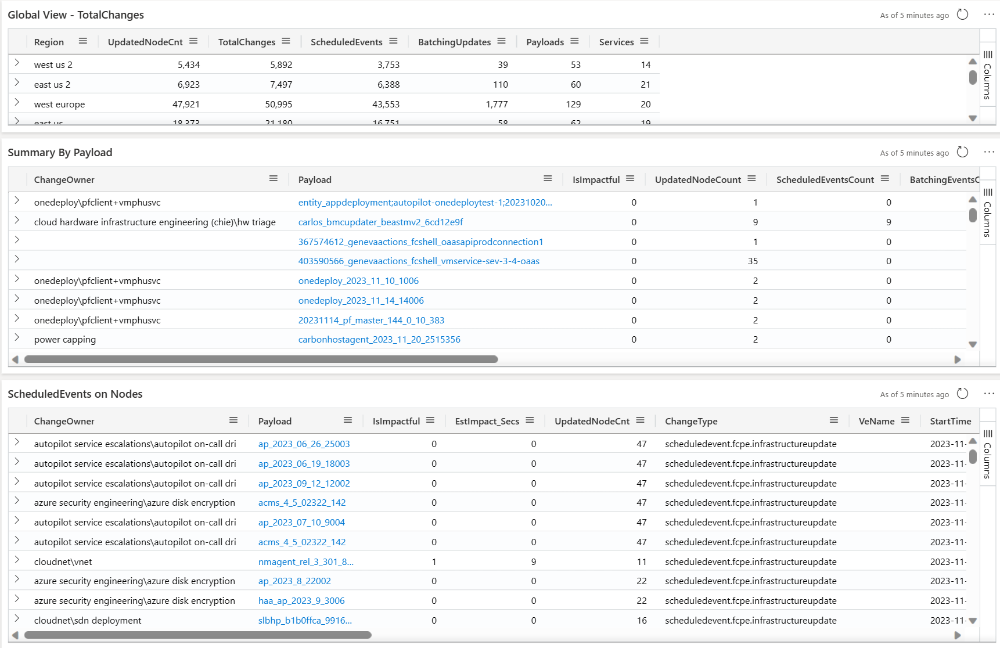

### <a name="hostChanges"> <h1> Navigating the "Host Changes" View </h1> </a>

The view shows changes made to the nodes for the selected filter criteria:

- Region (optional) : Select the Region from the drop down to list all the node changes made in the Region

- Cluster (optional) : Select the Cluster from the drop down to list all the node changes made in the Cluster, the cluster seletion will be confined to the selected Region

- ServiceName(optional): Select the ServiceName to confine changes made by a service

- Payload(optional): Input payload, to filter changes for a given payload

