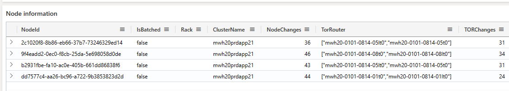
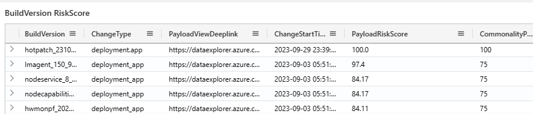

<h1> Navigating the Host Drill Down View </h1> 

For a given time range and list of comma separated node ids, the Host Drill Down View page provides a lot of detail. The node information table provides details such as if the node is batched, total number of changes on the node, the associated rack, cluster, ToR Router, Cluster Spine and changes on each of them. 

“Node Scheduled Events” provides the list of scheduled events, associated impact, Source and ChangeType. 

The “Build Version Risk Score” table provides the risk score of each of the payloads that were applied on the nodes. 

All T0/T1/T2 changes associated with the nodes are available in the below tables - 

