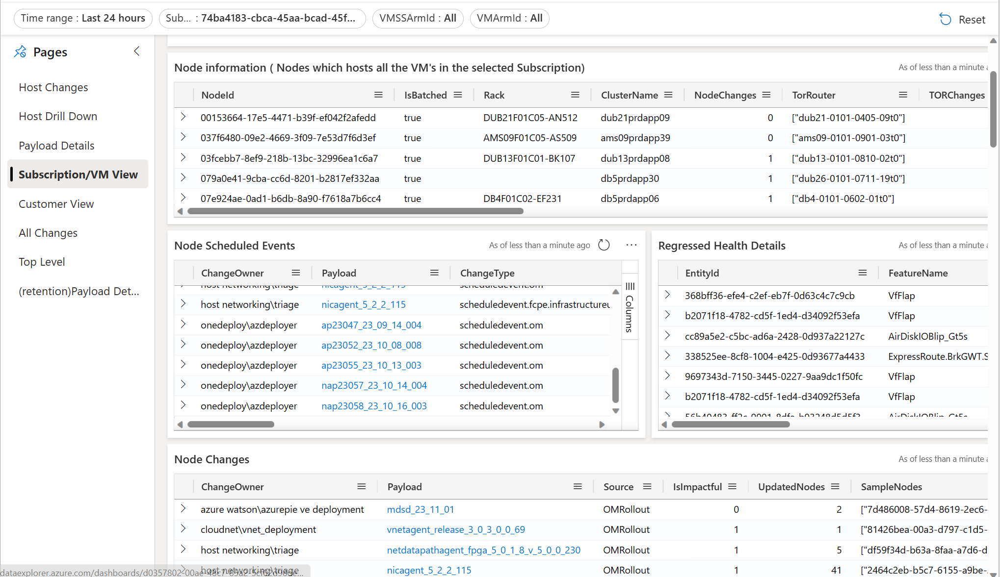

### <a name="Subscription/VM"> <h1> Navigating the “Subscription/VM” View </h1> </a>

The “Subscription/VM View” provides a subscription or ARM Resource (VMSS/VM) level view to show changes to all the nodes the VM(s) are hosted on.
For one or more comma separated list of Subscription Ids, the “Subscription/VM View” page provides the list of all changes that were made on the nodes, which hosts all the VMs in the list of subscription(s).
The VMSSArmID and VMArmId filters can be used to further drill down to the specific VMSS or VM , to search for changes made to the node, the VM is hosted on.

