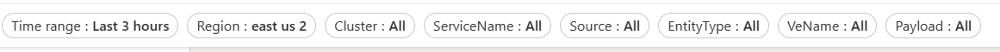
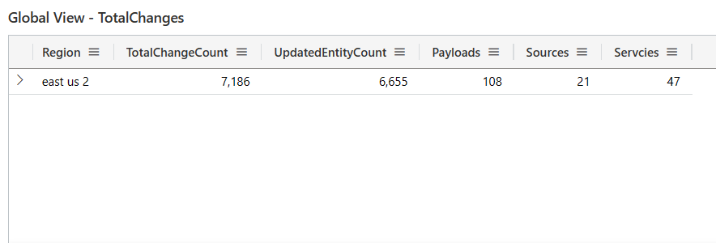
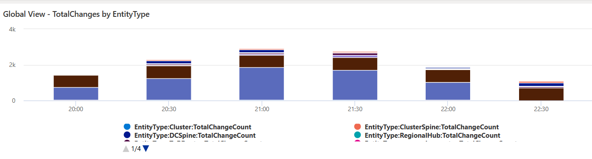
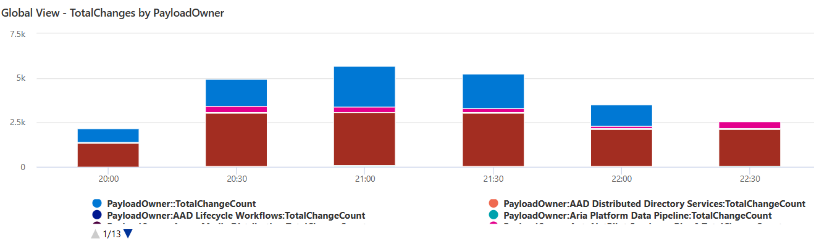

<h1>Interface How-To’s: </h1>

During incident mitigation, DRIs are looking for changes made by either their service or by a dependent service.  There are various tables and views within the dashboard that can help the DRI look for changes.

In a more practical scenario, DRIs don’t know which is the responsible service for the incident, in which case they only know the impact start time and impact location. The sections below, provide detailed steps for how to navigate and make the most of the dashboard, given the limited information available to the DRI. 

### <a name="toplevelView"> <h2>Navigating the Top-Level View</h2> </a>

1.	Clear any pre-populated filter values
2.	Select a time-range: preferably last 24 hrs or a custom time range   
3.	Select the region that has been impacted 

Alternatively, select a service or source to view all the changes made by the service or source 

To understand the details of the changes, navigate to the [“Change Details” View](ChangeDetails.md#changeDetails) 