<h2>Interface How-To’s: </h2>

During incident mitigation, DRIs are looking for changes made by either their service or by a dependent service.  There are various tables and views within the dashboard that can help the DRI look for changes.

In a more practical scenario, DRIs don’t know which is the responsible service for the incident, in which case they only know the impact start time and impact location. The sections below, provide detailed steps for how to navigate and make the most of the dashboard, given the limited information available to the DRI. 

### <a name="toplevelView">Navigating the Top-Level View </a>

1.	Clear any pre-populated filter values
2.	Select a time-range: preferably last 24 hrs or a custom time range   
3.	Select the region that has been impacted 

Alternatively, select a service or source to view all the changes made by the service or source 

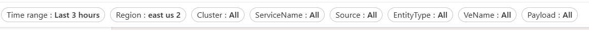

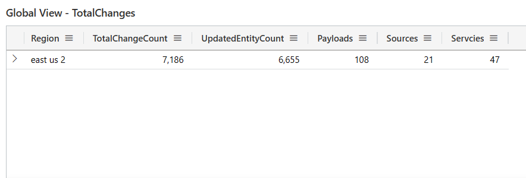

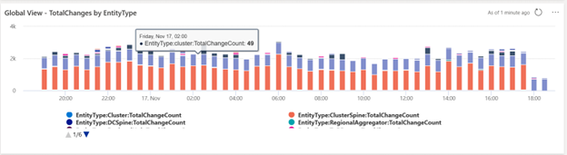

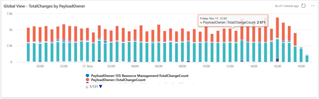

To understand the details of the changes, navigate to the [“Change Details” View]() 

<h2> Navigating the “Change Details” View </h2>

The Change Details View provides exhaustive details of the changes. Change details can be looked up for a specific time-range, location (region, availability zone, data center etc.), a specific entity Id (node, cluster, fabric cluster, storage tenant, sql cluster, etc.),a specific service or ICM team name.

### <a name="payloadRisk"> <h3> Find payloads with highest risk: </h3> </a>

1. Navigate to “Change Details” Page  
2. Clear any pre-populated filters 
3. Select a time range  
4. Select the impacted region  

The “All Updates” table shows the list of all the changes, made by all services, that are being deployed, along with the Payload risk score for each of the payloads. 

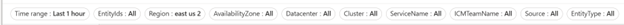

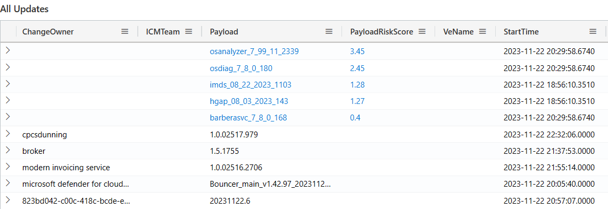

### <a name="hostUpdate"> <h3>Find Host Updates in a region: </h3> </a>

- Navigate to “Change Details” Page  
- Clear any pre-populated filters 
- Select a time range  
- Select the impacted region  

The “Host Update Summary” table shows the count of host updates being made at a given region. Use the Node view to navigate and review the details of the changes being made at the node level. 

The “Host Updates” table provides the details of each individual payload that is being applied to a node. The change owner of the payload, associated VE Name and Change Type are also provided for detailed investigation. 

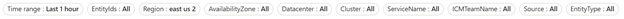

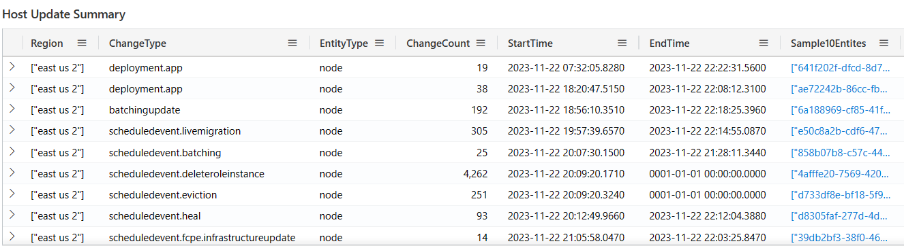

<h3>Find changes made by Quality Critical Service: </h3>

For a scenario where multiple changes are being deployed in a given time-frame and to find changes that were specifically made by Quality Critical Services, follow the below steps: 
Navigate to “Change Details” Page ➔ select a time range ➔ select the Region 

The table, “All Changes by QCS Service” will show the payload and other metadata associated with the change. 

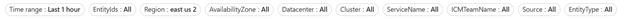

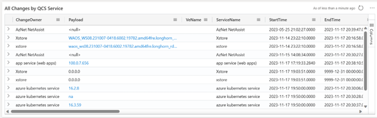

### <a name="hostUpdateNetworking"> <h3>Find Host Updates by Host Networking: </h3> </a>

Host Networking is a Quality Critical Service, and during Incident Mitigation, DRIs are often trying to rule out if there were any changes made by Host Networking that might have led to the incident.  

To identify the changes,  

1. Navigate to the “Change Details” Page 
2. Clear any pre-populated filters 
3. Select the incident time-line 
4. Select the impacted location – region, cluster information that might be available 
5. Select “Host Networking” under the “ServiceName” filter 

The list of changes made by “Host Networking” along with Payload details, Risk scores, VE Name etc for each change is listed out. 

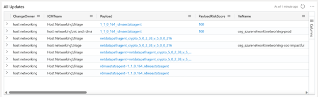

<h3> Find changes made on a node: </h3> 

For a given time range and list of comma separated node ids, the Node View page provides a lot of detail. The node information table provides details such as if the node is batched, total number of changes on the node, the associated rack, cluster, ToR Router, Cluster Spine and changes on each of them. 

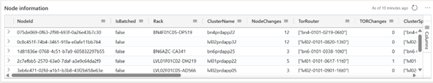

“Node Scheduled Events” provides the list of scheduled events, associated impact, Source and ChangeType. 

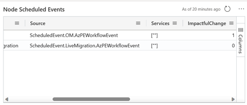

The “Build Version Risk Score” table provides the risk score of each of the payloads that were applied on the nodes. 

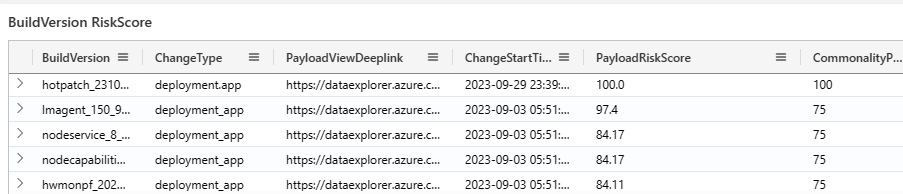

All T0/T1/T2 changes associated with the nodes are available in the below tables - 

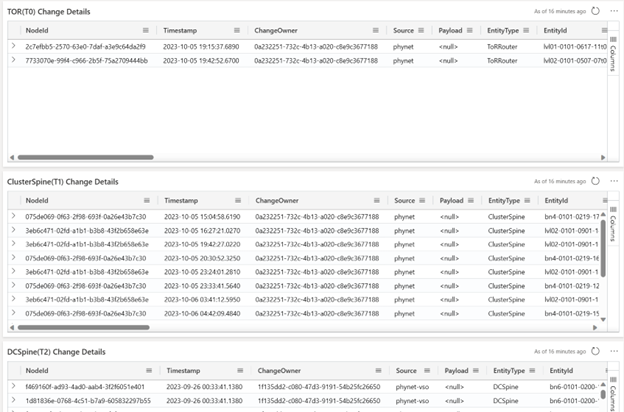