<h1>OneDeployFCM Dashboard (aka.ms/onedeployfcm)</h1>
<h2>Dashboard Overview: </h2>
The One deploy fcm dashboard has been built on top of the Entity Model data. The dashboard provides several views that allows the DRIs to find changes that were made at a given time duration, and/or, at a given location, and/or, by a given service. It allows the DRIs to zoom out for changes at a region level, or zoom in for changes at a given entity level, and everything in between.  DRIs can also see the SDP progression for a given payload. 

If you need access please add your-self to the idweb group: [fcmusers](https://idweb.microsoft.com/IdentityManagement/aspx/common/GlobalSearchResult.aspx?searchtype=e0c132db-08d8-4258-8bce-561687a8a51e&content=fcmusers).


<h2>FAQs</h2>

1.	What changes are happening in an impacted region?
    - Navigate to the [Top Level Changes](https://dataexplorer.azure.com/dashboards/d0357802-00ae-48c7-85a2-5cf02d98de77?p-_startTime=12hours&p-_endTime=now&p-_region=all&p-_cluster=all&p-_serviceName=v-Host+Networking&p-_icmTeamName=all&p-_source=all&p-_entityType=all&p-_veName=all&p-_payload=all&p-_payloadOwner=all#a2b4dbc9-e958-4054-bc3e-6677c4321dd9) tab to view all the changes made in a region or all the changes made by a service
    - Follow the steps [here](#navigating-the-top-level-view) to find the changes that have been made
2. Are there any control plane changes?
    - Navigate to the [Change Details](https://dataexplorer.azure.com/dashboards/d0357802-00ae-48c7-85a2-5cf02d98de77?p-_startTime=6hours&p-_endTime=now&p-_entityIds=v-uswestcentral-prod-a&p-_region=all&p-_availabilityZone=all&p-_datacenter=all&p-_cluster=all&p-_serviceName=v-Azure+Cosmos+DB&p-_icmTeamName=all&p-_source=all&p-_entityType=all&p-_veName=all&p-_payload=all&p-_payloadOwner=all#66cc3653-ecde-4c2c-9d24-1838d351d4d4) tab to view details of changes made
    - Follow the steps [here](#navigating-incidents-that-involve-control-plane-changes) to find control plane changes
3.	Are there any host networking changes? 
    - Navigate to the [Change Details](https://dataexplorer.azure.com/dashboards/d0357802-00ae-48c7-85a2-5cf02d98de77?p-_startTime=6hours&p-_endTime=now&p-_entityIds=v-uswestcentral-prod-a&p-_region=all&p-_availabilityZone=all&p-_datacenter=all&p-_cluster=all&p-_serviceName=v-Azure+Cosmos+DB&p-_icmTeamName=all&p-_source=all&p-_entityType=all&p-_veName=all&p-_payload=all&p-_payloadOwner=all#66cc3653-ecde-4c2c-9d24-1838d351d4d4) tab to view details of changes made
    - Follow the steps [here](#find-changes-made-by-service) to find changes made by “Host Networking” Service
4.	Are there any Azure networking changes? 
    - Navigate to the [Change Details](https://dataexplorer.azure.com/dashboards/d0357802-00ae-48c7-85a2-5cf02d98de77?p-_startTime=6hours&p-_endTime=now&p-_entityIds=v-uswestcentral-prod-a&p-_region=all&p-_availabilityZone=all&p-_datacenter=all&p-_cluster=all&p-_serviceName=v-Azure+Cosmos+DB&p-_icmTeamName=all&p-_source=all&p-_entityType=all&p-_veName=all&p-_payload=all&p-_payloadOwner=all#66cc3653-ecde-4c2c-9d24-1838d351d4d4) tab to view details of changes made
    - Follow the steps and example [here](#navigating-incidents-that-involve-networking-changes) to find out SDN changes
5.	What changes are happening to SQL clusters? 
    - Follow the steps and examples [here](#SQL-reports-that-a-tenant-is-unhealthy-and-needs-to-investigate-potential-host-related-culprits:)  
6.	Are there any changes to the node the SQL cluster is hosted on? 
    - Navigate to the [Node View](https://dataexplorer.azure.com/dashboards/d0357802-00ae-48c7-85a2-5cf02d98de77?p-_startTime=6hours&p-_endTime=now&p-_nodeid=all&p-_dynamicMeasure=all&p-_entityTypeNode=all#08c31477-dfa3-43d3-9427-a6a57b228c43)
    - Follow the steps [here](#changes-for-nodes) to find changes at the node
7.	Are there any TOR changes associated with the node? 
    - Navigate to the [Node View](https://dataexplorer.azure.com/dashboards/d0357802-00ae-48c7-85a2-5cf02d98de77?p-_startTime=6hours&p-_endTime=now&p-_nodeid=all&p-_dynamicMeasure=all&p-_entityTypeNode=all#08c31477-dfa3-43d3-9427-a6a57b228c43)
    - Follow the steps [here](#identifying-tor-t1-t2-changes-for-the-node) to find changes at the node
8.	What changes are happening to storage tenants? 
    - Navigate to the [Change Details](https://dataexplorer.azure.com/dashboards/d0357802-00ae-48c7-85a2-5cf02d98de77?p-_startTime=6hours&p-_endTime=now&p-_entityIds=v-uswestcentral-prod-a&p-_region=all&p-_availabilityZone=all&p-_datacenter=all&p-_cluster=all&p-_serviceName=v-Azure+Cosmos+DB&p-_icmTeamName=all&p-_source=all&p-_entityType=all&p-_veName=all&p-_payload=all&p-_payloadOwner=all#66cc3653-ecde-4c2c-9d24-1838d351d4d4) tab to view details of changes made
    - Follow the steps and examples here

<h2>Interface How-To’s: </h2>

During incident mitigation, DRIs are looking for changes made by either their service or by a dependent service.  There are various tabs and views within the dashboard that can help the DRI look for changes.

### Navigating the Top-Level View

1.	Clear any pre-populated filter values
2.	Select a time-range: preferably last 24 hrs or more 
3.	Select the region that has been impacted
4.	Alternatively, select a service to view all the changes made by the service

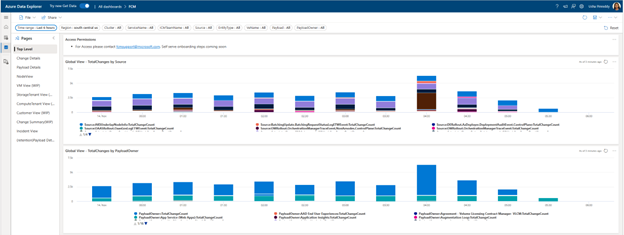
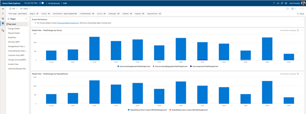


<h2> Navigating the “Change Details” View </h2>

The Change Details View provides exhaustive details of the changes. Change details can be looked up by a specific entity Id (node, cluster, fabric cluster, storage tenant, sql cluster, etc.), a specific time-range, location (region, availability zone, data center etc.),a specific service or ICM team name.

## Find changes made by service: 

Navigate to “Change Details” Page ➔ select a time range ➔ select your service name 
For example, the below shows all the changes that were made by “Host Networking” in the last 6 hours.

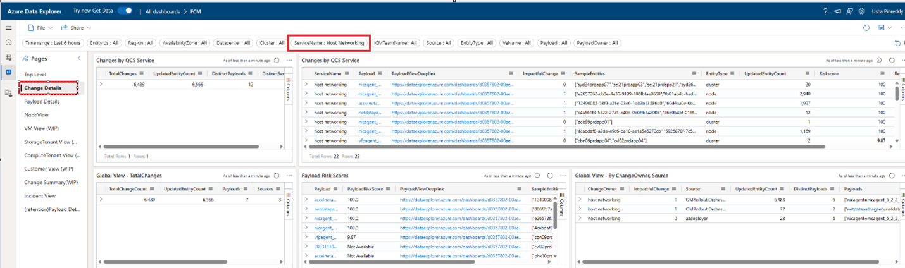

The details of the payload, the entities that were updated, if it was an impactful change, the risk score of the payload and the change system that made the change are detailed out.

<h2> Find Host Updates by Quality Critical Services: </h2>

Use this table to identify all the host updates that were made by [Quality Critical Services](https://eng.ms/docs/quality/okrs/azure_quality_critical_services). Simply select the time range (incident timeline) and/ or location filters.

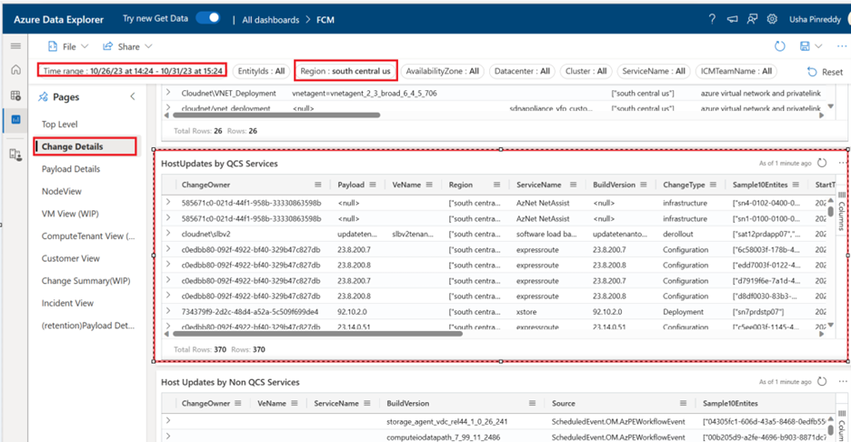

<h2> Find changes made on a node: </h2>

For a given time range and list of comma separated node ids, the Node View page provides a lot of detail. The node information table provides details such as if the node is batched, total number of changes on the node, the associated rack, cluster, ToR Router, Cluster Spine and changes on each of them. 

The “Build Version Risk Score” table provides the risk score of each of the payloads that were applied on the nodes.

Impactful changes and Scheduled Events list can be reviewed as well in the “Node Changes” and “Node Scheduled Events” table.

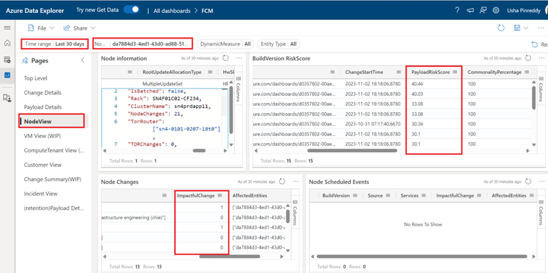
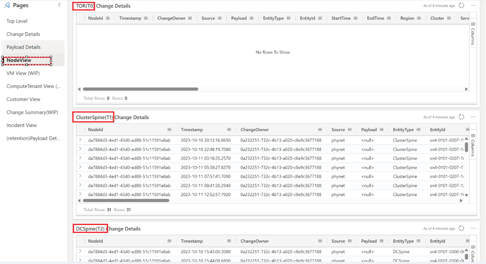

<h2> Examples/ Scenarios: </h2>

## Navigating Incidents that involve Control Plane Changes 

<h4> What type of Incidents are caused by Control Plane Changes? </h4>

CRUD operation failures on VM, VMSS

Incident pattern - ApiUnexpectedFailures exceeded thresholds for ApiName: virtualmachinescalesets.resourceoperation.put. Location: <Region>.

Example of Control plane Incident: [Incident-440639800 Details - IcM (microsofticm.com)](https://portal.microsofticm.com/imp/v3/incidents/incident/440639800/summary)

OR [Incident 425736167](https://portal.microsofticm.com/imp/v3/incidents/incident/425736167/summary) : CRUD operations failing for compute resources in ….

<h4> How to find Control plane changes: </h4>
Select the fabricCluster as the EntityId to get granular results

If fabriccluster is not available, choose the region

<h4> How to Identify fabricCluster for a given VM? </h4>

If you know the VMId, you can find the fabric cluster using the query 

```cluster('azcrp.kusto.windows.net').database('crp_allprod').VMApiQosEvent| where vMId =='<VMID>'|project fabricCluster,PreciseTimeStamp| order by PreciseTimeStamp desc|limit 100  ```

<h4> Where and what input is given in the dashboard to show the control plane changes </h4>

Identify the fabric cluster: **uswestcentral-prod-a**( provided in the incident 440639800)
Identify control plane changes:

1.	Go to Change Details view  [FCM (azure.com)](https://dataexplorer.azure.com/dashboards/d0357802-00ae-48c7-85a2-5cf02d98de77?p-_startTime=1hours&p-_endTime=now&p-_entityIds=all&p-_region=all&p-_availabilityZone=all&p-_datacenter=all&p-_cluster=all&p-_serviceName=v-Azure+Cosmos+DB&p-_icmTeamName=all&p-_source=all&p-_entityType=all&p-_veName=all&p-_payload=all&p-_payloadOwner=all#66cc3653-ecde-4c2c-9d24-1838d351d4d4)
2.	Make sure you remove/reset any filters, already set
3.	Enter the fabric cluster in to EntityId: **uswestcentral-prod-a**
4.	Enter the above fabric cluster name in the EntityId filter and set the time line correctly, recommended to use –24 hrs as the start time from the incident start time. There are scenarios where the issue was latent, so set the time filters as needed.

https://dataexplorer.azure.com/dashboards/d0357802-00ae-48c7-85a2-5cf02d98de77?p-_startTime=2023-11-09T23-51-00Z&p-_endTime=2023-11-10T23-51-00Z&p-_entityIds=v-uswestcentral-prod-a&p-_region=all&p-_availabilityZone=all&p-_datacenter=all&p-_cluster=all&p-_serviceName=all&p-_icmTeamName=all&p-_source=all&p-_entityType=all&p-_veName=all&p-_payload=all&p-_payloadOwner=all#66cc3653-ecde-4c2c-9d24-1838d351d4d4

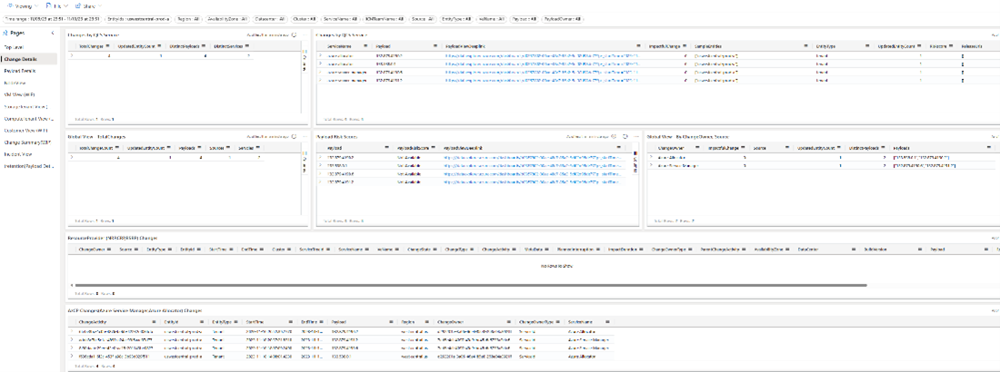

## Navigating Incidents that involve Networking Changes
<h4> What type of Incidents are caused by SDN Changes? </h4>

Network latencies, lost connection with the VM, lost connection between compute and storage nodes

<h4>Example of SDN  Incident: </h4>

[Incident-425027989 Details - IcM (microsofticm.com)](https://portal.microsofticm.com/imp/v3/incidents/details/425027989/home), The Host updates (NMAgent ) has triggered query time outs, followed by more issues on the client side

<h4>Where and what is the input is given in the dashboard to show the SDN (software defined network) changes </h4>

The first step in identifying the host updates is to identify the node or cluster or storage tenant/cluster. In the above incident , the below Entities/locations are identified

**Storage Nodes**: *222038fd-8e2a-4232-9c53-e4d1144312af, 3206df73-7121-480a-9bf3-65169887a5d1, 9ded79f9-5971-4b61-a187-7b05d0d425e4*

**Storage Tenant**: *ms-hkg21prdstf01a*

**Storage Cluster**: *hkg21prdstf01*

<h4>If granular location is provided, then the number of changes will be confined , correlated and accurate. It is highly recommended to inputs node’s affected to get accurate results.</h4>

<h4>Changes for Nodes: </h4>

5.	Go to [Node View](https://dataexplorer.azure.com/dashboards/d0357802-00ae-48c7-85a2-5cf02d98de77?p-_startTime=1hours&p-_endTime=now&p-_nodeid=all&p-_dynamicMeasure=all&p-_entityTypeNode=all#08c31477-dfa3-43d3-9427-a6a57b228c43)
6.	Get the nodes affected in the comma separated format, in this case *222038fd-8e2a-4232-9c53-e4d1144312af, 3206df73-7121-480a-9bf3-65169887a5d1, 9ded79f9-5971-4b61-a187-7b05d0d425e4*
7.	Enter the above comma separated values into NodeId filter and set the time line correctly, recommended to use –24 hrs as the start time from the incident start time. There are scenarios where the issue was latent, so se the time filters as needed.

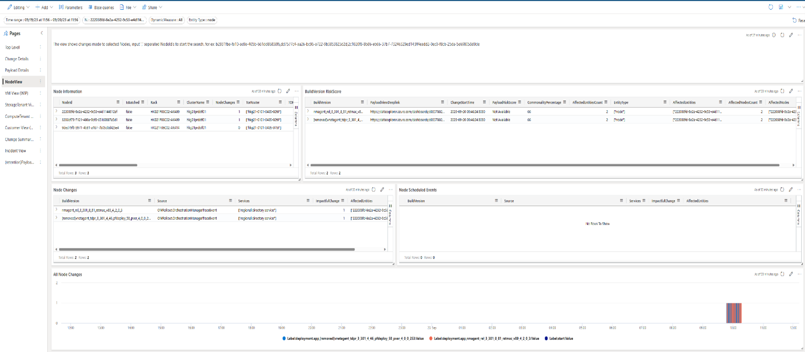

https://dataexplorer.azure.com/dashboards/d0357802-00ae-48c7-85a2-5cf02d98de77?p-_startTime=2023-09-19T11-56-00Z&p-_endTime=2023-09-20T11-56-00Z&p-_nodeid=v-222038fd-8e2a-4232-9c53-e4d1144312af%2C+3206df73-7121-480a-9bf3-65169887a5d1%2C+9ded79f9-5971-4b61-a187-7b05d0d425e4&p-_dynamicMeasure=all&p-_entityTypeNode=v-node#08c31477-dfa3-43d3-9427-a6a57b228c43


<h4> Changes for StorageTenant: </h4>

1.	Go to Change Details view  [FCM (azure.com)](https://dataexplorer.azure.com/dashboards/d0357802-00ae-48c7-85a2-5cf02d98de77?p-_startTime=1hours&p-_endTime=now&p-_entityIds=all&p-_region=all&p-_availabilityZone=all&p-_datacenter=all&p-_cluster=all&p-_serviceName=v-Azure+Cosmos+DB&p-_icmTeamName=all&p-_source=all&p-_entityType=all&p-_veName=all&p-_payload=all&p-_payloadOwner=all#66cc3653-ecde-4c2c-9d24-1838d351d4d4)
2.	Make sure you remove/reset any filters, already set
3.	Enter the storage tenant in EntityId : *ms-hkg21prdstf01a*
4.	Enter the above SQL cluster name in the EntityId filter and set the time line correctly, recommended to use –24 hrs as the start time from the incident start time. There are scenarios where the issue was latent, so se the time filters as needed.

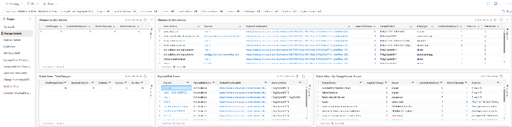


https://dataexplorer.azure.com/dashboards/d0357802-00ae-48c7-85a2-5cf02d98de77?p-_startTime=2023-09-19T11-56-00Z&p-_endTime=2023-09-20T11-56-00Z&p-_entityIds=v-ms-hkg21prdstf01a&p-_region=all&p-_availabilityZone=all&p-_datacenter=all&p-_cluster=all&p-_serviceName=all&p-_icmTeamName=all&p-_source=all&p-_entityType=all&p-_veName=all&p-_payload=all&p-_payloadOwner=all#66cc3653-ecde-4c2c-9d24-1838d351d4d4

Changes for Cluster:
1.	Go to Change Details view  [FCM (azure.com)](https://dataexplorer.azure.com/dashboards/d0357802-00ae-48c7-85a2-5cf02d98de77?p-_startTime=1hours&p-_endTime=now&p-_entityIds=all&p-_region=all&p-_availabilityZone=all&p-_datacenter=all&p-_cluster=all&p-_serviceName=v-Azure+Cosmos+DB&p-_icmTeamName=all&p-_source=all&p-_entityType=all&p-_veName=all&p-_payload=all&p-_payloadOwner=all#66cc3653-ecde-4c2c-9d24-1838d351d4d4)
2.	Make sure you remove/reset any filters, already set
3.	Enter the Cluster in Cluster filter: *hkg21prdstf01*
4.	Enter the above SQL cluster name in the EntityId filter and set the timeline correctly, recommended to use –24 hrs as the start time from the incident start time. There are scenarios where the issue was latent, so se the time filters as needed.


https://dataexplorer.azure.com/dashboards/d0357802-00ae-48c7-85a2-5cf02d98de77?p-_startTime=2023-09-19T11-56-00Z&p-_endTime=2023-09-20T11-56-00Z&p-_entityIds=v-ms-hkg21prdstf01a&p-_region=all&p-_availabilityZone=all&p-_datacenter=all&p-_cluster=all&p-_serviceName=all&p-_icmTeamName=all&p-_source=all&p-_entityType=all&p-_veName=all&p-_payload=all&p-_payloadOwner=all#66cc3653-ecde-4c2c-9d24-1838d351d4d4


### SQL reports that a tenant is unhealthy and needs to investigate potential host-related culprits: 

Identify Changes made to SQL cluster, For example incident [429061332](https://portal.microsofticm.com/imp/v3/incidents/incident/429061332/summary)

**SQL cluster**: *tr21509.eastus2-a.worker.database.windows.net*

Changes for SQL Cluster:
5.	Go to Change Details view  [FCM (azure.com)](https://dataexplorer.azure.com/dashboards/d0357802-00ae-48c7-85a2-5cf02d98de77?p-_startTime=1hours&p-_endTime=now&p-_entityIds=all&p-_region=all&p-_availabilityZone=all&p-_datacenter=all&p-_cluster=all&p-_serviceName=v-Azure+Cosmos+DB&p-_icmTeamName=all&p-_source=all&p-_entityType=all&p-_veName=all&p-_payload=all&p-_payloadOwner=all#66cc3653-ecde-4c2c-9d24-1838d351d4d4)
6.	Make sure you remove/reset any filters, already set
7.	Get the SQL cluster : *tr21509.eastus2-a.worker.database.windows.net*
8.	Enter the above SQL cluster name in the EntityId filter and set the time line correctly, recommended to use –24 hrs as the start time from the incident start time. There are scenarios where the issue was latent, so se the time filters as needed.

https://dataexplorer.azure.com/dashboards/d0357802-00ae-48c7-85a2-5cf02d98de77?p-_startTime=2023-10-03T15-42-00Z&p-_endTime=2023-10-04T15-42-00Z&p-_entityIds=v-tr21509.eastus2-a.worker.database.windows.net&p-_region=all&p-_availabilityZone=all&p-_datacenter=all&p-_cluster=all&p-_serviceName=all&p-_icmTeamName=all&p-_source=all&p-_entityType=all&p-_veName=all&p-_payload=all&p-_payloadOwner=all#66cc3653-ecde-4c2c-9d24-1838d351d4d4

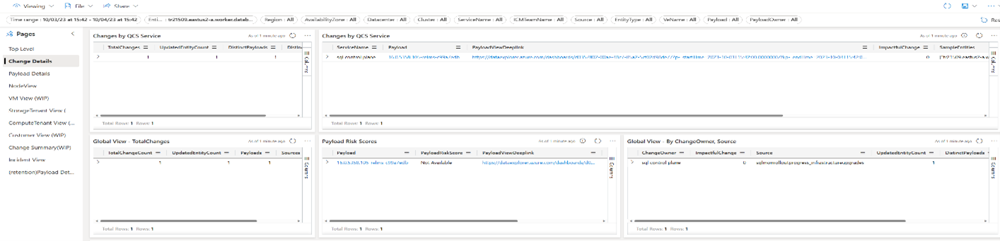


If the above SQL change is not identified as the culprit, lets dig into node’s the SQL cluster is hosted on find host changes

For the above SQL cluster, the node identified is: 668fd9f1-ceb8-6d43-606c-280cde4c930c ( SQL team can provide the node’s on which the Cluster is hosted)

### Changes for Nodes: 

1.	Go to [Node View](https://dataexplorer.azure.com/dashboards/d0357802-00ae-48c7-85a2-5cf02d98de77?p-_startTime=1hours&p-_endTime=now&p-_nodeid=all&p-_dynamicMeasure=all&p-_entityTypeNode=all#08c31477-dfa3-43d3-9427-a6a57b228c43)
2.	Get the nodes affected in the comma separated format, in this case : *668fd9f1-ceb8-6d43-606c-280cde4c930c* 
3.	Enter the above comma separated values into NodeId filter and set the time line correctly, recommended to use –24 hrs as the start time from the incident start time. There are scenarios where the issue was latent, so se the time filters as needed.

https://dataexplorer.azure.com/dashboards/d0357802-00ae-48c7-85a2-5cf02d98de77?p-_startTime=2023-10-03T15-42-00Z&p-_endTime=2023-10-04T15-42-00Z&p-_nodeid=v-668fd9f1-ceb8-6d43-606c-280cde4c930c&p-_dynamicMeasure=all&p-_entityTypeNode=all#08c31477-dfa3-43d3-9427-a6a57b228c43

### Identifying TOR, T1, T2 Changes for the Node:

The connection to the Node can be lost/interrupted due to update to the TOR, T1’s, T2’s connected to the Node. Since TOR is single point of failure, check for Tor updates. (There is more redundancy for T1 and T2, so mostly T1, T2 changes do not impact the Node).

The node information table in node view provides a summary and details of the node, example cluster, TOR, number of changes made to TOR, T1, number of changes made to T1, is the node batched, node allocation type (Empty Node, MultipleUpdate) etc.

To Identify ToR, T1 and T2 changes, go to Node View and select the nodeid, follow the same steps as identifying node changes mentioned above.

After the filters are set and queried for changes, scroll down in the Node view to look for TOR, T1 and T2 changes

https://dataexplorer.azure.com/dashboards/d0357802-00ae-48c7-85a2-5cf02d98de77?p-_startTime=2023-10-03T15-42-00Z&p-_endTime=2023-10-04T15-42-00Z&p-_nodeid=v-668fd9f1-ceb8-6d43-606c-280cde4c930c&p-_dynamicMeasure=all&p-_entityTypeNode=all#08c31477-dfa3-43d3-9427-a6a57b228c43

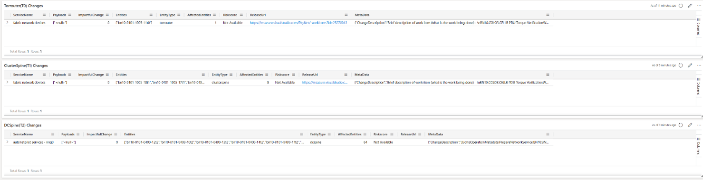
