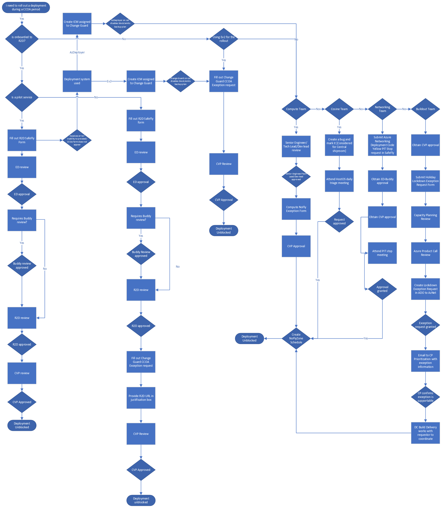

# Submitting CCOA Exception Requests Overview

## Critical Change Only Advisories (CCOA)
[Critical Change Only Advisories](https://microsoft.sharepoint.com/teams/AzureHighPriorityEventsProgramPortal/SitePages/Azure-Critical-Change-Only-Advisory.aspx) (CCOA) are a pre-defined period where engineering teams operate under a mandate allowing only critical changes to production. CCOAs applies to ring 0-2 services and production services including Networking, Compute, Storage, SQL Database, etc. No change should occur, except mandatory critical updates, as determined by respective organizations. CCOAs are planned 8 months in advance and are communicated in Fundamentals, PLR, and the weekly Hi-Pri Events Awareness email - join azhipricomms@microsoft.com.

To find out more about CCOAs, please visit https://aka.ms/ccoa. You will also find more information on your organization’s exception info and delegates, safe change guidance, and CCOA dates for this calendar year. Refer to [CCOA exceptions](http://aka.ms/ccoa/exceptions) for general guidance on how your organization is restricting change during this period.

## SafeFly CCOA Initiative

Depending on the service, CCOA exception requests had to be submitted either through either Change Guard or AzDeployer. However starting on November 17th, 2023, select services will be able to now submit their exception requests through SafeFly for the 2023 Black Friday CCOA. 

Before enabling the CCOA feature in SafeFly, services already onboarded to [Ready to Deploy (R2D)](https://eng.ms/docs/more/sre/engagements/r2d/readme) were heavily encouraged to participate in the process before proceeding with submitting a CCOA exception request. This required services to navigate to SafeFly - which has R2D built into the interface, input their deployment information, proceed with R2D reviews, and then navigate to Change Guard or AzDeployer to submit the actual exception request. Now, the process has been combined into one interface allowing services to submit their CCOA exception requests directly into SafeFly, proceed with R2D review, acquire the needed approvals. Once the deployment has been approved, SafeFly will unblock the deployment and the service will be able to proceed with the rollout.

However, this feature will only be enabled for a select number of services for the 2023 Black Friday CCOA. See below for guidence on the tools to use for submitting CCOA exception requests.

### Services in Scope

#### Pilot Services

For a full list of pilot services who will submit CCOA exception requests in SafeFly, refer to the table here: [Pilot Services](https://eng.ms/docs/products/fcm-engineering-hub/SafeFlyCCOAExceptions/PilotServices/PilotServices)

#### Which Exception Process to Use

| SDP TOOL | Quality Critical Service (QCS)? | Onboarded to R2D | Appear in Pilot Services List | Exception Process |
|:-----|:-----|:-----|:-----|:-----|
| EV2 | Yes  Yes  Yes  No | Yes  Yes  No  No | Yes  No  No  No   | Submit CCOA requests in SafeFly  Submit SafeFly request, proceed with approvals and R2D review in SafeFly, submit CCOA exception request in Change Guard  Submit CCOA exception request in Change Guard  Submit CCOA exception request in Change Guard |
|AZDeployer ApStager PilotFish|Yes  Yes  Yes  No | Yes  Yes  No  No | Yes  No  No  No   | Submit CCOA requests in SafeFly  Submit SafeFly request, proceed with approvals and R2D review in SafeFly, submit CCOA exception request following [NoFlyZone](https://msazure.visualstudio.com/AzureWiki/_wiki/wikis/AzureWiki.wiki/3335/Platform-NoFlyZone-Scheduling) guidence  Submit CCOA exception request following [NoFlyZone](https://msazure.visualstudio.com/AzureWiki/_wiki/wikis/AzureWiki.wiki/3335/Platform-NoFlyZone-Scheduling) guidence  Submit CCOA exception request following [NoFlyZone](https://msazure.visualstudio.com/AzureWiki/_wiki/wikis/AzureWiki.wiki/3335/Platform-NoFlyZone-Scheduling) guidence |

#### All-Up User E2E experience

#### Further Guidence on Exception Process
| User Experience | Link |
|:-----|:-----|
| Pilot Service| [Pilot Services](https://eng.ms/docs/products/fcm-engineering-hub/SafeFlyCCOAExceptions/PilotServices/SubmittingCCOARequests)|
