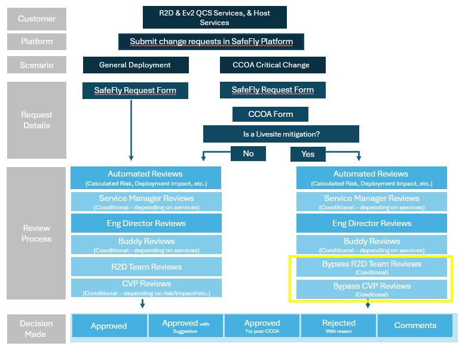

# Submitting CCOA Exception Requests Overview

## Critical Change Only Advisories (CCOA)
[Critical Change Only Advisories](https://aka.ms/ccoa) (CCOA) are a pre-defined period where engineering teams operate under a mandate allowing only critical changes to production. CCOAs applies to ring 0-2 services and production services including Networking, Compute, Storage, SQL Database, etc. No change should occur, except mandatory critical updates, as determined by respective organizations. CCOAs are planned 8 months in advance and are communicated in Fundamentals, PLR, and the weekly Hi-Pri Events Awareness email - join azhipricomms@microsoft.com.

To find out more about CCOAs, please visit https://aka.ms/ccoa. You will also find more information on your organization’s exception info and delegates, safe change guidance, and CCOA dates for this calendar year. Refer to [CCOA exceptions](http://aka.ms/ccoa/exceptions) for general guidance on how your organization is restricting change during this period.

## SafeFly CCOA Initiative

Depending on the service, CCOA exception requests had to be submitted either through either Change Guard or AzDeployer. Now QCS services using Ev2, AzDeployer or Pilotfish can submit their CCOA exception requests through SafeFly.

Before enabling the CCOA feature in SafeFly, services already onboarded to [Ready to Deploy (R2D)](https://eng.ms/docs/more/sre/engagements/r2d/readme) were heavily encouraged to participate in the process before proceeding with submitting a CCOA exception request. This required services to navigate to SafeFly - which has R2D built into the interface, input their deployment information, proceed with R2D reviews, and then navigate to Change Guard, AzDeployer or PilotFish to submit the actual exception request. Now, the process has been combined into one interface allowing services to submit their CCOA exception requests directly into SafeFly, proceed with R2D review and acquire the needed approvals. Once the deployment has been approved, SafeFly will unblock the deployment and the service will be able to proceed with the rollout.

However, this feature will only be enabled for a select number of services for the 2023 December Holidays CCOA. See below for guidance on the tools to use for submitting CCOA exception requests.

## Services in Scope

### SafeFly CCOA-Enabled Services

For a full list of SafeFly CCOA-enabled services who will submit CCOA exception requests in SafeFly, refer to the table here: [SafeFly CCOA Services](https://eng.ms/docs/products/fcm-engineering-hub/SafeFlyCCOAExceptions/PilotServices/PilotServices)

### Which Exception Process to Use for Ev2 Deployments

| Quality Critical   Service (QCS)? | Onboarded to R2D | Appear in SafeFly CCOA Services List | Exception Process                                                                                                         |
|-----------------------------------|------------------|--------------------------------------|---------------------------------------------------------------------------------------------------------------------------|
| Yes                               | Yes              | Yes                                  | Submit CCOA requests in SafeFly                                                                                           |
| No                                | Yes              | Yes                                  | Submit CCOA requests in SafeFly                                                                                           |
| Yes                               | Yes              | No                                   | Submit SafeFly request, proceed with approvals and R2D review in SafeFly,   submit CCOA exception request in Change Guard |
| Yes                               | No               | No                                   | Submit CCOA exception request in Change Guard                                                                             |
| No                                | No               | No                                   | Submit CCOA exception request in Change Guard                                                                             |

### Which Exception Process to Use for AzDeployer and PilotFish Deployments

| Quality Critical   Service (QCS)? | Onboarded to R2D | Appear in SafeFly CCOA Services List | Exception Process                                                                                                                                                                                                                                      |
|-----------------------------------|------------------|--------------------------------------|--------------------------------------------------------------------------------------------------------------------------------------------------------------------------------------------------------------------------------------------------------|
| Yes                               | Yes              | Yes                                  | Submit CCOA requests in SafeFly                                                                                                                                                                                                                        |
| No                                | Yes              | Yes                                  | Submit CCOA requests in SafeFly                                                                                                                                                                                                                        |
| Yes                               | Yes              | No                                   | Submit SafeFly request, proceed with approvals and R2D review in SafeFly,   submit CCOA exception request following   [NoFlyZone](https://msazure.visualstudio.com/AzureWiki/_wiki/wikis/AzureWiki.wiki/3335/Platform-NoFlyZone-Scheduling)   guidance |
| Yes                               | No               | No                                   | Submit CCOA exception request following   [NoFlyZone](https://msazure.visualstudio.com/AzureWiki/_wiki/wikis/AzureWiki.wiki/3335/Platform-NoFlyZone-Scheduling)   guidance                                                                             |
| No                                | No               | No                                   | Submit CCOA exception request following   [NoFlyZone](https://msazure.visualstudio.com/AzureWiki/_wiki/wikis/AzureWiki.wiki/3335/Platform-NoFlyZone-Scheduling)   guidance                                                                             |

#### All-Up User E2E experience

#### Further Guidence on Exception Process
| User Experience | Link |
|:-----|:-----|
| SafeFly CCOA Overview| [SafeFly CCOA Experience](https://eng.ms/docs/products/fcm-engineering-hub/SafeFlyCCOAExceptions/PilotServices/PilotServicesOverview) |
|Submitting CCOA Exception Requests in SafeFly|[CCOA Requests in SafeFly](https://eng.ms/docs/products/fcm-engineering-hub/SafeFlyCCOAExceptions/PilotServices/SubmittingCCOARequestsPilot)|
| Bypassing R2D Approval| [Bypassing R2D Approval](https://eng.ms/docs/products/fcm-engineering-hub/SafeFlyCCOAExceptions/PilotServices/BypassingR2D)
| Submitting CCOA Requests for R2D Ev2 Services (Non-QCS)| [CCOA Requests forvNon-QCS R2D Ev2](https://eng.ms/docs/products/fcm-engineering-hub/SafeFlyCCOAExceptions/R2DnonPilotEv2)|
| Submitting CCOA Requests for R2D AzDeployer/PilotFish/ApStager Services (Non-QCS)| [CCOA Requests for Non-QCS R2D Host](https://eng.ms/docs/products/fcm-engineering-hub/SafeFlyCCOAExceptions/R2DnonPilotAzD)|

#### Quick Links
|Links|
|:-----|
|[SafeFly Requests Page](https://safefly.azure.com/safe-fly-request/r2d/new)|
|[New R2D form](https://aka.ms/r2d)|
|[Change Guard](https://aka.ms/changeguard)|
|[CCOA Wiki](https://aka.ms/ccoa)|
|[R2D Wiki](https://eng.ms/docs/more/sre/engagements/r2d/readme)|
|[NoFlyZone Schedule](https://msazure.visualstudio.com/AzureWiki/_wiki/wikis/AzureWiki.wiki/3335/Platform-NoFlyZone-Scheduling?anchor=1.-how-to-bypass-noflyzone-schedule-for-critical-or-security-fixes)|
|[API_Set_SchedulesException](https://msazure.visualstudio.com/AzureWiki/_wiki/wikis/AzureWiki.wiki/52501/API_Set_SchedulesException)|

<!--| R2D AzDeployer/PilotFish/AP Stager Services (Non-Pilot)| [R2D AzD Services](https://eng.ms/docs/products/fcm-engineering-hub/SafeFlyCCOAExceptions/R2DnonPilotAzD)| -->