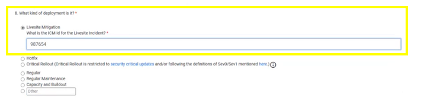
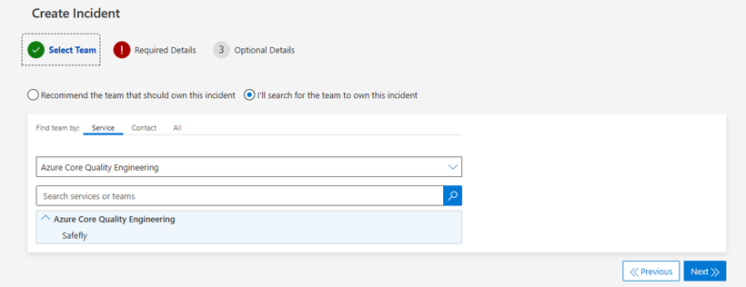

<<<<<<< HEAD
# Bypassing R2D

For critical LiveSite deployments during a CCOA period, services will have the ability to bypass R2D review in order to quickly roll out the necessary changes. Utilizing this feature should only be used for critical changes that need to be deployed immediately. When services bypass R2D review, they will still need to obtain CVP approval. If a CVP is unable to be reached, there are ways to bypass CVP approval in order to unblock these break/fix deployments. The decision chart below shows how to approach bypassing these approvals and the next section provides in-depth steps for bypassing these approvals. 

## How to Bypass R2D Review

Create a new request by first going to the [R2D form](https://safeflywebapp.azurewebsites.net/safe-fly-request/r2d/new) in [SafeFly](https://safeflywebapp.azurewebsites.net/safe-fly-request/r2d).

Fill out the necessary information in the form. Once you get to **Question 8: What kind of deployment is it?** Select **Livesite Mitigation** and input the corresponding ICM ID in the write-in portion. Continue to fill out the R2D form and submit when finished

After submitting the form, you will be taken to the R2D page that shows the status of your request. You will first need to obtain approval from the engineering director.

After the engineering director approves, R2D review will automatically be bypassed and the next step will be to optain CVP approval.

When the CVP approves the request, the deployment will be unblocked, allowing the service to begin the rollout

## If the CVP is Unavailable

There are times when a change is critical and needs to be deployed ASAP but the CVP is unavailable to approve the request in a timely manner - whether that be at 2am or if the CVP is out of office. There are ways to bypass CVP approval depending on the deployment system that is used.

### Ev2 Deployments - Bypassing CVP Approval

If a CVP is unavailable to approve a CCOA exception request, Change Guard will be utilized to bypass the CCOA deployment block. The person submitting the request should create an ICM, assign it to the Change Guard team and provide the SafeFly ID in the ICM. Here is a link to the [ICM Template](https://portal.microsofticm.com/imp/v3/incidents/create?tmpl=Q3x1H3)

Our on call engineers will conduct an investigation and will add your service to the approved services list. The deployment will then be unblocked and ready to roll out.

### AzDeployer/PilotFish Deployments - Bypassing CVP Approval

Bypassing CVP approvals for AzDeployer or PilotFish deployments does not require reaching out to the on-call team directly to unblock deployments. Instead, the user will create a NoFlyZone Set-SchedulesException on their SAW machine. 

Detailed information can be found here: [NoFlyZone Schedule](https://msazure.visualstudio.com/AzureWiki/_wiki/wikis/AzureWiki.wiki/3335/Platform-NoFlyZone-Scheduling?anchor=1.-how-to-bypass-noflyzone-schedule-for-critical-or-security-fixes). 

API for the Set_SchedulesException can be found here: [API_Set_SchedulesException](https://msazure.visualstudio.com/AzureWiki/_wiki/wikis/AzureWiki.wiki/52501/API_Set_SchedulesException)

=======
# Bypassing R2D
>>>>>>> 1c8ff4e06b78e314c22d1e2bdc1758993d69017e
