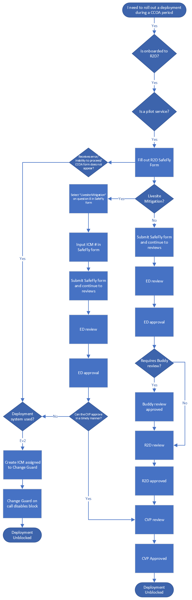
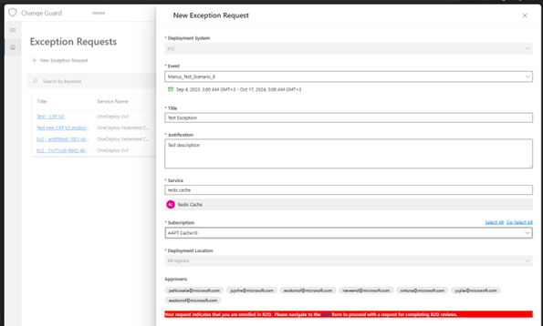

# If an Error Occurs: Fallback Plan for Ev2 Pilot Services

If you are a service that is QC, uses Ev2 as a deployment system and is onboarded to R2D, this page will provide the information to help navigate any issues. Below is an image of the decision path for this user experience.

<<<<<<< HEAD
If an error occurs and the service is unable to submit a CCOA exception request, Change Guard will be utilized to bypass the CCOA deployment block. Upon receiving and error or faced with the inability to submit an exception request in SafeFly, the person submitting the request should create an ICM, assign it to the Change Guard team and provide the SafeFly ID in the ICM. An ICM template is available [here](https://portal.microsofticm.com/imp/v3/incidents/create?tmpl=Q3x1H3).
=======
If an error occurs and the service is unable to submit a CCOA exception request, Change Guard will be utilized to bypass the CCOA deployment block. Upon receiving and error or faced with the inability to submit an exception request in SafeFly, the the person submitting the request should create an ICM, assign it to the Change Guard team and provide the SafeFly ID in the ICM.
>>>>>>> 1c8ff4e06b78e314c22d1e2bdc1758993d69017e

Our on call engineers will conduct an investigation and if still unable to submit requests, they will add your service to the approved services list on the Change Guard backend. The service will then abandon their previous submission in SafeFly and instead, proceed with submitting their exception request in Change Guard. Guidance on submitting CCOA exceptions in Change Guard is available here.

Ev2 pilot services will not be able to submit an exception request in Change Guard without intervention from the Change Guard team. If they attempt to submit a CCOA request in the Change Guard portal instead of SafeFly, they will receive the following error that contains a link to the R2D form.

