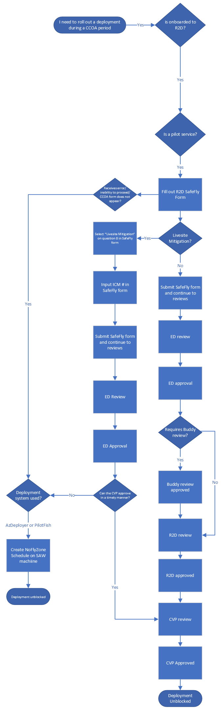
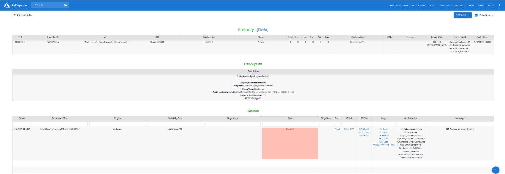

# If an Error Occurs: Fallback Plan for Host Pilot Services

If you are a service that is QC, uses AzDeployer, AP Stager, or PilotFish as a deployment system and is onboarded to R2D, this page will provide the information you need to submit CCOA exception requests in SafeFly. Below is an image of the decision path for this user experience

If an error occurs and the service is unable to submit a CCOA exception request, SafeFly on-call will manually bypass the CCOA deployment block. Upon receiving an error or faced with the inability to rollout a deployment after completing R2D in SafeFly, the person submitting the request should create an ICM, assign it to the SafeFly team and provide the SafeFly ID in the ICM

Our on call engineers will then add your service to the approved services list in the NoFlyZone Arcus API. Once added to the approved services list, the user deploying the change will proceed with bypassing the NoFlyZone schedule in AzDeployer. Information on how to bypass the schedule is available here: Platform NoFlyZone Scheduling - Overview (visualstudio.com)

AzDeployer pilot services will not be able to submit an exception request in through the NoFlyZone Schedule without intervention from the SafeFly team. If they attempt to submit a CCOA request without contacting the SafeFly team, the deployment will be blocked

<!--

 -->