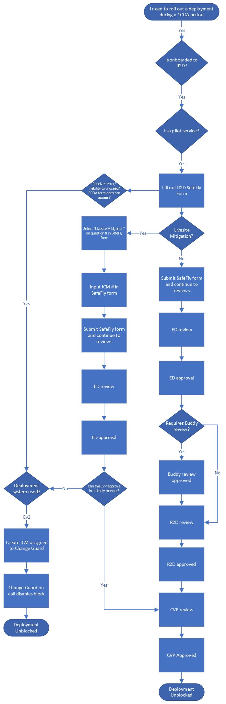
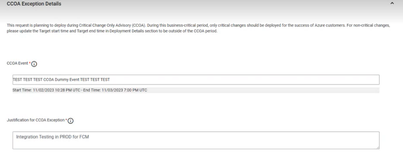

# Ev2 Pilot Services

If you are a service that is QC, uses Ev2 as a deployment system and is onboarded to R2D, this page will provide the information you need to submit CCOA exception requests in SafeFly. Below is an image of the decision path for this user experience

## User Experience for Submitting CCOA Exception Requests

When submitting a CCOA exception, pilot services will navigate to the SafeFly home page and create a new request. During a CCOA period, a banner will be displayed at the top of the page indicating that there is a CCOA in effect along with a link to the CCOA documentation.  

When the user enters a start and end range that falls within a CCOA period along with the qualifying deployment tool, and service selected, a CCOA exception form will appear after the Deployment Details section of the page. 

The form will be automatically populated with the CCOA event that the exception is needed for. 

Once the form is submitted, the user will be routed to their request where it will show the reviews they need to complete along with the progress of the reviews. The review process is as follows:

1.	Automatic reviews: occurs immediately and provides a calculated risk, deployment impact, etc.
2.	Service Manager Reviews: this is conditional and is dependent on the service itself
3.	Engineering director reviews
4.	Buddy Reviews: this is conditional and is dependent on the service itself
5.	R2D team reviews: user will need to schedule a meeting with the R2D team
    - Meeting Times:
        - Morning R2D Review: Daily 8:35AM - 9:30AM PT
        - Evening R2D Reviews: Mon/Thu 1:30PM - 2:00PM PT, or as needed we can set up if its high priority deployment request and needs review.
    - What to expect in R2D discussions
        - Safefly request must be “ED (Engineering Director) approved” prior to bringing in R2D pre-deploy forum.
        - Know your payload, engage others in review meetings to provide inputs, as needed.
        - Engineering Managers (Principal +) are required to be part of the R2D review discussions for the service deployment request.
        - Expect R2D council to be actively engaged and learn more about payload risks and quality validation completed to ensure change is safe and avoid shipping bad code to production regions.
        - Ensure the team has information on pending and ongoing repairs corresponding to improving deployment stature for the service (Test/Release, Detection etc.)
6. CVP Reviews
    - If R2D review rejects the request, the CVP still has the ability to overrule the decision and user will be able to proceed with deployment
    - If R2D approves, CVP can reject request
7.	Once all approvals have been met, the deployment will be unblocked and the user will be able to proceed with rolling out their deployment

## If an Error Occurs: Fallback Plan